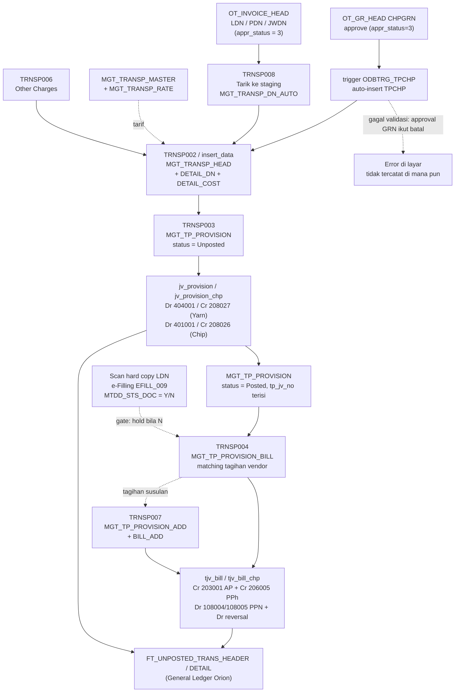
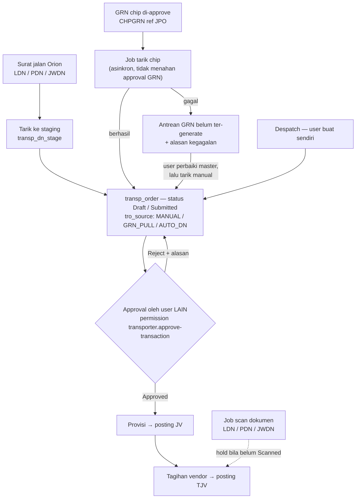

# PRD — Transporter Module (Migrasi Oracle Forms/Reports 6i → Laravel)

**Version:** 1.5 Draft
**Date:** 2026-09-14
**Author:** IT — Apps Mutu Gading
**Status:** For Review
**Target Module:** `Modules/Transporter`
**Target Schema:** `MGTHRIS` (koneksi `oracle_mgthris`)
**Legacy Schema:** `MGTDAT` (koneksi `oracle_mgtdat`, read-only kecuali posting GL)

---

## Executive Summary

Modul Transporter adalah aplikasi legacy Oracle Forms & Reports 6i yang mengelola seluruh siklus biaya angkutan (freight) PT. Mutu Gading Tekstil: master transporter & tarif, pencatatan transaksi angkutan per surat jalan, provisi biaya angkutan ke General Ledger, sampai penagihan (bill) dari vendor angkutan dan posting TJV.

Sistem lama terdiri dari **8 form (.fmb)**, **9 report (.rdf)**, **1 package PL/SQL** (`PKG_TRANSPORTER`, 4.000 baris), **1 trigger** (`ODBTRG_TPCHP`), **1 function**, **2 procedure**, **8 view**, **14 tabel aktif**, dan **12 sequence** di schema `MGTDAT` — ditambah satu ketergantungan di luar database: aplikasi web **e-Filling** yang mengendalikan kelengkapan hard copy surat jalan. Sistem masih aktif dipakai: data transaksi terakhir **Agustus 2026**.

Volume data in-scope untuk migrasi: **± 215.000 baris** pada 14 tabel aktif (di luar 30+ tabel backup manual yang tidak ikut dimigrasi).

Migrasi ini bukan sekadar port 1:1. Analisa menemukan kelemahan struktural yang serius pada sistem lama — praktis tanpa foreign key, tanpa trigger, tanpa audit trail, tanpa approval workflow, `COMMIT` di dalam package sehingga tidak bisa rollback, dan integritas data yang hanya dijaga oleh kode di sisi Forms. Akibatnya sudah terlihat: 331 provisi tanpa transaksi induk, 126 baris detail DN yatim, 21 nomor transaksi duplikat. PRD ini memuat rencana perbaikan struktur tersebut sekaligus rencana pemindahan datanya.

---

## 1. Background & Objective

### 1.1 Background

- Aplikasi Transporter dibangun dengan Oracle Forms 6i (client/server) dan hanya bisa dijalankan dari PC yang terinstal Oracle Developer Suite. Report dijalankan lewat `RUN_PRODUCT` ke Reports Runtime.
- Kode terakhir dimodifikasi: `TRNSP002.fmb` Oktober 2025, `PKG_TRANSPORTER` body 17 Oktober 2025 — artinya masih dalam pemeliharaan aktif dan setiap perubahan bisnis masih membutuhkan developer Forms.
- Identitas user diambil dari tabel `MENU_USER` milik Orion ERP, terpisah dari user management aplikasi Laravel yang sekarang berjalan.
- Modul lain yang sejenis (LC Control) sudah lebih dulu dimigrasi ke Laravel dan sudah memiliki pola posting GL ke Orion (`Modules/LcControl/app/Services/Erp/JournalVoucherPostingService.php`). Pola ini bisa dipakai ulang.

### 1.2 Objective

1. Memindahkan seluruh fungsi 8 form dan 8 report ke Laravel/Livewire di `Modules/Transporter`, dengan skema tabel baru di `MGTHRIS`.
2. Memindahkan data historis dari `MGTDAT` ke skema baru dengan jejak (traceability) ke ID lama.
3. Memperbaiki kelemahan struktural: referential integrity, audit trail, approval workflow, idempotensi posting GL, dan penghapusan `COMMIT` implisit.
4. Menghapus ketergantungan pada Oracle Developer Suite dan `MENU_USER`; otorisasi memakai Spatie Permission seperti modul lain.
5. Mempertahankan hasil akuntansi yang **identik** dengan sistem lama (nomor JV/TJV, akun, nilai, kurs) supaya tidak ada gap di General Ledger.

### 1.3 Non-Objective

- Tidak mengubah bagan akun (chart of account) atau kebijakan akuntansi yang berlaku.
- Tidak memigrasi tabel backup manual (`MGT_TP_PROVISION_<ddmmyyyy>` dan sejenisnya).
- Tidak mengubah sumber data hulu: `OT_INVOICE_HEAD`, `OT_WMS_PACK_TABLE_ALTHARA`, `OM_SUPPLIER`, `OT_GR_HEAD` tetap milik Orion ERP dan tetap dibaca dari `MGTDAT`.
- Tidak memigrasi konsumen hilir (laporan penjualan `SALR*`, Delivery Margin, laporan pajak). Semuanya tetap berjalan di Orion dan dilayani lewat compatibility view (§4.5).
- Tidak membangun modul penjadwalan armada / GPS tracking (di luar cakupan sistem lama).

---

## 2. Scope

### 2.1 In-Scope

| # | Item | Keterangan |
|---|---|---|
| 1 | Master Transporter & Tarif | Pengganti TRNSP001 |
| 2 | Transaksi Angkutan (manual) | Pengganti TRNSP002 |
| 3 | Generate Transaksi Otomatis dari Surat Jalan | Pengganti TRNSP008 |
| 4 | Biaya Lain-lain (Other Charges) | Pengganti TRNSP006 |
| 5 | Provisi & Posting JV | Pengganti TRNSP003 |
| 6 | Tagihan Transporter & Posting TJV | Pengganti TRNSP004 |
| 7 | Tagihan Tambahan (Add-On) | Pengganti TRNSP007 |
| 8 | Monitoring GRN Chip | Pengganti TRNSP005 |
| 9 | 9 report (dikonsolidasi jadi 5) | Excel + PDF |
| 10 | Auto-generate transaksi chip dari GRN + halaman GRN yang gagal & tarik manual | Pengganti trigger `ODBTRG_TPCHP` |
| 10a | Approval maker-checker untuk semua transaksi angkutan | Baru — tidak ada di sistem lama |
| 11 | Kontrol dokumen surat jalan (scan LDN) | Pengganti e-Filling `EFILL_009` |
| 12 | Migrasi data 14 tabel aktif | ± 215.000 baris |
| 13 | Posting GL ke `MGTDAT.FT_*` | Reuse pola LcControl |
| 14 | Compatibility view di `MGTDAT` untuk ± 25 konsumen hilir | Lihat §3.9 dan §4.5 |

### 2.2 Out-of-Scope

- Perubahan proses bisnis penagihan/pembayaran vendor di luar apa yang sudah ada di sistem lama.
- Migrasi `MGT_TP_PROVISION_DEL` dalam bentuk apa pun. Tabel itu lahir dari kekurangan sistem lama (tidak ada soft delete dan tidak ada audit trail), bukan dari kebutuhan bisnis — di sistem baru fungsinya digantikan soft delete + activity log (F-02.9). Datanya ditinggalkan di `MGTDAT` sebagai arsip pasif.
- Rekonsiliasi ulang GL periode lampau.
- Modul pembayaran (payment voucher) — sudah ditangani Orion / LcControl.

---

## 3. Analisa Sistem Lama

### 3.1 Inventaris Form (.fmb)

| Form | Judul di Form | Tabel Utama | Fungsi Bisnis |
|---|---|---|---|
| **TRNSP001** | Transporter Master | `MGT_TRANSP_MASTER`, `MGT_TRANSP_RATE` | Master kombinasi transporter × tujuan × jenis truk, beserta tarif berjenjang. Nomor otomatis `TR` + 4 digit. |
| **TRNSP002** | Transporter Transaction | `MGT_TRANSP_HEAD`, `MGT_TRANSP_DETAIL_DN`, `MGT_TRANSP_DETAIL_COST`, `MGT_TRANSP_DETAIL_OTHCHG` | Entri manual satu perjalanan truk: pilih transporter, tarik surat jalan (LDN/JWDN/PDN), sistem menghitung biaya dari tarif, tambah biaya lain-lain, lalu di-*Approve*. |
| **TRNSP003** | Transporter JV Provision | `MGT_TP_PROVISION` | Tarik transaksi TPDN/TPCHP dalam rentang tanggal → jadi baris provisi → *Generate JV Provision* memanggil `pkg_transporter.jv_provision` / `jv_provision_chp`. |
| **TRNSP004** | Transporter Bill | `MGT_TP_PROVISION_BILL`, `MGT_TP_PROVISION` | Entri tagihan vendor (invoice, faktur pajak, PPN, PPh), mencocokkan (matching) ke baris provisi yang sudah ber-JV, lalu *Generate JV Transporter* memanggil `tjv_bill` / `tjv_bill_chp`. |
| **TRNSP005** | Transporter Chip Status (GRN Chip) | `OT_GR_HEAD`, `MGT_TRANSP_MASTER` | Monitoring GRN chip (`CHPGRN`) yang transporternya belum ter-setup; bisa auto-create master bertipe `STO` + tarif `Q`. |
| **TRNSP006** | Transporter Others | `MGT_TRANSP_DETAIL_OTHCHG` | Entri biaya lain-lain berdiri sendiri (tol, solar, inap, kawal, jalan ditutup) dengan status `Provision` / `Not Provision`. |
| **TRNSP007** | Transporter Bill Add On | `MGT_TP_PROVISION_ADD`, `MGT_TP_PROVISION_BILL_ADD` | Tagihan susulan atas provisi yang sudah pernah ditagih. Memanggil `tjv_bill_add` / `tjv_bill_chp_add`. |
| **TRNSP008** | Auto Transporter Transaction / Dashboard | `MGT_TRANSP_DN_AUTO` | Tarik surat jalan hari-H dari `OT_INVOICE_HEAD` ke tabel staging, lalu *Generate TPDN* memanggil `pkg_transporter.insert_data` untuk membuat transaksi + detail + biaya secara massal. |

### 3.2 Inventaris Report (.rdf)

| Report | Judul | Sumber Data | Catatan |
|---|---|---|---|
| TRNSP001.rdf | TRANSPORTER REGISTER | `MGT_TRANSP_HEAD`, `OT_WMS_PACK_TABLE_ALTHARA` | Register transaksi angkutan |
| TRNSP002.rdf | Delivery Note Transporter Value | `MGT_TRANSP_HEAD`, `MGT_TP_PROVISION`, `FT_OS`, `FT_*_TRANS_DETAIL`, `OT_GR_HEAD`, `OT_INVOICE_HEAD` | Report paling kompleks: nilai angkutan per surat jalan + status provisi + status bill + outstanding AP |
| TRNSP003.rdf | TRANSPORTER REGISTER (Cost Master Batch / Cost Transaction) | `MGT_TRANSP_VIEW` | Rincian biaya per item & grade |
| TRNSP004.rdf | Transporter Details — Freight per Kg | `MGT_TRANSP_HEAD`, `OT_INVOICE_HEAD` | Total Cost Amount & Total Cost per Kg |
| TRNSP005.rdf | TRANSPORTER BILL | `MGT_TP_PROVISION_BILL` | Rekap tagihan |
| TRNSP006.rdf | TRANSPORTER BILL (varian) | `MGT_TP_PROVISION_BILL` | Hampir identik dengan 005 |
| TRNSP007.rdf | TRANSPORTER PROVISION STATUS / NOT YET PROVISION | `MGT_TP_PROVISION`, `MGT_TRANSP_HEAD` | Transaksi yang belum diprovisi |
| TRNSP008.rdf | TRANSPORTER PROVISION | `MGT_TP_PROVISION` | Rekap provisi |
| TRNSP009.rdf | **TRANSPORTER BUDGET** | `MGT_TP_PROVISION`, `MGT_TP_PROVISION_BILL`, `MGT_TRANSP_MASTER`, `OM_SUPPLIER`, `FV_TRANS_HEADER`, `FT_OS`, `FV_OS_MATCH` | Outstanding hutang angkutan per supplier — provisi belum ter-bill + tagihan belum lunas. Lihat rincian di bawah |

#### 3.2.1 TRNSP009 — Transporter Budget (rincian)

Report ini semula tidak ikut diserahkan; berkasnya menyusul (versi 29 Oktober 2021, identik dengan salinan kerja terakhir di drive developer).

**Parameter:** *tidak ada parameter user sama sekali.* Yang ada hanya parameter sistem Oracle Reports (`DESTYPE`, `DESNAME`, `DESFORMAT`, `COPIES`, `CURRENCY`, `THOUSANDS`, `DECIMAL`, `MODE`, `ORIENTATION`, `BACKGROUND`, `PRINTJOB`) plus `M_DEST_TYPE` dari template Orion — bernilai `'E'` untuk memicu ekspor Excel lewat `RPT2XLS.run`. Artinya report **selalu berjalan atas seluruh data**, tanpa filter tanggal maupun supplier, dengan header *"As On : <tanggal hari ini>"*.

**Struktur:** dua level group — `G_SUPP_NAME` (outer, per supplier) → `G_MTM_TRANSP_CODE` (detail). Sub total per supplier lewat `CS_AMT_SUPP` ("Sub Total :"), grand total lewat `SumAMTPerReport` ("Grand Total :"), nomor urut lewat `CS_NMR`.

**11 kolom output** (persis seperti yang ditulis `B_23FormatTrigger` ke Excel):

| # | Kolom | Sumber |
|---|---|---|
| 1 | No. | `CS_NMR` (nomor urut) |
| 2 | Supplier Code | `MTM_TRANSP_CODE` / `TPB_SUPP_CODE` |
| 3 | Supplier Name | `SUPP_NAME` / `TPB_SUPP_NAME` |
| 4 | Trans No. | `TP_NO` (provisi) / `TPB_TRX_NO` (tagihan) |
| 5 | Trans Date | `TP_DT` / `TPB_DT` |
| 6 | Finance Doc | `TP_JV_NO` (provisi) / `TP_TJV_NO` (tagihan) |
| 7 | JV or Bill Date | `TP_JV_DT` / `TPB_BILL_DT` |
| 8 | Amount | Provisi: `SUM(NVL(TP_AMT,0) + NVL(TP_OTH_AMT,0))` — Tagihan: `NVL(OST_FC_AMT,0) - NVL(SUM(MATCH_FC_AMT),0)` (outstanding setelah matching) |
| 9 | Remarks | Literal `'PROVISION'` atau `'BILL'` |
| 10 | Due Date | Aturan 10 / 25 (§3.7.3) |
| 11 | Status | Provisi: `POSTED` / `NOT POSTED` — Tagihan: `POSTED` / `NOT POSTED` / `NOT GENERATED` |

**Dua bagian `UNION ALL`:**

1. **PROVISION** — dari `MGT_TP_PROVISION` join `MGT_TRANSP_MASTER` dan `OM_SUPPLIER`, disaring `TP_MATCH_STATUS IS NULL` (belum dicocokkan ke tagihan). Status `POSTED` bila `TP_JV_NO` ketemu di `FV_TRANS_HEADER`, selain itu `NOT POSTED`.
2. **BILL** — dari `MGT_TP_PROVISION_BILL` join `MGT_TP_PROVISION` lewat `TPB_SYS_ID = TP_TPB_SYS_ID`, outstanding dihitung dari `FT_OS` dikurangi `FV_OS_MATCH`, disaring `HAVING NVL(OST_FC_AMT,0) - NVL(SUM(MATCH_FC_AMT),0) <> 0` (hanya yang masih ada sisa).

Urutan akhir: `SUPP_NAME, DUE_DATE, TP_DT, TP_JV_NO`. Ada pewarnaan baris (`VG_COLOR`: merah / hijau / biru) di layout PDF.

> **Hubungan dengan `TRANSPORTER_BUDGET_V`.** View tersebut (dibuat April 2025) adalah evolusi dari query TRNSP009 dengan tiga perbedaan: (a) menambah kolom `TYPE` (`CHIPS` / `YARN` / `OTHERS`, diturunkan dari prefix `TP_NO`), (b) memakai `TH_DOC_DT` dari `FV_TRANS_HEADER` sebagai `JV_BILL_DT` alih-alih `TP_JV_DT`, dan (c) menambahkan pengecualian hardcode `TPB_TRX_NO NOT IN ('TBILL-2022000696','TBILL-2022000718')` (temuan T-12). Karena itu **report baru F-08.5 harus mengacu ke logika view yang lebih baru**, bukan ke TRNSP009 apa adanya — sekaligus memindahkan dua nomor tagihan yang dikecualikan itu ke data, bukan kode.

> **Peluang konsolidasi:** TRNSP005, TRNSP006, dan TRNSP008 nyaris identik (sumber `MGT_TP_PROVISION_BILL` / `MGT_TP_PROVISION`, kolom Bill Amount / Diff. Amount yang sama). Diusulkan digabung menjadi **1 report parametrik**. Total 9 report → **5 report**.

### 3.3 Objek Database (schema MGTDAT)

**Tabel aktif (in-scope migrasi):**

| Tabel | Baris | Rentang Tanggal | Peran |
|---|---:|---|---|
| `MGT_TRANSP_MASTER` | 739 | 2017-02 … 2026-08 | Master transporter × tujuan × truk |
| `MGT_TRANSP_RATE` | 799 | 2017-01 … 2026-08 | Tarif berjenjang per master |
| `MGT_TRANSP_HEAD` | 33.126 | 2014-02 … 2026-08 | Header transaksi angkutan |
| `MGT_TRANSP_DETAIL_DN` | 92.650 | — | Surat jalan yang diangkut |
| `MGT_TRANSP_DETAIL_COST` | 35.403 | — | Rincian perhitungan biaya |
| `MGT_TRANSP_DETAIL_OTHCHG` | 862 | — | Biaya lain-lain |
| `MGT_TRANSP_DN_AUTO` | 27.009 | 2024-08 … 2026-08 | Staging surat jalan otomatis |
| `MGT_TP_PROVISION` | 21.411 | 2020-06 … 2026-08 | Baris provisi biaya angkutan |
| `MGT_TP_PROVISION_DN` | 758 | — | Relasi provisi ↔ surat jalan |
| `MGT_TP_PROVISION_BILL` | 3.809 | 2021-01 … 2026-08 | Header tagihan vendor |
| `MGT_TP_PROVISION_ADD` | 42 | 2022-09 … 2022-11 | Provisi tambahan (add-on) |
| `MGT_TP_PROVISION_BILL_ADD` | 5 | 2022-10 … 2022-12 | Tagihan tambahan |
| `MGT_TP_PROVISION_DEL` | 10.479 | — | Arsip provisi yang dihapus — **artefak workaround, tidak dimigrasi** |
| `MGT_TP_PROVISION_TPCHP` | 43 | — | Snapshot lama, tidak dipakai |
| **Total** | **± 227.000** | | |

**Tabel di luar scope:** 30+ tabel backup manual berpola `MGT_TP_PROVISION_<ddmmyyyy>` (± 300.000 baris), `MGT_TRANSP_HEAD_15062024`, `MGT_TRANSP_DETAIL_COST_241022`, `MGT_TRANSP_DETAIL_OTHCHG_AAM`, dll. Ini adalah snapshot manual yang dibuat sebelum operasi berisiko — bukti bahwa sistem lama tidak punya mekanisme rollback.

**Sequence (12):** `MGT_TRANSP_HEAD_SEQ` (34.468), `MGT_TRANSP_DETAIL_DN_SEQ` (96.476), `MGT_TRANSP_DETAIL_COST_SEQ` (42.312), `MGT_TRANSP_DETAIL_OTHCHG_SEQ` (891), `MGT_TRANSP_DN_AUTO_SEQ` (29.257), `MGT_TRANSP_RATE_SEQ` (876), `MGT_TP_PROVISION_SEQ` (47.290), `MGT_TP_PROVISION_ID_SEQ` (4.636), `MGT_TP_PROVISION_DN_SEQ` (802), `MGT_TP_PROVISION_BILL_SEQ` (4.094), `MGT_TP_PROVISION_ADD_SEQ` (47), `MGT_TP_PROVISION_BILL_ADD_SEQ` (6).

**View (8):** `MGT_TRANSP_VIEW`, `MGT_TRANSP_TRX_VIEW`, `TRANSP_LDN_PN`, `TRANSP_LDN_PN_AUTO`, `TRANSP_DESTI_V`, `TRANSP_LIST_V`, `TRANSPORTER_BUDGET_V`, `EXPORT_COST_TRANSPORTER_V`.

**Program unit:**
- `PKG_TRANSPORTER` (spec 11 baris, body 4.000 baris) — 7 procedure: `jv_provision`, `jv_provision_chp`, `tjv_bill`, `tjv_bill_chp`, `tjv_bill_add`, `tjv_bill_chp_add`, `insert_data`.
- `FNC_TRANSP_AMT_INV_MGT(p_sys_id)` — hitung nilai angkutan per invoice (rate per kg).
- `EV_DN_TRANSP_MGT`, `O_VAL_TRANSPORTER` — procedure pendukung.
- **`ODBTRG_TPCHP`** (`BEFORE UPDATE ... FOR EACH ROW ON MGTDAT.OT_GR_HEAD`, status ENABLED) — jalur pembuatan transaksi TPCHP otomatis dari approval GRN chip. Lihat §3.5.

> Trigger `ODBTRG_TPCHP` **tidak** berada di tabel transporter, melainkan di `OT_GR_HEAD` (tabel GRN milik Orion). Karena itu ia tidak muncul saat menelusuri trigger pada tabel `MGT_TRANSP_*`, padahal ia adalah salah satu penulis utama `MGT_TRANSP_HEAD`. `OT_GR_HEAD` sendiri memikul **18 trigger** — perubahan apa pun di sana berisiko tinggi.

### 3.4 Alur Bisnis End-to-End



### 3.5 Auto-Generate TPCHP dari GRN Chip — trigger `ODBTRG_TPCHP`

Transaksi angkutan chip (`TPCHP`) **tidak dibuat lewat form**. Ia dibuat otomatis oleh trigger database `MGTDAT.ODBTRG_TPCHP` pada saat GRN chip di-approve. Ini melengkapi gambaran alur: `TRNSP002` hanya jalur manual, `TRNSP008`/`insert_data` jalur otomatis untuk yarn, dan trigger ini jalur otomatis untuk chip.

**Pemicu:** `BEFORE UPDATE FOR EACH ROW ON MGTDAT.OT_GR_HEAD`

**Rantai kondisi (semuanya harus terpenuhi):**

| # | Kondisi | Pesan error bila gagal |
|---|---|---|
| 1 | `gh_appr_status = 3` (GRN disetujui) | — (diam saja) |
| 2 | `gh_txn_code = 'CHPGRN'` dan `gh_ref_txn_code = 'JPO'` | — (diam saja) |
| 3 | GRN punya minimal 1 batch number (`OT_GR_BATCH`) | `2441464` — *"Tidak Bisa di Approve !! GRN Chip Batch Number Harus Isi !!"* |
| 4 | Ada master `MGT_TRANSP_MASTER` bertipe `STO`, aktif, dengan `mtm_transp_name = gh_flex_05` dan `mtm_cust_supp = gh_supp_code` | `2441461` — *"Setup Master Transporter BELUM ADA !!. Please Kirimkan Copy Contract kemudian Info ke IT ext. 173 / 114"* |
| 5 | GRN belum pernah masuk `MGT_TRANSP_DETAIL_DN` (anti-duplikasi) | — |
| 6 | Master punya tarif dengan `mtr_rate != 0` | `2441452` — *"Chips Transpoter Master belum di Setup !!"* |
| 7 | Total netto item (`SUM(gi_qty_bu)/1000`) ≤ gross weight di `gh_flex_06` | `2441453` — *"Gross Quantity Flexi Field Harus Sama atau Lebih Besar Dengan Total Quantity Item."* |
| 8 | `gh_flex_06` ≤ **60.000** kg | `2441456` — *"Cek Gross Quantity Flexi Field Tidak Boleh lebih besar dari 50500 Kgs."* |

**Yang dibuat (3 insert per GRN):**

1. `MGT_TRANSP_HEAD` — `mth_txn_code = 'TPCHP'`, nomor `YYYY` + 6 digit (`MAX(mth_transp_no) + 1` untuk tahun berjalan), `mth_status = 'Approved'` langsung, data truk/sopir dari `gh_flex_03` / `gh_flex_04`.
2. `MGT_TRANSP_DETAIL_DN` — 1 baris, `mtdd_dn_txn_code = 'CHPGRN'`, `mtdd_dn_no = gh_no`, `mtdd_dn_qty = gh_flex_06`, `mtdd_used_status = 'N'`.
3. `MGT_TRANSP_DETAIL_COST` — 1 baris, `total_rate = gh_flex_06 × mtr_rate` (selalu perkalian langsung, **tanpa** logika prioritas/kelebihan muatan seperti jalur yarn di §3.7.2).

**Pemetaan flex field GRN:**

| Kolom | Isi |
|---|---|
| `gh_flex_03` | Nomor polisi |
| `gh_flex_04` | Sopir |
| `gh_flex_05` | Nama transporter (dicocokkan ke `mtm_transp_name`) |
| `gh_flex_06` | Gross weight (kg) — jadi dasar qty **dan** dasar perhitungan biaya |

**Catatan implementasi yang bermasalah:**

- Batas 60.000 kg sudah tiga kali diubah (50.500 → 52.000 → 57.000 → 60.000), tetapi **teks pesan errornya tidak pernah ikut diperbarui** — operator masih dibilang batasnya 50.500 kg. Ambang ini seharusnya jadi parameter, bukan literal di kode.
- Baris `if sql%notfound then raise_application(...)` di dalam loop cursor tidak pernah bernilai benar (`SQL%NOTFOUND` tidak berlaku untuk cursor FOR-loop) — cabang error `2441452` praktis dead code.
- Trigger memakai `nvl(:new.x, :old.x)` di hampir semua tempat, gejala trigger yang pernah dipakai sebagai `AFTER INSERT OR UPDATE` (baris pertama yang dikomentari) lalu diubah jadi `BEFORE UPDATE`.
- Karena berjalan di dalam transaksi approval GRN, kegagalan apa pun di sini **membatalkan approval GRN** — biaya angkutan dan penerimaan barang jadi saling mengunci.

### 3.6 Kontrol Dokumen LDN — integrasi e-Filling

Kolom `MGT_TRANSP_DETAIL_DN.MTDD_STS_DOC` dan `MTDD_STS_PRS` adalah **kontrol hard copy surat jalan**: Finance baru boleh memproses tagihan vendor angkutan setelah lembar LDN fisik diterima dan dipindai. Selama PDF hasil scan belum ada, tagihan di-*hold*.

**Penulis kolom ini bukan Forms dan bukan objek database.** Hasil penelusuran:

- Tidak satu pun objek PL/SQL di seluruh instance (34 schema, `DBA_SOURCE`) menulis `MTDD_STS_DOC` / `MTDD_STS_PRS`.
- Tidak ada trigger database, tidak ada `DBMS_SCHEDULER` job.
- 8 form `TRNSP*` hanya **membaca** kedua kolom itu (dikonfirmasi juga terhadap seluruh `.fmb` di drive D — hanya `TRNSP004`, `TRNSP007`, dan `EXPCSTPRV_01` yang menyebutnya, semuanya `SELECT`).
- 66.000 dari 66.100 baris yang berisi nilai memiliki `MTDD_UPD_UID` dan `MTDD_UPD_DT` **NULL** → ditulis oleh UPDATE massal dari luar, tanpa audit.

Penulisnya adalah aplikasi web legacy **e-Filling** (PHP di XAMPP, schema `MGTAPPS`), lewat **job terjadwal** yang menjalankan logika menu **"Transporter Comparation"** — `MST_MENUS.MENU_ID = 2C90000000`, `FILE_NAME = Efilling_File\EFILL_009`, di bawah grup menu *Efilling Document*. Job ini berjalan di luar database (Windows Task Scheduler / cron pada host XAMPP), sehingga tidak terlihat di `DBA_SCHEDULER_JOBS`.

**Rantai proses e-Filling:**

```
Scanner  →  D:/XAMPP/htdocs/webapps/SCAN_DOC/<workstation>/          (mis. FIN3)
   ↓ EFILL_001 "Read and Rename Document Scan"   → rename jadi <TYPE>-<nomor>.pdf
   ↓ EFILL_002 "Move documents after Scan"
        D:/XAMPP/htdocs/webapps/Doc_Folder/<TYPE>/<TAHUN>/<TYPE>-<nomor>.pdf
        contoh: Doc_Folder/LDN/2026/LDN-2026001234.pdf
   ↓ EFILL_009 "Transporter Comparation"
        bandingkan isi folder dengan MGT_TRANSP_DETAIL_DN
        → UPDATE MTDD_STS_PRS = 'Y', MTDD_STS_DOC = 'Y'  bila PDF ditemukan
        → MTDD_STS_DOC = 'N'                              bila belum ada
```

**Konfigurasi format & folder** disimpan di `MGTAPPS.EFILL_TYPE_DATA` / `EFILL_TYPE_DATA_FORMAT` / `EFILL_DATA_FOLDER`:

| Tipe dokumen | Prefix nama file | Folder tahun tersedia | Wajib dikontrol? |
|---|---|---|---|
| `LDN`, `LDN SALES` | `LDN-` / `LDN_` | 2021 – 2026 | **Ya** |
| `PDN`, `PDN SALES` | `PDN-` / `PDN_` | 2021 – 2026 | **Ya** |
| `JWDN`, `JWDN SALES` | `JWDN-` / `JWDN_` | 2025 – 2026 | **Ya** — belum terpasang di sistem lama, lihat catatan di bawah |
| `CHPGRN` | `CHPGRN-` / `CHPGRN_` | 2022 – 2026 | **Tidak** — chip GRN tidak memerlukan kontrol dokumen |

**Titik pemakaian di sistem lama** — `TRNSP004` dan `TRNSP007` memblokir *Generate JV Transporter* dengan query:

```sql
SELECT COUNT(MTDD_STS_DOC)
  FROM MGT_TRANSP_HEAD, MGT_TRANSP_DETAIL_DN
 WHERE MTDD_MTH_SYS_ID = MTH_SYS_ID
   AND MTH_TXN_CODE || '-' || MTH_TRANSP_NO = :transp_no
   AND NVL(MTDD_STS_DOC, 'N') = 'N'
```

Bila hasilnya ≠ 0, form menampilkan pesan **"Document Belum Lengkap"** dan TJV tidak boleh dibuat. Nilai ini juga disimpan sebagai `TP_STATUS_DOC` di `MGT_TP_PROVISION`.

**Kondisi data saat ini:**

| Status | LDN | PDN | JWDN | CHPGRN |
|---|---:|---:|---:|---:|
| `doc = 'Y'`, `prs = 'Y'` (scan ada) | 49.575 | 241 | 0 | 0 |
| `doc = 'N'` (scan belum ada) | 15.742 | 154 | 0 | 399 |
| `NULL` (di luar cakupan kontrol) | 22.170 | 172 | 14 | 3.538 |

Temuan penting:

- Kontrol ini **mulai berlaku Januari 2022**. Semua baris sebelum itu bernilai NULL. Karena form memakai `NVL(MTDD_STS_DOC,'N') = 'N'`, data lama secara teknis dianggap "belum lengkap" — aman hanya karena transaksinya sudah ditagih.
- Kontrol berjalan untuk **LDN dan PDN** saja. **`JWDN` seharusnya ikut dikontrol** — jenis ini terlewat waktu job e-Filling disusun, sehingga 14 baris `JWDN` (mulai April 2025) tidak pernah mendapat status dokumen sama sekali. Ini **gap yang harus ditutup di sistem baru**, bukan keputusan desain.
- **`CHPGRN` memang tidak perlu kontrol dokumen** — penerimaan chip diverifikasi lewat GRN, bukan lewat hard copy surat jalan. 3.538 baris bernilai NULL sudah benar. Adapun 399 baris `CHPGRN` bernilai `'N'` (Januari–Juni 2022) adalah sisa percobaan awal dan perlu dinormalkan saat migrasi.
- Backlog *hold* saat ini wajar: 712 LDN (189 TPDN) untuk Agustus 2026 dan 131 LDN (33 TPDN) untuk Juli 2026 — lag scan normal. Sisa bulan-bulan sebelumnya hanya 1–21 baris per bulan.
- `MTDD_STS_PRS` dan `MTDD_STS_DOC` **selalu diisi bersamaan** dengan nilai yang sama. Tidak ada satu pun baris dengan nilai berbeda, sehingga salah satunya redundan.

### 3.7 Business Rules yang Diekstrak

#### 3.7.1 Penomoran

| Dokumen | Format | Sumber |
|---|---|---|
| Master transporter | `TR` + 4 digit | `'TR' \|\| LPAD(MAX(TO_NUMBER(SUBSTR(MTM_NO,3))) + 1, 4, 0)` |
| Transaksi angkutan | `{TPDN\|TPCHP}-{YYYY}{6 digit}` | `MAX(MTH_TRANSP_NO)` per `MTH_TXN_CODE` per tahun; jika kosong → `YYYY000001` |
| Provisi | Sama dengan nomor transaksi | `TP_NO = MTH_TXN_CODE \|\| '-' \|\| MTH_TRANSP_NO` |
| Tagihan | `TBILL-{YYYY}{6 digit}` | `NVL(MAX(SUBSTR(TPB_TRX_NO,7,10)),0) + 1` per tahun |
| Tagihan add-on | `TBILLADD-{YYYY}{6 digit}` | `NVL(MAX(SUBSTR(TPBA_TRX_NO,10,10)),0) + 1` per tahun |

> Catatan: penomoran memakai `MAX() + 1`, bukan sequence. Rawan tabrakan bila dua user menyimpan bersamaan. Di sistem baru harus diganti dengan `SysIdHelper` / sequence + unique constraint.

#### 3.7.2 Perhitungan Tarif (paling penting)

Master `MGT_TRANSP_MASTER` menyimpan kapasitas truk (`MTM_TRUCK_CAP`). Tarif `MGT_TRANSP_RATE` menyimpan baris berjenjang yang diurutkan `MTR_PRIORITY`, dengan dua tipe:

| `MTR_RATE_TYPE` | Arti | Rumus total |
|---|---|---|
| `W` (649 baris) | Borongan/flat per truk | `total = MTR_RATE` |
| `Q` (150 baris) | Per satuan berat (kelebihan muatan) | `total = MTR_MAX_CAP × MTR_RATE` |

Pada tipe `Q`, nilai sentinel `MTR_MAX_CAP = 1` berarti *"pakai kelebihan muatan aktual"*:

```sql
DECODE(b.mtr_max_cap, 1, (a.qty - b.mtm_truck_cap), b.mtr_max_cap)  -- qty = total kg surat jalan
...
WHERE mtr_max_cap >= 1   -- baris kelebihan diabaikan bila muatan ≤ kapasitas
```

Artinya: baris prioritas 1 (`W`) menagih tarif borongan sampai kapasitas truk; baris prioritas berikutnya (`Q`) menagih kelebihan per kg. Bila muatan tidak melebihi kapasitas, baris `Q` tidak muncul.

#### 3.7.3 Due Date Tagihan

```
Tanggal transaksi 1–15  → jatuh tempo tanggal 10 bulan berikutnya
Tanggal transaksi 16–31 → jatuh tempo tanggal 25 bulan berikutnya
```

Di Forms aturan ini ditulis sebagai `DECODE` 15 cabang yang berulang di banyak query. Di sistem baru cukup satu helper.

#### 3.7.4 Pajak & Gross-Up

Profil pajak per vendor disimpan di `IM_VS_STATIC_VALUE` dengan `VSSV_VS_CODE = 'TRANSPORTER'` (48 vendor terdaftar):

| Kolom | Nilai | Arti |
|---|---|---|
| `VSSV_FIELD_01` | `PPN` / `PPN 1%` / null | Skema PPN |
| `VSSV_FIELD_02` | `PPH 0.5` / `NON PPH` / null | Skema PPh |
| `VSSV_FIELD_03` | `DDMMYYYY` | Tanggal berakhir berlakunya `PPH 0.5` — divalidasi `SYSDATE <= TO_DATE(VSSV_FIELD_03,'DDMMYYYY')` |

Gross-up PPh diambil dari `OM_SUPPLIER.SUPP_FLEX_06 = 'Y'`:

```sql
DECODE(tp_amt_pph_grossup, 0,
       NVL(tp_amt,0) + NVL(tp_oth_amt,0),
       ROUND((NVL(tp_amt,0) + NVL(tp_oth_amt,0)) * 1.02))   -- gross-up 2%
```

#### 3.7.5 Matriks Akun GL

Semua posting memakai `comp_code = '002'`, `divn_code = '001'`, `dept_code = 'FIN'`, `head_no_1 = 1`, `head_no_2 = 2`.

| Proses | Prosedur | Debit | Kredit |
|---|---|---|---|
| Provisi Yarn (TPDN) | `jv_provision` | `404001` | `208027` |
| Provisi Chip (TPCHP) | `jv_provision_chp` | `401001` | `208026` |
| Tagihan Yarn | `tjv_bill` | `404001` (reversal provisi), `108004` PPN masukan (atau `108005` bila nomor FP diawali `05`) | `203001` AP (sub-account = kode supplier), `206005` PPh |
| Tagihan Chip | `tjv_bill_chp` | idem, basis `208026`/`401001` | idem |
| Tagihan Add-On | `tjv_bill_add` / `tjv_bill_chp_add` | idem | idem |

Aturan khusus PPN: baris PPN masukan **tidak dibuat** bila nomor faktur pajak diawali `08` (faktur non-kreditable).

#### 3.7.6 Mata Uang & Kurs

Nilai transaksi dalam **IDR**, tetapi GL Orion menyimpan basis **USD**:

```sql
amt_usd = ROUND(amt * curs_usd_b(LAST_DAY(TRUNC(jv_dt,'MM')), 'IDR'), 2)
```

`curs_usd_b` mengembalikan faktor IDR→USD (contoh saat ini `0.00005531585` = 1/18.078), diambil pada **akhir bulan** periode JV. Di GL: `td_doc_amt` / `td_doc_amt_2` / `td_doc_amt_3` = nilai USD, `td_fc_amt` = nilai IDR asli.

Di Laravel sudah tersedia `Modules\LcControl\Services\ExchangeRateService::getExchangeRate($date, 'USD', 'IDR', 'B')` yang membaca `fm_exchange_rate` dan mengembalikan kurs IDR-per-USD — perlu **dibalik** (`1 / rate`) agar setara `curs_usd_b`.

#### 3.7.7 Flex Field di GL

Rincian angkutan dititipkan di kolom flex `FT_UNPOSTED_TRANS_DETAIL`:

| Kolom | Isi |
|---|---|
| `td_flex_15` | `tp_no` (nomor transaksi angkutan) |
| `td_flex_16` | `tp_dt` format `DDMMYYYY` |
| `td_flex_17` | `tp_name` (nama transporter) |
| `td_flex_18` | `tp_destination` |
| `td_flex_19` | `tp_pol_no` (nomor polisi) |
| `td_flex_20` | `tp_driver` |

Untuk TJV, `th_flex_10 = tpb_trx_no` dipakai sebagai **kunci idempotensi** — `tjv_bill` menolak memposting bila `th_flex_10` sudah ada di `FT_UNPOSTED_`/`FT_CUR_`/`FT_PRV_TRANS_HEADER`.

#### 3.7.8 Sumber Surat Jalan

| Jenis | Sumber header | Sumber kuantitas |
|---|---|---|
| `LDN`, `JWDN` | `OT_INVOICE_HEAD` (`invh_appr_status = 3`) | `SUM(PRD_GROSS_WT)` dari `OT_WMS_PACK_TABLE_ALTHARA` |
| `PDN` | `OT_INVOICE_HEAD` (`invh_appr_status = 3`) | `SUM(TO_NUMBER(INVI_FLEX_01))` dari `OT_INVOICE_ITEM` |
| `CHPGRN` | `OT_GR_HEAD` (`gh_txn_code = 'CHPGRN'`) | dari GRN |

Data transporter dititipkan di flex field surat jalan: `INVH_FLEX_06` = kode transporter (`MTM_NO`), `INVH_FLEX_02` = nomor polisi, `INVH_FLEX_03` = sopir, `INVH_FLEX_07` = tujuan. Untuk GRN chip: `GH_FLEX_05` = nama transporter.

#### 3.7.9 Status

| Field | Nilai | Distribusi |
|---|---|---|
| `MTH_STATUS` | `null` / `Approved` | 12.017 null, 21.109 Approved |
| `TP_STATUS` | `Unposted` / `Posted` | 18 Unposted, 21.393 Posted |
| `TP_STATUS_DOC` | `Document Lengkap` / `Document Belum Lengkap` / null | kelengkapan dokumen surat jalan |
| `TP_MATCH_STATUS` | `Y` / null | sudah dicocokkan ke tagihan |
| `TPB_STATUS` | `GENERATE` / null | TJV sudah dibuat |
| `TPB_TYPE` | `YARNS` / `CHIPS` / `OTHERS` | 2.725 / 1.075 / 9 |
| `MTM_TYPE` | `DES` (tujuan) / `STO` (chip supplier) | 649 / 90 |
| `MTDD_STS_PRS`, `MTDD_STS_DOC` | `Y` / `N` / null | status provisi & dokumen per surat jalan |
| `MTDO_STATUS` | `Provision` / `Not Provision` | 384 / 478 |

Tidak ada state machine yang eksplisit — status ditulis langsung sebagai string di berbagai tempat.

### 3.8 Integrasi Lintas Sistem

| Objek `MGTDAT` | Arah | Dipakai untuk |
|---|---|---|
| `OT_INVOICE_HEAD`, `OT_INVOICE_ITEM` | baca | Surat jalan LDN/PDN/JWDN |
| `OT_WMS_PACK_TABLE_ALTHARA` | baca | Berat kotor & jumlah koli |
| `OT_GR_HEAD` | baca | GRN chip |
| `OM_SUPPLIER` | baca | Nama vendor, flag gross-up |
| `OM_CUSTOMER` | baca | Nama pelanggan di dashboard |
| `IM_VS_STATIC_VALUE` | baca | Lookup `DESTINATION` (45), `TYPE_TRUCK` (8), `TRANSP_TYPE` (2), `TRANSPORT` (4), `TRANSPORTER` (48 profil pajak) |
| `FM_ACNT_PERIOD` | baca | Resolusi periode akuntansi |
| `FM_EXCHANGE_RATE` | baca | Kurs USD/IDR |
| `FM_TRAN_DOC_NO` | baca+tulis | Nomor dokumen JV/TJV berjalan |
| `FT_UNPOSTED_TRANS_HEADER` / `_DETAIL` | tulis | Posting GL |
| `FT_TXN_AUTH` | tulis | Baris otorisasi transaksi GL |
| `FT_CUR_TRANS_HEADER`, `FT_PRV_TRANS_HEADER`, `FT_OS`, `FV_OS_MATCH` | baca | Cek duplikasi posting & outstanding AP |
| `MENU_USER` | baca | Identitas & grup user lama (akan ditinggalkan) |

**Hak akses:** user `MGTHRIS` memiliki role `DBA` dan system privilege `SELECT ANY TABLE`, sehingga secara teknis sudah bisa membaca dan menulis seluruh objek `MGTDAT`. Ini terlalu longgar. Rekomendasi: minta DBA memberi grant eksplisit (`SELECT` untuk tabel baca, `INSERT`/`UPDATE` untuk `FT_*` dan `FM_TRAN_DOC_NO`) dan mencabut ketergantungan pada role DBA untuk operasi aplikasi.

### 3.9 Konsumen Hilir — Modul Lain yang Membaca Tabel Transporter

Asumsi awal bahwa tabel transporter hanya dipakai oleh 8 form dan 9 report modulnya sendiri **tidak benar**. Penelusuran `DBA_DEPENDENCIES` di seluruh instance menemukan ± 25 objek database yang bergantung padanya, dan pemindaian seluruh `.fmb` / `.rdf` di drive D menambah **12 report & form Orion** lagi — report tidak muncul di `DBA_DEPENDENCIES` karena SQL-nya tertanam di file, bukan di database. Sebagian besar milik domain bisnis lain.

**Temuan pertama, dan ini melegakan: tidak ada satu pun objek di luar modul Transporter yang MENULIS ke tabel ini.** Pencarian `INSERT/UPDATE/DELETE` terhadap `MGT_TRANSP_*` / `MGT_TP_PROVISION*` di seluruh `DBA_SOURCE` hanya menemukan `PKG_TRANSPORTER` dan `ODBTRG_TPCHP`. Semua konsumen lain **read-only**. Migrasi satu arah aman dari sisi tulis.

**Temuan kedua, dan ini yang berat: konsumen bacanya banyak dan lintas domain.**

| Konsumen | Tipe | Tabel yang dibaca | Domain |
|---|---|---|---|
| `PRC_DELVRY_MARGIN_MGT` | Procedure | HEAD, DETAIL_DN, DETAIL_COST, TP_PROVISION, TP_PROVISION_BILL | **Delivery Margin** — mengisi `MGT_DELVRY_MARGIN` (kolom `DELMGN_TRANSP_NAME`, `DELMGN_TRANSP_RATE`) |
| `MV_DASH_DELMAR_MGT`, `VIEW_DELVRY_MARGIN_SUM` | MV / View | via `MGT_DELVRY_MARGIN` | Dashboard (MV di-refresh tiap 4 jam oleh `JOB_REFRESH_ALL_MV`) |
| **`Modules/Finance/.../SalesDeliveryMarginService`** | **Aplikasi Laravel** | `mgt_delvry_margin` | **Aplikasi baru sudah menjadi konsumen hilir** |
| `MGTAPPS.UPDATE_FSFC_VCH` | Procedure | TP_PROVISION_BILL (`TPB_FP_NO`, `TPB_TRX_NO`) | Coretax — pemetaan faktur pajak → nomor voucher; dijalankan job `REFRESH_PREPOPULATE_CORETAX` tiap 12 jam |
| `PRC_FP_SCAN_MGT` | Procedure | TP_PROVISION_BILL | Scan Faktur Pajak |
| `FV_TRANS_DETAILS_PPH23_V` | View | TP_PROVISION_BILL | Laporan PPh 23 |
| `FV_TRANS_INPUT_MGT` | View | TP_PROVISION_BILL | Input transaksi GL |
| `OV_BILL_VS_PAYMENT_MGT` | View | TP_PROVISION, TP_PROVISION_BILL | Bill vs Payment |
| `VIEW_SUPP_OUTSTANDING`, `VIEW_SUPP_OUTSTD_ALL` (+ mirror `MGTAPPS.VIEW_SUPP_OUTSTANDING`) | View | TP_PROVISION, TP_PROVISION_BILL | Outstanding hutang supplier |
| `VIEW_DAISAL_DET_MGT`, `VIEW_DAILY_SAL_REP_ADI_DET`, `VIEW_SAL_PRDGRD_ORION_KURS` (+ `_GRP`) | View | HEAD, DETAIL_DN, DETAIL_COST | Daily Sales Report |
| `MGT_PEND_LDN_TO_TPDN_V`, `MGT_PEND_TPDN_TO_PROVISION_V` | View | HEAD, DETAIL_DN, DETAIL_COST, DETAIL_OTHCHG, MASTER, TP_PROVISION | Dashboard *pending* (dibuat 2024) |
| `VIEW_CHP_TRNSP` | View | MASTER | Chip |
| `ODBTRG_BACKUP_ISSQTY_MGT` | Trigger di `OT_INVOICE_HEAD` | MASTER | Backup issue quantity |
| Report Orion Sales: `SALR026`, `SALR027`, `SALR028`, `SALR029`, `SALR036`, `SALR037`, `SALR041`, `SALR043`, `SALR044`, `SALR049` | RDF | HEAD, DETAIL_DN, DETAIL_COST, TP_PROVISION | Daily Sales Report, CF/FOB Rate, Export Cost, Conversion Cost |
| Report Orion `OPD106_MGT_1` (+ varian `_1_1`) | RDF | MASTER | Delivery / packing list — salinan kerja terbaru Juli 2026 |
| Form Orion `SALATTREKAP` | FMB | TP_PROVISION, TP_PROVISION_BILL | Rekap penjualan |

**Rantai yang paling kritis** — biaya angkutan adalah komponen *selling cost* di laporan margin, dan rantainya berakhir di aplikasi Laravel yang sedang dibangun:

```
MGT_TRANSP_HEAD / DETAIL_DN / DETAIL_COST / TP_PROVISION / TP_PROVISION_BILL
   → PRC_DELVRY_MARGIN_MGT        (isi DELMGN_TRANSP_NAME, DELMGN_TRANSP_RATE)
   → MGT_DELVRY_MARGIN
   → MV_DASH_DELMAR_MGT (refresh 4 jam)  +  VIEW_DELVRY_MARGIN_SUM
   → Modules/Finance — SalesDeliveryMarginService, SummarySalesDeliveryMargin, FinanceDashboard
```

**Konsekuensi arsitektur.** Memindahkan tabel ke `MGTHRIS` tanpa penanganan akan mematahkan ± 25 objek database di `MGTDAT` plus 12 report/form Orion, termasuk laporan penjualan harian dan laporan pajak PPh 23. Karena itu **compatibility layer bersifat wajib, bukan opsional** (lihat §4.6). Ini menjawab pertanyaan terbuka Q-02 di versi sebelumnya: jawabannya ya, tabel lama masih dibaca luas.

### 3.10 Temuan & Kelemahan Sistem Lama

| # | Temuan | Bukti | Dampak |
|---|---|---|---|
| T-01 | **Nyaris tanpa foreign key** | Hanya 1 FK di seluruh 14 tabel: `MGT_TRANSP_RATE_FK` → `MGT_TRANSP_MASTER` | Data yatim tidak tercegah |
| T-02 | **Tidak ada trigger di tabel transporter** — logika otomatis justru bersembunyi di tabel milik modul lain | `USER_TRIGGERS` kosong untuk semua tabel `MGT_TRANSP_*`; sementara `ODBTRG_TPCHP` (pembuat transaksi TPCHP) menempel di `OT_GR_HEAD` bersama 17 trigger lain | Integritas bergantung pada kode Forms; pembuatan TPCHP tidak terlihat dari sisi modul transporter dan kegagalannya membatalkan approval GRN |
| T-03 | **Data yatim nyata** | 126 `DETAIL_DN` tanpa header, 37 `DETAIL_COST` tanpa header, 2 `OTHCHG` tanpa header, 331 provisi tanpa transaksi induk, 4 provisi dengan `tp_code` tidak ada di master | Report bisa menampilkan angka tidak konsisten |
| T-04 | **Nomor transaksi duplikat** | 21 kombinasi `MTH_TXN_CODE + MTH_TRANSP_NO` muncul lebih dari sekali | Akibat penomoran `MAX()+1` tanpa unique constraint |
| T-05 | **Master duplikat** | 53 kombinasi `transp_code + destination + truck_type` ganda | Pemilihan tarif bisa ambigu |
| T-06 | **Data kotor pada nomor provisi** | 328 baris `TP_NO` tanpa tanda hubung (`AMBIL BARANG`, `RETUR BENANG`, `PALLET`), 1 baris `+TPCHP` | Parsing prefix `SUBSTR(tp_no,1,4)` gagal → baris terlewat saat generate JV |
| T-07 | **`COMMIT` di dalam package** | `jv_provision` dan `insert_data` memanggil `commit` langsung | Tidak bisa rollback; kalau gagal di tengah, data setengah jadi |
| T-08 | **30+ tabel backup manual** | `MGT_TP_PROVISION_02092023` … `_03032025` (± 300k baris) | Gejala dari T-07: user membuat snapshot sebelum operasi berisiko |
| T-09 | **Akun & kode di-hardcode** | `'404001'`, `'208027'`, `'002'`, `'001'`, `'FIN'` literal di package | Perubahan kebijakan akuntansi butuh recompile package |
| T-10 | **Logging debug di produksi** | `DUMMY_MGT('1 v_year : '...)` di sepanjang `jv_provision` | Tidak ada log terstruktur |
| T-11 | **Tanggal batas di-hardcode di view** | `TO_DATE('01-JAN-2016')`, `TO_DATE('01-JAN-2017')` di `MGT_TRANSP_VIEW`, `TRANSP_LDN_PN` | View makin lambat setiap tahun |
| T-12 | **Pengecualian data di-hardcode** | `TPB_TRX_NO NOT IN ('TBILL-2022000696','TBILL-2022000718')` di `TRANSPORTER_BUDGET_V` | Perbaikan data lewat kode, bukan lewat data |
| T-13 | **Tidak ada approval workflow** | `MTH_STATUS` hanya `null`/`Approved`, tanpa jejak siapa & kapan | Tidak ada kontrol maker-checker |
| T-14 | **Audit trail minim, dan penghapusan diakali dengan tabel bayangan** | Hanya `*_CR_UID`/`*_CR_DT`/`*_UPD_UID`/`*_UPD_DT`. Karena tidak ada soft delete, baris yang dihapus disalin ke `MGT_TP_PROVISION_DEL` (10.479 baris) — tabel yang seharusnya tidak pernah perlu ada | Perubahan nilai tidak terekam; data terbelah dua tabel dan setiap query historis harus menyatukannya |
| T-15 | **Duplikasi kode masif** | `tjv_bill`, `tjv_bill_chp`, `tjv_bill_add`, `tjv_bill_chp_add` masing-masing ± 670 baris dan hampir identik | Perbaikan bug harus dilakukan 4 kali |
| T-16 | **`NUMBER` tanpa presisi** | Semua kolom nilai uang bertipe `NUMBER` polos | Pembulatan tidak konsisten |
| T-17 | **Identitas user terpisah** | `MENU_USER.USER_ID` (Orion), bukan user aplikasi | Tidak bisa dikaitkan ke RBAC Laravel |
| T-18 | **Kontrol dokumen LDN ditulis dari luar database** | 66.000 baris `MTDD_STS_DOC`/`MTDD_STS_PRS` dengan `MTDD_UPD_UID` & `MTDD_UPD_DT` NULL; penulisnya aplikasi PHP e-Filling `EFILL_009` | Tidak ada jejak siapa/kapan menandai dokumen lengkap — padahal ini gerbang pembayaran vendor |
| T-19 | **Dua kolom untuk satu makna** | `MTDD_STS_PRS` dan `MTDD_STS_DOC` selalu diisi nilai yang sama, tanpa pengecualian | Satu kolom redundan |
| T-20 | **`JWDN` terlewat dari kontrol dokumen** | 14 baris `JWDN` (mulai April 2025) tidak pernah mendapat status dokumen; job `EFILL_009` hanya menangani `LDN` dan `PDN` | Tagihan angkutan `JWDN` lolos gerbang tanpa verifikasi hard copy. Dikonfirmasi sebagai kelalaian, bukan keputusan desain — wajib ditutup di sistem baru (F-10.5) |
| T-21 | **Ambang & pesan error tidak sinkron** | `ODBTRG_TPCHP` membatasi gross weight 60.000 kg, pesan `2441456` masih berbunyi "tidak boleh lebih besar dari 50500 Kgs" | Operator disesatkan; ambang di-hardcode, sudah 4 kali diubah lewat recompile |
| T-22 | **Dead code di trigger** | `if sql%notfound then` di dalam cursor FOR-loop — kondisi yang tidak pernah benar | Validasi "Chips Transporter Master belum di Setup" tidak pernah jalan |

---

## 4. Target Architecture

### 4.1 Struktur Modul

```
Modules/Transporter/
├── app/
│   ├── Data/           Master/, Transaction/, Provision/, Billing/
│   ├── Enums/          TransportTypeEnum, RateTypeEnum, TransactionStatusEnum,
│   │                   ProvisionStatusEnum, BillStatusEnum, BillTypeEnum,
│   │                   DocumentStatusEnum, OtherChargeStatusEnum
│   ├── Interfaces/     satu interface per repository
│   ├── Repositories/   Eloquent*
│   ├── Services/       Master/, Transaction/, Provision/, Billing/, Erp/
│   ├── Models/
│   │   ├── MgtHris/    tabel baru (owned)
│   │   └── MgtDat/     read-only ke Orion
│   ├── Livewire/       satu komponen per halaman
│   ├── Jobs/           GenerateTransaction, PostProvisionJv, PostBillTjv, Export*
│   ├── Exports/        5 export class
│   └── Console/Commands/  PullDeliveryNotes (scheduled)
├── database/migrations/
├── resources/views/livewire/
├── routes/web.php, breadcrumbs.php
├── tests/
└── module.json         requires: Core, Auth, UI
```

Konvensi mengikuti modul terbaru (`LcControl`, `MaterialControl`): tabel `snake_case` polos di `MGTHRIS`, kolom ber-prefix singkatan tabel, PK `*_sys_id` dari `SysIdHelper`, kolom audit `*_created_by` / `*_created_timestamp` / `*_modified_by` / `*_modified_timestamp`.

### 4.2 Data Model Baru

| Tabel Baru (MGTHRIS) | Prefix | Menggantikan | Perubahan Utama |
|---|---|---|---|
| `transp_master` | `trm_` | `MGT_TRANSP_MASTER` | + unique `(transp_code, destination, truck_type, type)`; `frz_flag` → `is_active` boolean |
| `transp_rate` | `trr_` | `MGT_TRANSP_RATE` | FK ke master (ON DELETE CASCADE); + unique `(master_id, priority)`; `max_cap` sentinel `1` diganti kolom eksplisit `is_overflow` |
| `transp_order` | `tro_` | `MGT_TRANSP_HEAD` | + unique `(txn_code, transp_no)`; status jadi enum; + kolom approval (`tro_submitted_by/at`, `tro_approved_by/at`, `tro_rejected_by/at`, `tro_reject_reason`); + `tro_source` (`MANUAL` / `GRN_PULL` / `AUTO_DN`) dan `tro_source_ref` (mis. `gh_sys_id`); + soft delete (`tro_deleted_by/at`, `tro_delete_reason`) menggantikan tabel `_DEL` |
| `transp_order_dn` | `tod_` | `MGT_TRANSP_DETAIL_DN` | FK ke order; + unique `(order_id, dn_txn_code, dn_no)` |
| `transp_order_cost` | `toc_` | `MGT_TRANSP_DETAIL_COST` | FK ke order |
| `transp_other_charge` | `tocg_` | `MGT_TRANSP_DETAIL_OTHCHG` | FK opsional ke order; `othchg_id` dinormalisasi ke tabel master baru |
| `transp_charge_type` | `tct_` | *(baru)* | Master jenis biaya lain-lain (Tol, Solar, Inap, Kawal, Jalan Ditutup) — sebelumnya string bebas |
| `transp_dn_stage` | `tds_` | `MGT_TRANSP_DN_AUTO` | + unique `dn_sys_id`; purge otomatis setelah diproses |
| `transp_provision` | `trp_` | `MGT_TP_PROVISION` + `_ADD` | **Digabung** dengan kolom `trp_kind` = `MAIN` / `ADDON` |
| `transp_provision_dn` | `tpd_` | `MGT_TP_PROVISION_DN` | FK ke provision |
| `transp_bill` | `trb_` | `MGT_TP_PROVISION_BILL` + `_BILL_ADD` | **Digabung** dengan kolom `trb_kind` = `MAIN` / `ADDON` |
| `transp_posting_log` | `tpl_` | *(baru)* | Satu baris per posting GL: jenis (`JV`/`TJV`), referensi sumber, nomor dokumen hasil, payload, status, pesan error. Menjadi kunci idempotensi menggantikan `th_flex_10` |
| `transp_document_scan` | `tds_` | *(baru — menggantikan `MTDD_STS_PRS` + `MTDD_STS_DOC`)* | Satu baris per surat jalan yang wajib dikontrol dokumennya: jenis & nomor surat jalan, status (`Pending`/`Scanned`/`Waived`), path & nama berkas PDF, waktu ditemukan, sumber perubahan (job / manual), pengubah, alasan waive. Status dokumen tidak lagi menempel di baris detail DN, sehingga riwayatnya bisa disimpan utuh |
| `transp_grn_pull_attempt` | `tgp_` | *(baru)* | Satu baris per GRN chip yang dicoba dijadikan transaksi: referensi GRN, waktu & pemicu percobaan (job / manual), hasil, dan alasan gagal. Menjadi sumber data halaman "GRN Chip Belum Ter-generate" (F-09.9) |
| `transp_document_type` | `tdt_` | `MGTAPPS.EFILL_TYPE_DATA(_FORMAT)` (bagian yang relevan) | Konfigurasi jenis surat jalan yang dikontrol: kode (`LDN`/`PDN`/`JWDN`), prefix nama berkas, pola folder, dan flag `wajib_kontrol` — sehingga menambah jenis baru cukup lewat data |

**Penggabungan `_ADD`:** tabel add-on hanya berisi 42 dan 5 baris, terakhir dipakai Desember 2022, dan strukturnya identik dengan tabel utama. Menggabungkannya menghapus duplikasi 2 × 670 baris kode PL/SQL (`tjv_bill_add`, `tjv_bill_chp_add`) menjadi satu jalur kode dengan parameter.

**Kolom traceability:** setiap tabel baru mendapat `*_legacy_id` (nilai `*_SYS_ID` lama) supaya rekonsiliasi pasca-migrasi bisa dilakukan.

**Tipe data uang:** semua kolom nilai memakai `NUMBER(18,2)` (IDR) dan `NUMBER(18,2)` untuk USD, bukan `NUMBER` polos.

### 4.3 Enum & State Machine

```php
enum TransactionStatusEnum: int {
    case Draft = 0;       // MTH_STATUS null — masih bisa diubah pembuatnya
    case Submitted = 1;   // baru — menunggu approval
    case Approved = 2;    // MTH_STATUS 'Approved' — oleh user LAIN, bukan pembuat
    case Rejected = 3;    // baru — dikembalikan ke Draft dengan alasan
    case Provisioned = 4; // sudah masuk provisi, terkunci
    case Cancelled = 5;   // baru — dibatalkan sebelum masuk provisi
}

enum ProvisionStatusEnum: int {
    case Unposted = 0;   // TP_STATUS 'Unposted'
    case Posted = 1;     // TP_STATUS 'Posted'
    case Matched = 2;    // TP_MATCH_STATUS 'Y'
    case Billed = 3;     // TP_TJV_NO terisi
}
```

Status lama yang berupa string bebas dipetakan ke enum saat migrasi (lihat §6.3).

**Aturan maker-checker.** `Submitted → Approved` maupun `Submitted → Rejected` hanya boleh dilakukan oleh user yang **berbeda dari pembuat transaksi**, dan hanya oleh pemegang permission `transporter.approve-transaction`. Aturan ini berlaku untuk **semua** jalur pembuatan transaksi — manual despatch, tarik chip dari GRN, maupun generate otomatis dari surat jalan — tanpa pengecualian. Transaksi berstatus `Draft` atau `Rejected` masih bisa diubah pembuatnya; `Approved` terkunci kecuali di-*unapprove* oleh approver (kembali ke `Submitted`, tercatat di activity log) selama belum masuk provisi.

### 4.4 Posting GL

Diusulkan **mengangkat** `JournalVoucherPostingService` + `EloquentJournalVoucherRepository` dari `Modules/LcControl` ke `Modules/Core` (namespace `Modules\Core\Services\Erp`), lalu dipakai bersama oleh LcControl dan Transporter. Alasannya:

- Mekanika GL-nya persis sama: resolusi `fm_acnt_period`, nomor dari `fm_tran_doc_no`, insert `ft_unposted_trans_header` + `_detail`, update `tdoc_cur_no`.
- Aturan modul (`CLAUDE.md` §Module Rules) melarang modul mengakses kelas internal modul lain secara langsung; komponen bersama harus berada di `Core` atau `UI`.

**Yang perlu ditambahkan** ke service bersama tersebut (belum ada di implementasi LcControl saat ini):

1. Insert baris `FT_TXN_AUTH` (`tauth_sys_id` dari `tauth_sys_id.nextval`, `tauth_tbl_identifier` dari `FT_TXN_AUTH` existing untuk txn code terkait). Sistem lama selalu menulis baris ini; tanpa itu dokumen JV bisa tidak muncul di layar otorisasi Orion. **Perlu dikonfirmasi ke tim Finance.**
2. Dukungan `th_flex_10` dan `td_flex_15..20`.
3. Pengecekan idempotensi lintas `FT_UNPOSTED_` / `FT_CUR_` / `FT_PRV_TRANS_HEADER`.

Posting dijalankan sebagai **queued job** dengan `DB::connection('oracle_mgtdat')->transaction()`, dicatat ke `transp_posting_log`, dan hasilnya dikirim lewat notifikasi — bukan `commit` di tengah loop seperti sistem lama.

### 4.5 Compatibility Layer untuk Konsumen Hilir

Karena ± 25 objek `MGTDAT` masih membaca tabel transporter (§3.9), setelah cutover setiap tabel lama **diganti oleh view dengan nama dan bentuk kolom yang persis sama**, yang membaca tabel baru di `MGTHRIS`:

```sql
RENAME MGT_TRANSP_HEAD TO Z_MGT_TRANSP_HEAD_ARCH;

CREATE OR REPLACE VIEW MGTDAT.MGT_TRANSP_HEAD AS
SELECT tro_legacy_id      AS mth_sys_id,
       tro_txn_code       AS mth_txn_code,
       tro_transp_no      AS mth_transp_no,
       ...
  FROM MGTHRIS.transp_order;
```

Aturan:

| # | Aturan |
|---|---|
| CL-1 | Nama view = nama tabel lama, urutan & tipe kolom identik, supaya konsumen tidak perlu diubah sama sekali |
| CL-2 | View bersifat **read-only** (`WITH READ ONLY`). Tidak ada konsumen yang menulis (§3.9), jadi ini aman dan sekaligus mencegah penulisan liar |
| CL-3 | Kolom yang dihilangkan di skema baru (mis. `MTDD_STS_PRS` yang redundan) tetap diekspos di view, diturunkan dari kolom penggantinya |
| CL-4 | Grant `SELECT` pada view diberikan ke semua grantee yang sebelumnya punya akses ke tabel |
| CL-5 | Uji regresi wajib: recompile seluruh dependent object, lalu bandingkan output `PRC_DELVRY_MARGIN_MGT`, 10 report `SALR*`, `OPD106_MGT_1`, form `SALATTREKAP`, `FV_TRANS_DETAILS_PPH23_V`, `VIEW_SUPP_OUTSTANDING`, dan `UPDATE_FSFC_VCH` sebelum vs sesudah |
| CL-6 | Compatibility layer adalah **jembatan sementara**, bukan arsitektur akhir. Setiap konsumen dijadwalkan pindah ke sumber baru; view dicabut setelah konsumen terakhir migrasi |

Perhatian khusus performa: `PRC_DELVRY_MARGIN_MGT` dan report `SALR*` melakukan join berat ke `MGT_TRANSP_DETAIL_DN` (92k baris). Membacanya lewat view lintas-schema akan lebih lambat daripada tabel lokal. Perlu diukur di staging; bila terlalu lambat, opsi cadangannya adalah materialized view di `MGTDAT` yang di-refresh terjadwal.

### 4.6 Log Channel

Menambah channel di `config/logging.php` sesuai standar cron job internal:

| Channel | Untuk |
|---|---|
| `transporter_dn_pull` | Tarik surat jalan otomatis |
| `transporter_generate` | Generate transaksi massal |
| `transporter_posting` | Posting JV & TJV |
| `transporter_doc_scan` | Job pencocokan berkas scan surat jalan |

---

## 5. Functional Requirements

### 5.0 Alur Target

Perbedaan pokok dengan sistem lama (§3.4): tiga jalur pembuatan transaksi bermuara ke **satu halaman dan satu antrean approval**, kegagalan tarik chip **tidak lagi hilang** melainkan masuk antrean yang bisa ditindaklanjuti, dan tidak ada transaksi yang langsung berstatus Approved.




### 5.1 Master Transporter (pengganti TRNSP001)

| ID | Requirement |
|---|---|
| F-01.1 | CRUD master transporter: kode (auto `TR####`), nama, kode vendor Orion (`OM_SUPPLIER`), tipe (`DES`/`STO`), tujuan, jenis truk, kapasitas, status aktif |
| F-01.2 | Tabel tarif inline (child) dengan prioritas, tipe (`W`/`Q`), kapasitas maksimum / flag kelebihan, tarif |
| F-01.3 | Lookup tujuan & jenis truk dari `IM_VS_STATIC_VALUE` (`DESTINATION`, `TYPE_TRUCK`) |
| F-01.4 | Validasi: tidak boleh ada duplikat `(transp_code, destination, truck_type, type)` — memperbaiki T-05 |
| F-01.5 | Validasi: minimal 1 baris tarif prioritas 1 bertipe `W` sebelum master bisa diaktifkan |
| F-01.6 | Export Excel daftar master + tarif |
| F-01.7 | Soft-delete: master yang sudah dipakai transaksi tidak boleh dihapus, hanya dinonaktifkan |

### 5.2 Transaksi Angkutan (pengganti TRNSP002)

| ID | Requirement |
|---|---|
| F-02.1 | Entri header: tanggal, jenis (`TPDN`/`TPCHP`), transporter (dari master), nomor polisi, sopir, tujuan, keterangan |
| F-02.2 | Nomor transaksi otomatis dari sequence, unik per `(txn_code, tahun)` — memperbaiki T-04 |
| F-02.3 | Tarik surat jalan: cari `LDN`/`JWDN`/`PDN` yang `appr_status = 3` dan belum dipakai transaksi lain; tampilkan berat kotor |
| F-02.4 | Hitung biaya otomatis dari tarif master sesuai §3.7.2; hasil bisa dilihat dan (dengan hak akses) di-override manual dengan alasan |
| F-02.5 | Tambah biaya lain-lain dari master jenis biaya |
| F-02.6 | Workflow: Draft → Submitted → Approved / Rejected. **Approval wajib dilakukan user lain, bukan pembuatnya** (segregation of duty), dengan permission `transporter.approve-transaction` — memperbaiki T-13 |
| F-02.6a | Reject wajib mengisi alasan; transaksi kembali ke Draft dan bisa diperbaiki pembuatnya |
| F-02.6b | Approval massal untuk beberapa transaksi sekaligus, tetap satu per satu tercatat di activity log |
| F-02.6c | Halaman *approval inbox*: daftar transaksi berstatus Submitted yang menunggu persetujuan user yang sedang login |
| F-02.7 | Transaksi yang sudah masuk provisi terkunci dari perubahan |
| F-02.8 | Audit trail lengkap lewat `LogsActivityWithDescription` — memperbaiki T-14 |
| F-02.9 | **Soft delete**, bukan hapus fisik. Baris yang dibatalkan tetap tersimpan dengan penanda, alasan, dan pelaku — sehingga tidak perlu tabel arsip terpisah seperti `MGT_TP_PROVISION_DEL` di sistem lama (§6.2) |
| F-02.10 | Satu halaman untuk semua jalur pembuatan transaksi — despatch manual, tarik chip dari GRN, dan generate otomatis — dengan penanda sumber (`tro_source`: `MANUAL` / `GRN_PULL` / `AUTO_DN`). Alur approval dan tampilannya sama untuk ketiganya |

> **Satu menu untuk tiga jalur.** Transaksi angkutan bisa lahir dari tiga sumber — despatch (yarn) yang **dibuat sendiri oleh user**, chip yang **ditarik dari GRN**, dan surat jalan yang **di-generate otomatis** dari staging. Ketiganya memakai halaman, daftar, dan alur approval yang sama; yang membedakan hanya kolom `tro_source` dan cara barisnya masuk. Tidak ada menu terpisah per jalur, supaya approver melihat satu antrean saja.
>
> *Asumsi:* "menu yang sama" diartikan sebagai satu halaman Transaksi Angkutan yang menaungi ketiga jalur, bukan tiga halaman berbeda dengan tampilan seragam. Kalau yang dimaksud sebaliknya, cukup beri tahu — perubahannya kecil.

### 5.3 Tarik & Generate Otomatis (pengganti TRNSP008)

| ID | Requirement |
|---|---|
| F-03.1 | Halaman dashboard harian: daftar surat jalan tanggal tertentu dari `OT_INVOICE_HEAD` (`LDN`/`PDN`/`JWDN`) beserta status (sudah/belum jadi transaksi) |
| F-03.2 | Tombol tarik ke staging (`transp_dn_stage`), dengan berat kotor dari WMS (LDN/JWDN) atau `INVI_FLEX_01` (PDN) |
| F-03.3 | Tombol *Generate TPDN*: mengelompokkan staging per (transporter, jenis truk, kapasitas, nopol, sopir, tujuan) → membuat 1 transaksi + detail DN + detail biaya per kelompok (logika `pkg_transporter.insert_data`) |
| F-03.4 | Dijalankan sebagai queued job dengan progress & notifikasi |
| F-03.5 | Command terjadwal opsional untuk tarik otomatis harian |
| F-03.6 | Idempoten: baris staging yang sudah punya `transp_txn` tidak diproses ulang |
| F-03.7 | Untuk despatch yang tidak tertangkap otomatis, user **membuat transaksinya sendiri** lewat halaman yang sama (F-02, `tro_source = MANUAL`) — misal angkutan yang surat jalannya belum lengkap datanya di Orion, atau kasus `AMBIL BARANG` / `RETUR BENANG` / `PALLET` |
| F-03.8 | Hasil generate otomatis masuk berstatus **Submitted**, bukan langsung Approved. Wajib disetujui user lain (F-02.6) |

### 5.4 Biaya Lain-lain (pengganti TRNSP006)

| ID | Requirement |
|---|---|
| F-04.1 | Master jenis biaya (Tol, Solar, Inap, Kawal, Jalan Ditutup) — menggantikan `MTDO_OTHCHG_ID` string bebas |
| F-04.2 | Entri biaya lain-lain, boleh terkait transaksi angkutan atau berdiri sendiri |
| F-04.3 | Status `Provision` / `Not Provision`; hanya yang `Provision` ikut ke provisi |

### 5.5 Provisi & Posting JV (pengganti TRNSP003)

| ID | Requirement |
|---|---|
| F-05.1 | Filter rentang tanggal + jenis (`TPDN`/`TPCHP`); tampilkan transaksi Approved yang belum diprovisi |
| F-05.2 | Buat baris provisi: nilai = biaya angkutan + biaya lain-lain, di-gross-up 2% bila vendor bertanda `SUPP_FLEX_06 = 'Y'` |
| F-05.3 | Hitung due date sesuai §3.7.3 lewat helper terpusat |
| F-05.4 | Preview jurnal (Dr/Cr, akun, nilai IDR & USD, kurs yang dipakai) **sebelum** posting |
| F-05.5 | Posting JV sebagai queued job; hasil dicatat di `transp_posting_log`; gagal → rollback penuh — memperbaiki T-07 |
| F-05.6 | Idempoten: satu batch provisi tidak bisa diposting dua kali |
| F-05.7 | Akun GL diambil dari tabel konfigurasi (`transp_posting_account`), bukan literal di kode — memperbaiki T-09 |

### 5.6 Tagihan & Posting TJV (pengganti TRNSP004 + TRNSP007)

| ID | Requirement |
|---|---|
| F-06.1 | Entri tagihan: vendor, nomor invoice, tanggal, mata uang, nomor & tanggal faktur pajak, DPP, PPN%, PPh%, total |
| F-06.2 | PPN & PPh dihitung otomatis dari profil pajak vendor (`IM_VS_STATIC_VALUE`), termasuk validasi masa berlaku `PPH 0.5` |
| F-06.3 | Matching: pilih baris provisi ber-JV milik vendor tsb; tampilkan selisih (`amt_typing` vs `amt_diff`) |
| F-06.4 | Blokir generate TJV bila masih ada surat jalan yang hard copy-nya belum discan (lihat F-10); tampilkan daftar LDN yang menahan, bukan sekadar pesan "Document Belum Lengkap" |
| F-06.5 | Preview jurnal TJV (AP, PPN masukan / dikecualikan bila FP diawali `08`, PPh, reversal provisi) sebelum posting |
| F-06.6 | Posting TJV sebagai queued job; idempoten lewat `transp_posting_log` |
| F-06.7 | Tagihan add-on ditangani sebagai `trb_kind = ADDON` pada halaman yang sama, bukan halaman terpisah |
| F-06.8 | Pembatalan matching: provisi yang belum ber-TJV bisa dilepas dari tagihan. Barisnya **tidak dipindah ke tabel arsip** — cukup dikembalikan ke status sebelumnya, dengan perubahan tercatat di activity log |

### 5.7 Monitoring GRN Chip (pengganti TRNSP005)

| ID | Requirement |
|---|---|
| F-07.1 | Daftar GRN `CHPGRN` sejak 1 April 2021 yang transporternya belum ter-setup, dengan status `BELUM DI SETUP` / `GRN BELUM APPROVE` |
| F-07.2 | Aksi buat master `STO` otomatis (jenis truk `TRAILER`, kapasitas 20.000, tarif tipe `Q` prioritas 1) |

### 5.8 Auto-Generate Transaksi Chip (pengganti trigger `ODBTRG_TPCHP`)

| ID | Requirement |
|---|---|
| F-09.1 | Saat GRN chip (`CHPGRN` ref `JPO`) disetujui di Orion, sistem membuat transaksi `TPCHP` beserta detail DN dan detail biaya secara otomatis |
| F-09.2 | **Dipindahkan keluar dari trigger database.** Implementasi: command terjadwal / polling terhadap `OT_GR_HEAD` (`gh_appr_status = 3`, belum punya baris di `transp_order_dn`), dijalankan sebagai queued job |
| F-09.3 | Alasan: trigger berjalan di dalam transaksi approval GRN, sehingga kegagalan setup transporter **membatalkan approval GRN**. Pemisahan ini memutus kopling antara penerimaan barang dan biaya angkutan |
| F-09.4 | Validasi yang dipertahankan: GRN punya batch number; master `STO` aktif dengan nama transporter & supplier cocok; tarif ≠ 0; netto item ≤ gross weight; gross weight ≤ ambang |
| F-09.5 | Ambang gross weight (kini 60.000 kg) menjadi **parameter konfigurasi**, bukan literal di kode; pesan error mengutip nilai parameter yang berlaku — memperbaiki T-21 |
| F-09.6 | GRN yang gagal validasi **tidak** memblokir approval; masuk ke antrean *exception* dengan alasan, dan bisa diproses ulang setelah master diperbaiki |
| F-09.7 | Notifikasi ke tim terkait bila ada GRN chip yang gagal dibuatkan transaksi angkutan |
| F-09.8 | Perhitungan biaya chip tetap `gross_weight × rate` (tanpa prioritas/kelebihan muatan), dipisahkan eksplisit dari kalkulator tarif yarn |
| F-09.9 | **Halaman "GRN Chip Belum Ter-generate".** Menampilkan seluruh GRN `CHPGRN` yang sudah di-approve tetapi belum punya transaksi angkutan, lengkap dengan **alasan kegagalannya** per baris: batch number kosong, master `STO` belum di-setup, tarif belum diisi, netto item > gross weight, atau gross weight melebihi ambang. Selama ini kegagalan hanya muncul sebagai pesan error sesaat waktu approval GRN dan langsung hilang |
| F-09.10 | **Tarik manual** dari halaman tersebut: per baris maupun massal (pilih beberapa GRN sekaligus). Dipakai kalau job otomatis gagal atau kalau master baru saja diperbaiki dan user tidak ingin menunggu jadwal berikutnya |
| F-09.11 | Baris yang alasannya sudah teratasi (misal master `STO` baru dibuat) otomatis lolos pada percobaan berikutnya, tanpa perlu tindakan khusus. Tarik manual bersifat idempoten — GRN yang sudah punya transaksi tidak akan diproses dua kali |
| F-09.12 | Hasil tarik manual masuk sebagai transaksi berstatus **Submitted**, bukan langsung Approved seperti di sistem lama. Tetap harus disetujui user lain (F-02.6) |
| F-09.13 | Setiap percobaan (otomatis maupun manual) tercatat: waktu, pemicu, hasil, dan alasan bila gagal — jadi ada jejak kenapa sebuah GRN belum jadi transaksi |

### 5.9 Kontrol Dokumen Surat Jalan (pengganti e-Filling `EFILL_009`)

| ID | Requirement |
|---|---|
| F-10.1 | Status dokumen disimpan di **tabel tersendiri** `transp_document_scan` (satu baris per surat jalan), bukan sebagai kolom status di baris detail DN. Pasangan redundan `MTDD_STS_PRS` + `MTDD_STS_DOC` diringkas jadi satu enum `Pending` / `Scanned` / `Waived` — memperbaiki T-19 |
| F-10.2 | Setiap perubahan status mencatat waktu, pelaku, dan sumbernya (job otomatis atau override manual), beserta nama & path berkas PDF yang ditemukan — memperbaiki T-18 |
| F-10.3 | **Job terjadwal baru** di modul Transporter (`transporter:scan-delivery-documents`) menggantikan job e-Filling `EFILL_009`. Job mencocokkan daftar berkas di repositori dokumen dengan surat jalan berstatus `Pending`, dengan pola nama `{TYPE}-{nomor}.pdf` di `Doc_Folder/{TYPE}/{tahun}/`, lalu menandai yang ketemu sebagai `Scanned` |
| F-10.4 | Jalan di queue tersendiri, idempoten, punya log channel `transporter_doc_scan`, dan mencatat ringkasan tiap eksekusi (jumlah dicek / ketemu / masih pending) |
| F-10.5 | **Cakupan jenis surat jalan: `LDN`, `PDN`, dan `JWDN`.** `JWDN` terlewat di sistem lama dan wajib ikut di sistem baru — memperbaiki T-20 |
| F-10.6 | **`CHPGRN` tidak dikontrol dokumennya.** Penerimaan chip sudah diverifikasi lewat GRN, sehingga tagihan angkutan chip tidak boleh ter-*hold* karena alasan dokumen |
| F-10.7 | Jenis yang dikontrol diatur lewat tabel konfigurasi `transp_document_type`, bukan literal di kode — menambah/mencabut jenis cukup lewat data |
| F-10.8 | Override manual (`Waived`) hanya untuk role Finance tertentu, wajib mengisi alasan, dan tercatat di activity log |
| F-10.9 | Halaman monitoring: daftar surat jalan yang menahan tagihan, dikelompokkan per transporter dan per bulan, lengkap dengan umur *hold* |
| F-10.10 | Tautan langsung ke berkas PDF hasil scan dari halaman tagihan, sehingga Finance bisa memverifikasi tanpa membuka aplikasi e-Filling |
| F-10.11 | Data historis sebelum Januari 2022 (nilai NULL) dipetakan ke `Waived` dengan alasan "di luar cakupan kontrol", supaya tidak ikut menahan apa pun |
| F-10.12 | Sebelum cutover, job baru dijalankan dalam mode *shadow* berdampingan dengan `EFILL_009`; hasil keduanya dibandingkan sampai identik. Job lama dimatikan pada hari cutover — memitigasi RK-13 |

### 5.10 Reports

| ID | Report Baru | Menggantikan | Format |
|---|---|---|---|
| F-08.1 | Transporter Register | TRNSP001, TRNSP003 | Excel, PDF |
| F-08.2 | Delivery Note Transporter Value | TRNSP002 | Excel |
| F-08.3 | Freight Cost per Kg | TRNSP004 | Excel |
| F-08.4 | Transporter Provision & Bill (parametrik: Provision / Bill / Not Yet Provision) | TRNSP005, TRNSP006, TRNSP007, TRNSP008 | Excel, PDF |
| F-08.5 | Transporter Budget / Outstanding AP — per supplier, dua bagian (provisi belum ter-bill + tagihan belum lunas), dengan sub total per supplier dan grand total. **Wajib punya filter** (tanggal, supplier, tipe, status) — sistem lama tidak punya sama sekali | TRNSP009 + `TRANSPORTER_BUDGET_V` | Excel |

Semua report dijalankan sebagai queued job dan dikirim lewat `ReportStatusNotification` dengan link unduhan, mengikuti pola modul lain.

---

## 6. Data Migration Plan

### 6.1 Prinsip

1. **One-way.** Setelah cutover, sistem lama read-only. Tidak ada sinkronisasi dua arah.
2. **Traceable.** Setiap baris baru menyimpan `*_legacy_id`.
3. **Idempoten & re-runnable.** Script migrasi bisa dijalankan berulang di lingkungan staging tanpa duplikasi.
4. **Cleansing tercatat.** Setiap baris yang diperbaiki atau dibuang masuk ke tabel `transp_migration_exception` dengan alasan.
5. **Angka GL tidak diubah.** Nilai provisi & tagihan yang sudah terposting dipindah apa adanya, termasuk yang secara logika janggal.

### 6.2 Ruang Lingkup Data

| Tabel Lama | Baris | Migrasi | Tujuan |
|---|---:|---|---|
| `MGT_TRANSP_MASTER` | 739 | Ya | `transp_master` |
| `MGT_TRANSP_RATE` | 799 | Ya | `transp_rate` |
| `MGT_TRANSP_HEAD` | 33.126 | Ya | `transp_order` |
| `MGT_TRANSP_DETAIL_DN` | 92.650 | Ya (kecuali 126 yatim) | `transp_order_dn` |
| `MGT_TRANSP_DETAIL_COST` | 35.403 | Ya (kecuali 37 yatim) | `transp_order_cost` |
| `MGT_TRANSP_DETAIL_OTHCHG` | 862 | Ya | `transp_other_charge` |
| `MGT_TRANSP_DN_AUTO` | 27.009 | Sebagian — hanya baris `mtda_transp_txn IS NULL` | `transp_dn_stage` |
| `MGT_TP_PROVISION` | 21.411 | Ya | `transp_provision` (`kind = MAIN`) |
| `MGT_TP_PROVISION_ADD` | 42 | Ya | `transp_provision` (`kind = ADDON`) |
| `MGT_TP_PROVISION_DN` | 758 | Ya | `transp_provision_dn` |
| `MGT_TP_PROVISION_BILL` | 3.809 | Ya | `transp_bill` (`kind = MAIN`) |
| `MGT_TP_PROVISION_BILL_ADD` | 5 | Ya | `transp_bill` (`kind = ADDON`) |
| `MGT_TP_PROVISION_DEL` | 10.479 | **Tidak** | Artefak dari absennya soft delete di sistem lama; digantikan soft delete + activity log |
| `MGT_TP_PROVISION_TPCHP` | 43 | Tidak | snapshot usang |
| 30+ tabel backup | ± 300.000 | Tidak | tetap di `MGTDAT` |
| **Total in-scope** | **± 216.000** | | |

### 6.3 Aturan Cleansing

| Kode | Masalah | Jumlah | Aturan |
|---|---|---:|---|
| C-01 | `DETAIL_DN` tanpa header | 126 | Buang, catat ke tabel exception |
| C-02 | `DETAIL_COST` tanpa header | 37 | Buang, catat |
| C-03 | `OTHCHG` tanpa header | 2 | Migrasi sebagai biaya berdiri sendiri (`order_id = NULL`) |
| C-04 | Provisi tanpa transaksi induk | 331 | Migrasi tetap (nilai GL sudah terposting), tandai `is_orphan = 1` |
| C-05 | Provisi dengan `tp_code` tidak ada di master | 4 | Migrasi, `master_id = NULL`, simpan `tp_code` mentah |
| C-06 | `TP_NO` tanpa tanda hubung (`AMBIL BARANG`, `RETUR BENANG`, `PALLET`) | 328 | `txn_code = 'OTHERS'`, `transp_no` diisi dari sequence baru, nomor lama disimpan di `legacy_no` |
| C-07 | `TP_NO` = `+TPCHP...` | 1 | Perbaiki manual ke `TPCHP` |
| C-08 | Nomor transaksi duplikat | 21 | Beri suffix `-A`/`-B` pada `legacy_no`; `transp_no` baru dari sequence; laporkan ke Finance untuk konfirmasi |
| C-09 | Master duplikat `(transp_code, destination, truck_type)` | 53 | Pertahankan yang punya transaksi terbanyak sebagai aktif; sisanya dinonaktifkan (`is_active = 0`), relasi diarahkan ke yang aktif |
| C-10 | `MTM_FRZ_FLAG_NUM` | 66 baris = 1 | `1` → `is_active = false`, `2`/null → `true` |
| C-11 | `MTDO_OTHCHG_ID` NULL dengan nama "Ambil Barang" | 472 | Buat jenis biaya `AMBIL_BARANG` di master baru |
| C-12 | Status string bebas | semua | Petakan ke enum: `null`→Draft, `Approved`→Approved, `Unposted`→Unposted, `Posted`→Posted, `GENERATE`→Generated, `Document Lengkap`→Complete, `Document Belum Lengkap`→Incomplete |
| C-13 | `MTDD_STS_PRS` + `MTDD_STS_DOC` redundan | 66.100 | Pindahkan ke tabel `transp_document_scan` sebagai satu status: `Y`→`Scanned`, `N`→`Pending`, `NULL` (pra-2022)→`Waived` dengan alasan "di luar cakupan kontrol" |
| C-15 | 399 baris `CHPGRN` bernilai `'N'` (Jan–Jun 2022) | 399 | `CHPGRN` tidak dikontrol dokumennya — **tidak** dibuatkan baris di `transp_document_scan` sama sekali, supaya tidak ada tagihan chip yang ter-*hold* |
| C-16 | 14 baris `JWDN` tanpa status dokumen | 14 | Buatkan baris `transp_document_scan` berstatus `Pending`, lalu jalankan job scan sekali untuk mengisi status sebenarnya |
| C-17 | Transaksi historis tanpa jejak approval | 33.126 | `MTH_STATUS = 'Approved'` → `Approved`, approver diisi penanda migrasi (`MIGRATION`) dengan catatan "disetujui di sistem lama, pelaku tidak terekam". `MTH_STATUS` NULL → `Approved` juga bila sudah masuk provisi, `Draft` bila belum. **Tidak** memaksa data lama melalui alur maker-checker |
| C-18 | Sumber transaksi historis tidak tercatat | 33.126 | Turunkan `tro_source`: `TPCHP` → `GRN_PULL`; `TPDN` dengan `mth_remark` berakhiran `'Auto'` → `AUTO_DN`; sisanya → `MANUAL` |
| C-14 | Transaksi `TPCHP` hasil trigger tanpa jejak sumber GRN yang eksplisit | 3.937 | Isi `tod_source` = `GRN_TRIGGER` dan simpan `gh_sys_id` sebagai referensi, supaya asal-usul transaksi terbaca |

### 6.4 Tahapan Eksekusi

| Fase | Isi | Estimasi | Verifikasi |
|---|---|---|---|
| **M-0** | Snapshot penuh 14 tabel ke schema arsip; export CSV sebagai cadangan luar-database | 1 hari | Checksum baris & jumlah |
| **M-1** | Master: `transp_charge_type`, `transp_master`, `transp_rate`, `transp_posting_account` | 1 hari | 739 + 799 baris; jumlah tarif per master cocok |
| **M-2** | Transaksi: `transp_order`, `transp_order_dn`, `transp_order_cost`, `transp_other_charge` | 2 hari | Total nilai biaya per bulan cocok dengan sistem lama |
| **M-3** | Provisi: `transp_provision`, `transp_provision_dn` | 2 hari | Total `tp_amt + tp_oth_amt` per bulan & per akun cocok; jumlah baris ber-`tp_jv_no` cocok |
| **M-4** | Tagihan: `transp_bill` | 1 hari | Total `tpb_total` per vendor per bulan cocok; outstanding AP cocok dengan `FT_OS` |
| **M-5** | Staging: `transp_dn_stage` (baris terbuka saja) | 0,5 hari | Jumlah baris terbuka cocok |
| **M-6** | Sinkronisasi sequence: set nilai awal semua sequence baru di atas nilai maksimum data ter-migrasi | 0,5 hari | Insert uji tidak bentrok |
| **M-7** | Pasang compatibility view di `MGTDAT` (§4.5), recompile seluruh dependent object | 1 hari | Tidak ada objek `INVALID`; uji regresi CL-5 lolos |
| **M-8** | Jalankan job scan dokumen (F-10) dalam mode *shadow*, bandingkan hasilnya dengan `EFILL_009` | 1 minggu berjalan | Selisih 0 selama 5 hari kerja berturut-turut |
| **M-9** | Rekonsiliasi menyeluruh & sign-off Finance | 2 hari | Lihat §6.5 |

### 6.5 Kriteria Rekonsiliasi (wajib lulus sebelum cutover)

| # | Uji | Toleransi |
|---|---|---|
| R-01 | Jumlah baris per tabel (setelah dikurangi exception yang disetujui) | 0 selisih |
| R-02 | `SUM(tp_amt + tp_oth_amt)` per bulan per `txn_code` | 0 selisih |
| R-03 | `SUM(tpb_total)`, `SUM(tpb_ppn_amt)`, `SUM(tpb_pph_amt)` per vendor per bulan | 0 selisih |
| R-04 | Daftar nomor JV & TJV yang tercatat | identik |
| R-05 | Jumlah provisi per status | 0 selisih |
| R-06 | Outstanding AP per vendor vs `TRANSPORTER_BUDGET_V` lama | 0 selisih |
| R-07 | 20 transaksi acak, dibandingkan field-per-field | 0 selisih |
| R-08 | Report baru vs report lama untuk 3 periode berbeda | 0 selisih |
| R-09 | Output `PRC_DELVRY_MARGIN_MGT`, 10 report `SALR*`, `OPD106_MGT_1`, dan form `SALATTREKAP` sebelum vs sesudah compatibility view dipasang | 0 selisih |
| R-10 | `FV_TRANS_DETAILS_PPH23_V`, `VIEW_SUPP_OUTSTANDING`, `UPDATE_FSFC_VCH` sebelum vs sesudah | 0 selisih |
| R-11 | Status dokumen hasil job baru vs `EFILL_009` selama masa *shadow* | 0 selisih selama 5 hari kerja |

### 6.6 Strategi Cutover

Direkomendasikan **cutover di batas bulan, setelah periode JV ditutup**, bukan big-bang di tengah bulan:

```
H-30   Migrasi ke staging + rekonsiliasi + UAT
H-14   Dry-run migrasi produksi (baca saja) + rekonsiliasi ulang
H-7    Freeze perubahan Forms; hanya operasional
H-1    Tutup periode JV bulan berjalan di sistem lama
H      Migrasi produksi (jendela ± 4 jam, di luar jam kerja)
       Pasang compatibility view di MGTDAT + recompile dependent object
       Matikan job e-Filling EFILL_009; aktifkan job scan dokumen baru
       Verifikasi R-01..R-11
       Cabut hak tulis user pada tabel MGTDAT transporter
H+1    Go-live sistem baru
H+30   Paralel monitoring; sistem lama tetap bisa dibaca untuk report historis
H+90   Arsipkan objek lama (rename dengan prefix Z_)
```

**Rollback plan:** selama 30 hari pertama, snapshot M-0 dipertahankan. Bila harus mundur, hak tulis `MGTDAT` dikembalikan dan data yang terlanjur masuk sistem baru di-replay ke tabel lama lewat script balikan (harus disiapkan bersama script maju).

---

## 7. Non-Functional Requirements

| # | Requirement |
|---|---|
| NF-01 | Halaman daftar dengan 33.000+ baris harus dipaginasi; tidak ada query tanpa `LIMIT` |
| NF-02 | Generate transaksi massal & posting GL dijalankan sebagai queued job (`high` queue), bukan request sinkron |
| NF-03 | Semua akses data lewat repository; tidak ada `DB::` facade di Livewire component |
| NF-04 | Semua posting GL dibungkus transaksi database; tidak ada commit parsial |
| NF-05 | Query ke `MGTDAT` yang berat (WMS pack, invoice) diberi indeks pendukung atau di-cache; hindari view dengan batas tanggal hardcode |
| NF-06 | Migrasi harus SQLite-compatible untuk CI |
| NF-07 | Coverage test: unit test untuk kalkulasi tarif, due date, pajak, gross-up, dan pemetaan jurnal — bagian paling berisiko |
| NF-08 | Aktivitas dicatat via Spatie Activitylog |

---

## 8. Security & Access Control

| Role | Hak |
|---|---|
| `Super Admin` | Semua |
| `Transporter Admin` | CRUD master, entri transaksi, tarik & generate |
| `Transporter Approver` | Approve / reject transaksi angkutan. **Tidak boleh menyetujui transaksi yang dibuatnya sendiri** — dicek di service, bukan hanya di UI |
| `Finance` | Provisi, posting JV, tagihan, posting TJV |
| `Transporter Viewer` | Baca & report saja |

Middleware pada route: `role:Super Admin|Finance|Transporter Admin|Transporter Approver|Transporter Viewer`, ditambah `permission:` per aksi sensitif (`transporter.approve-transaction`, `transporter.post-jv`, `transporter.post-tjv`, `transporter.override-cost`, `transporter.waive-document`, `transporter.pull-grn`).

Aturan segregation of duty yang ditegakkan di service layer (bukan sekadar disembunyikan di UI):

| Aksi | Larangan |
|---|---|
| Approve transaksi angkutan | Pelaku tidak boleh sama dengan pembuat (`tro_created_by`) |
| Waive kontrol dokumen | Pelaku tidak boleh sama dengan pembuat tagihan terkait |
| Posting JV / TJV | Hanya role Finance, dan hanya atas transaksi yang sudah `Approved` |

Catatan basis data: mintakan grant eksplisit dari DBA sehingga aplikasi tidak bergantung pada role `DBA` milik `MGTHRIS` (lihat §3.8).

---

## 9. Risks & Mitigations

| # | Risiko | Dampak | Mitigasi |
|---|---|---|---|
| RK-01 | Hasil jurnal berbeda dengan sistem lama | Tinggi — GL tidak balance | Shadow-run: jalankan posting sistem baru dalam mode preview untuk 3 periode historis, bandingkan baris-per-baris dengan `FT_*` sebelum go-live |
| RK-02 | Data kotor (T-06, C-06/C-07) menyebabkan baris terlewat | Sedang | Cleansing eksplisit + laporan exception yang di-sign-off Finance |
| RK-03 | `FT_TXN_AUTH` tidak ditulis | Sedang — dokumen tidak muncul di otorisasi Orion | Konfirmasi ke Finance, tambahkan ke service GL bersama, uji di staging |
| RK-04 | Kurs berbeda (`curs_usd_b` vs `ExchangeRateService`) | Tinggi — selisih nilai USD | Unit test membandingkan hasil kedua sumber untuk 24 bulan terakhir |
| RK-05 | Sistem lama masih dipakai setelah cutover | Sedang — data terpecah | Cabut hak tulis di level database, bukan hanya himbauan |
| RK-06 | Refactor `JournalVoucherPostingService` ke Core merusak LcControl | Sedang | Pindahkan tanpa mengubah perilaku; jalankan test suite LcControl sebelum & sesudah |
| RK-07 | Nomor transaksi duplikat historis (T-04) menyulitkan unique constraint | Sedang | Selesaikan di fase cleansing C-08 sebelum constraint dipasang |
| RK-08 | Volume 92k baris detail DN membuat report lambat | Rendah | Indeks pada `(order_id)`, `(dn_txn_code, dn_no)`, dan tanggal |
| RK-09 | Aplikasi e-Filling tidak ikut dimigrasi dan tetap menulis ke tabel lama | Tinggi — kontrol dokumen putus, tagihan lolos gerbang | Sepakati kontraknya lebih dulu (Q-11): apakah modul baru membaca repositori dokumen langsung, atau e-Filling diarahkan menulis ke tabel baru |
| RK-10 | Memindahkan pembuatan TPCHP dari trigger ke job asinkron mengubah perilaku yang dirasakan user | Sedang — transaksi tidak lagi muncul seketika saat GRN di-approve | Konfirmasi ke Finance (Q-15); sediakan tombol "proses sekarang" dan notifikasi kegagalan |
| RK-11 | ± 25 objek `MGTDAT` + 12 report/form Orion (Delivery Margin, `SALR*`, `OPD106_MGT_1`, `SALATTREKAP`, PPh 23, outstanding supplier, Coretax) patah saat tabel dipindah | **Tinggi** — laporan penjualan harian & laporan pajak berhenti, dan dashboard Finance di aplikasi Laravel ikut kosong | Compatibility view §4.5 dipasang di jendela cutover yang sama; uji regresi CL-5 masuk kriteria go/no-go |
| RK-12 | Compatibility view lintas-schema memperlambat join berat (`PRC_DELVRY_MARGIN_MGT`, `SALR*` ke 92k baris detail DN) | Sedang | Ukur di staging pada fase M-2; siapkan materialized view di `MGTDAT` sebagai cadangan |
| RK-13 | Job e-Filling `EFILL_009` tetap menulis ke tabel lama setelah cutover | Tinggi — status dokumen berhenti diperbarui, semua tagihan ter-*hold* | Job lama dimatikan pada hari cutover; job baru (F-10) sudah aktif lebih dulu di mode *shadow* dan hasilnya dibandingkan |
| RK-14 | Paket sumber yang diserahkan terbukti tidak lengkap — `TRNSP009` baru ketahuan dari pemindaian drive, bukan dari folder handover | Sedang — fungsi hilang saat go-live | Inventarisasi report & form `TRNSP*` langsung dari Orion Reports server sebelum P5 (Q-16), bukan dari folder salinan |

---

## 10. Roadmap

| Fase | Isi | Estimasi |
|---|---|---|
| **P0 — Fondasi** | Scaffolding modul, migration semua tabel, model, enum, repository, seeder master jenis biaya, angkat service GL ke Core | 2 minggu |
| **P1 — Master** | Master transporter + tarif (F-01), master jenis biaya, monitoring GRN chip (F-07) | 1,5 minggu |
| **P2 — Transaksi** | Transaksi angkutan + approval maker-checker & approval inbox (F-02), biaya lain-lain (F-04), tarik & generate otomatis (F-03), auto-generate chip dari GRN + halaman GRN gagal & tarik manual (F-09) | 5 minggu |
| **P3 — Provisi** | Provisi + preview jurnal + posting JV (F-05), `transp_posting_log` | 2,5 minggu |
| **P4 — Tagihan** | Tagihan + pajak + matching + posting TJV + add-on (F-06), kontrol dokumen surat jalan (F-10) | 4 minggu |
| **P5 — Report** | 5 report (F-08) | 1,5 minggu |
| **P6 — Migrasi** | Script migrasi, cleansing, compatibility view (§4.5), rekonsiliasi, shadow-run posting & job scan | 3,5 minggu |
| **P7 — UAT & Cutover** | UAT Finance, dry-run, cutover, hypercare | 2 minggu |
| **Total** | | **± 22 minggu** |

---

## Appendix A — Glossary

| Istilah | Arti |
|---|---|
| **TPDN** | Transporter Delivery Note — transaksi angkutan benang/yarn |
| **TPCHP** | Transporter Chip — transaksi angkutan chip (bahan baku) |
| **LDN** | Local Delivery Note — surat jalan lokal |
| **JWDN** | Jasa Wenang Delivery Note |
| **PDN** | Pallet Delivery Note |
| **CHPGRN** | Chip Goods Receipt Note |
| **JV** | Journal Voucher — jurnal provisi biaya angkutan |
| **TJV** | Transporter Journal Voucher — jurnal tagihan transporter |
| **Provisi** | Pencadangan biaya angkutan sebelum tagihan vendor masuk |
| **Matching** | Mencocokkan baris provisi dengan tagihan vendor |
| **Gross-up** | Menambahkan 2% PPh ke nilai biaya bila PPh ditanggung perusahaan |
| **FP** | Faktur Pajak |
| **DPP** | Dasar Pengenaan Pajak |
| **Rate type W** | Tarif borongan per truk |
| **Rate type Q** | Tarif per satuan berat untuk kelebihan muatan |
| **`DES` / `STO`** | Tipe master: berbasis tujuan / berbasis supplier chip |
| **JPO** | Jenis referensi PO untuk GRN chip (`gh_ref_txn_code`) |
| **e-Filling** | Aplikasi web legacy pengarsipan dokumen hasil scan (PHP/XAMPP, schema `MGTAPPS`) |
| **EFILL_009** | Menu "Transporter Comparation" di e-Filling — pencocok PDF scan LDN dengan surat jalan di transaksi angkutan |
| **Hold tagihan** | Penahanan proses TJV karena hard copy surat jalan belum diterima & discan |

---

## Appendix B — Matriks Akun GL

| Akun | Nama (asumsi) | Dipakai di |
|---|---|---|
| `404001` | Biaya Angkut Penjualan (Yarn) | JV Provision Yarn (Dr), TJV reversal (Dr) |
| `208027` | Hutang Provisi Angkutan Yarn | JV Provision Yarn (Cr) |
| `401001` | Biaya Angkut Pembelian (Chip) | JV Provision Chip (Dr) |
| `208026` | Hutang Provisi Angkutan Chip | JV Provision Chip (Cr) |
| `203001` | Hutang Usaha (AP) — sub-account = kode supplier | TJV (Cr) |
| `206005` | Hutang PPh | TJV (Cr) |
| `108004` | PPN Masukan | TJV (Dr), bila FP tidak diawali `05`/`08` |
| `108005` | PPN Masukan (FP `05`) | TJV (Dr) |
| `401009`, `401011` | Akun biaya alternatif (muncul di kode terkomentari) | perlu konfirmasi Finance |

Konstanta lain: `comp_code = '002'`, `divn_code = '001'`, `dept_code = 'FIN'`, `head_no_1 = 1`, `head_no_2 = 2`.

> **Perlu dikonfirmasi:** nama akun di atas adalah asumsi dari konteks kode. Minta konfirmasi ke Finance dan simpan di tabel `transp_posting_account` beserta tanggal berlakunya.

---

## Appendix C — Open Questions

| # | Pertanyaan | Kepada |
|---|---|---|
| Q-01 | Apakah baris `FT_TXN_AUTH` wajib dibuat? LcControl saat ini tidak membuatnya, sistem lama membuatnya. | Finance / DBA Orion |
| ~~Q-02~~ | ~~Apakah tabel lama masih dibaca oleh laporan/aplikasi lain?~~ **Terjawab:** ya — ± 25 objek lintas domain (§3.9). Compatibility view jadi wajib (§4.5). | — |
| Q-03 | Apakah alur add-on (`TRNSP007`) masih akan dipakai? Terakhir dipakai Desember 2022. | Finance |
| Q-04 | Apakah 21 nomor transaksi duplikat (T-04) perlu diperbaiki di GL, atau cukup dibiarkan sebagai data historis? | Finance |
| Q-05 | Apakah 328 baris `TP_NO` non-standar (`AMBIL BARANG`, `RETUR BENANG`, `PALLET`) merupakan kategori bisnis resmi yang perlu jadi `txn_code` tersendiri? | Finance / Logistik |
| Q-06 | Apakah gross-up 2% adalah konstanta permanen, atau perlu dibuat parameter per vendor / per periode? | Finance |
| Q-07 | Siapa saja user aktif modul ini (dari `MENU_USER`) dan bagaimana pemetaannya ke role Laravel? | IT |
| ~~Q-08~~ | ~~Apakah `MGT_TP_PROVISION_DEL` masih dirujuk?~~ **Terjawab:** tabel itu salah rancang sejak awal — tidak dimigrasi sama sekali; datanya ditinggal sebagai arsip pasif di `MGTDAT`. | — |
| Q-09 | Berapa lama data historis harus bisa diakses lewat aplikasi baru (retensi)? | Finance |
| Q-10 | Apakah kebijakan due date (10 / 25) masih berlaku dan berlaku untuk semua vendor? | Finance |
| Q-11 | Job scan baru mengakses `Doc_Folder` dengan cara apa — share jaringan yang di-mount ke server aplikasi, atau API kecil di sisi e-Filling? Menentukan desain job F-10.3. | IT |
| ~~Q-12~~ | ~~`JWDN` dan `CHPGRN` sengaja tidak dikontrol?~~ **Terjawab:** `JWDN` terlewat dan wajib ikut dikontrol; `CHPGRN` memang tidak perlu. | — |
| Q-13 | Siapa yang berhak melakukan override `Waived` atas kontrol dokumen LDN, dan apakah butuh persetujuan berjenjang? | Finance |
| Q-14 | Ambang gross weight chip 60.000 kg — apakah ini batas kontraktual per vendor atau batas teknis truk? Menentukan apakah parameternya global atau per master transporter. | Logistik / Finance |
| Q-15 | Apakah pembuatan transaksi TPCHP boleh dipisah dari approval GRN (asinkron), atau Finance memerlukan keduanya atomik seperti sekarang? | Finance / Logistik |
| Q-16 | Berkas `TRNSP009.RDF` sudah diterima (versi Okt 2021). Yang masih perlu dipastikan: apakah report ini masih terpasang & dipakai, mengingat `TRANSPORTER_BUDGET_V` (Apr 2025) sudah memuat logika yang lebih baru? Sekalian minta inventaris lengkap report `TRNSP*` dari Orion Reports server — paket sumber terbukti belum tentu lengkap. | IT |

---

## Document Control

| Versi | Tanggal | Perubahan |
|---|---|---|
| 1.0 Draft | 2026-09-14 | Draft awal berdasarkan analisa 8 form (.fmb), 8 report (.rdf), `PKG_TRANSPORTER`, 14 tabel aktif, 8 view, dan profiling data produksi di schema `MGTDAT`. |
| 1.5 Draft | 2026-09-14 | Keputusan desain dari review: (a) `MGT_TP_PROVISION_DEL` dinyatakan salah rancang dan **tidak dimigrasi** — digantikan soft delete + activity log (F-02.9), Q-08 ditutup; (b) approval maker-checker wajib untuk **semua** transaksi angkutan, approver harus user lain (F-02.6, enum + aturan SoD di §8); (c) chip yang gagal ter-generate dari GRN punya halaman khusus beserta alasannya dan bisa ditarik manual (F-09.9 s/d F-09.13, tabel `transp_grn_pull_attempt`); (d) despatch dibuat sendiri oleh user di halaman yang sama (F-02.10, F-03.7). Menambah C-17 & C-18. Estimasi 21 → 22 minggu. |
| 1.4 Draft | 2026-09-14 | Menambahkan §3.2.1 — rincian `TRNSP009` (Transporter Budget) setelah berkasnya diterima: tanpa parameter user, 11 kolom, dua bagian `UNION ALL` provisi + tagihan outstanding, group per supplier. Inventaris report modul jadi 9. F-08.5 dipertajam (wajib berfilter, mengacu logika `TRANSPORTER_BUDGET_V` yang lebih baru). Q-16 dan RK-14 disesuaikan. |
| 1.3 Draft | 2026-09-14 | Melengkapi inventaris konsumen hilir setelah pemindaian penuh drive D selesai: report Orion bertambah jadi `SALR026/027/028/029/036/037/041/043/044/049`, `OPD106_MGT_1`, dan form `SALATTREKAP`. Menemukan `TRNSP009.RDF` yang tidak ada di paket sumber (Q-16, RK-14). Menyesuaikan CL-5, R-09, RK-11. |
| 1.2 Draft | 2026-09-14 | Menambahkan §3.9 (± 25 konsumen hilir lintas domain — Delivery Margin, 7 report `SALR*`, PPh 23, outstanding supplier, Coretax) dan §4.5 (compatibility layer wajib). Meluruskan cakupan kontrol dokumen: `JWDN` wajib ikut (kelalaian di sistem lama), `CHPGRN` memang dikecualikan. F-10 dirombak jadi tabel `transp_document_scan` + job baru `transporter:scan-delivery-documents`. Menambah C-15, C-16, R-09 s/d R-11, RK-11 s/d RK-13, fase M-7 & M-8. Menutup Q-02 dan Q-12. |
| 1.1 Draft | 2026-09-14 | Menambahkan §3.5 (trigger `ODBTRG_TPCHP` — jalur auto-generate TPCHP dari GRN chip) dan §3.6 (kontrol dokumen LDN lewat aplikasi e-Filling `EFILL_009`). Menambah temuan T-18 s/d T-22, requirement F-09 & F-10, aturan cleansing C-13 & C-14, dan pertanyaan Q-11 s/d Q-15. Mengoreksi T-02. |

**Sumber analisa:**
- `D:\IT Project\docs-markdown\apps-mutugading\transporter\TRNSP001–008.fmb` / `.rdf`, `TRNSP009.rdf`
- `D:\IT Project\docs-markdown\apps-mutugading\transporter\ODBTRG_TPCHP.trg`
- `MGTDAT.PKG_TRANSPORTER` (spec + body, 4.011 baris)
- `MGTDAT` data dictionary: `USER_TABLES`, `USER_TAB_COLUMNS`, `USER_CONSTRAINTS`, `USER_INDEXES`, `USER_SEQUENCES`, `USER_TRIGGERS`, `USER_VIEWS`, `USER_SOURCE`
- `DBA_SOURCE` / `DBA_OBJECTS` / `DBA_TRIGGERS` / `DBA_SCHEDULER_JOBS` seluruh instance (34 schema) — untuk menelusuri penulis `MTDD_STS_DOC`
- `DBA_DEPENDENCIES` seluruh instance — untuk memetakan konsumen hilir tabel transporter
- Pemindaian seluruh `.fmb` / `.rdf` di drive D — menemukan report `SALR026/028/029/036/037/041/044` dan form `SALATTREKAP` sebagai konsumen
- `MGTAPPS.MST_MENUS`, `EFILL_TYPE_DATA`, `EFILL_TYPE_DATA_FORMAT`, `EFILL_DATA_FOLDER`, `EFILL_LOG_ACCESS` — konfigurasi & log aplikasi e-Filling
- `MGTDAT.IM_APP_ERROR_MESSAGE` — teks pesan error trigger (2441452, 2441453, 2441456, 2441461, 2441464)
- Profiling data produksi per 2026-09-14
