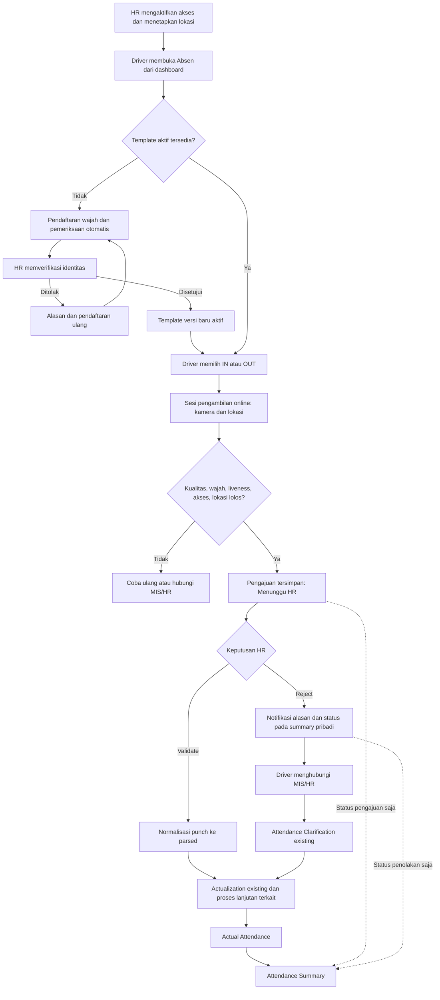

# PRD — Absensi Wajah Driver

| Atribut | Nilai |
|---|---|
| Versi | 1.0 — rancangan implementasi |
| Tanggal | 17 September 2026 |
| Project | Apps PT. Mutu Gading Tekstil |
| Pemilik domain | Hr; integrasi Mis; antarmuka personal SelfService |
| Status | Kebutuhan hasil diskusi dirangkum; parameter pilot belum menjadi konfigurasi produksi |
| Dokumen terkait | [Rancangan teknis dan database](technical-design.md), [SDK dan evaluasi](SDK.md) |

## 1. Tujuan dan keputusan utama

Menyediakan absensi IN/OUT untuk driver yang diberikan akses oleh HR, menggunakan kamera web, verifikasi wajah perusahaan, liveness, dan lokasi yang ditetapkan per karyawan. Setiap punch wajib diperiksa HR sebelum masuk perhitungan kehadiran existing.

Keputusan hasil diskusi yang menjadi dasar implementasi:

1. Tidak menggunakan biometrik bawaan Android/iPhone. Foto dan template wajah dikelola perusahaan.
2. Web responsif merupakan kanal awal: browser Android, iPhone, dan desktop yang didukung. Native app tidak termasuk fase ini.
3. HR menentukan karyawan yang mendapatkan akses, lokasi yang diperbolehkan, serta status aktif/nonaktif.
4. Pertama kali membuka fitur, karyawan harus mendaftarkan wajah. HR mengesahkan identitas sebelum template dapat dipakai.
5. Setiap absensi memeriksa kualitas wajah, kecocokan identitas 1:1, liveness, akses, dan lokasi.
6. Bukti asli driver disimpan pada tabel sendiri. Pengajuan tidak dikirim ke `hm_att_logs` dan tidak dibuat menjadi XML mesin.
7. Sesudah HR menyetujui: normalisasi ke `hm_att_parsed_logs` → actualization existing → `hm_att_actual` → Attendance Summary.
8. Pengambilan OUT dan sesi berikutnya tidak menunggu persetujuan HR. HR boleh memvalidasi besok atau setelahnya.
9. Tidak membandingkan jam punch dengan jadwal untuk mengizinkan pengambilan. Jadwal, shift, lembur, serta anomali tetap diproses oleh actualization existing.
10. Status dan hasil kehadiran dilihat melalui Attendance Summary personal di SelfService. Akses MIS/HR untuk operasional tetap tersedia.
11. Penolakan disertai alasan dan notifikasi. Driver menghubungi MIS/HR untuk Attendance Clarification existing; fitur ini tidak membuat proses klarifikasi mandiri baru.
12. Tombol **Absen** langsung tersedia di dashboard utama dan sidebar bagi pengguna eligible. Pengguna tidak harus membuka landing page SelfService terlebih dahulu.

Web tidak memberi jaminan lokasi atau input kamera bebas manipulasi. PWA tidak menghilangkan keterbatasan tersebut. Target produk adalah kontrol berlapis, bukti yang dapat diaudit, dan pemeriksaan HR; bukan klaim anti-fake-GPS 100%. Detail teknis dan sumber ada pada dokumen SDK.

## 2. Ruang lingkup

### Termasuk

- Master lokasi dan radius; daftar karyawan per lokasi.
- Master akses per karyawan; penempatan banyak lokasi dengan masa berlaku opsional.
- Pendaftaran, pemeriksaan HR, penggantian, dan pencabutan template wajah.
- Pengambilan kamera online; pemeriksaan wajah/liveness/lokasi; bukti privat.
- Pencegahan pengiriman ulang, urutan IN/OUT, dan pengecualian sesi tidak lengkap.
- Antrean validasi HR dan detail bukti; Validate/Reject per punch.
- Integrasi reliable ke parsed dan perhitungan ulang actual tanggal yang terdampak.
- Attendance Summary personal dan indikator pengajuan pada summary operasional.
- Notifikasi existing; audit; hubungan ke Attendance Clarification existing.
- Monitoring kegagalan, retry, retensi file, pengujian Oracle/SQLite dan browser.

### Tidak termasuk fase pertama

- Native Android/iOS, pengambilan offline, impor foto galeri sebagai absensi, pengajuan waktu mundur.
- Pencarian identitas 1:N seluruh karyawan; analisis umur, gender, emosi, atau etnis.
- Approval absensi otomatis tanpa HR; approval hierarki baru; bulk approval tanpa membaca bukti.
- Mesin payroll/actualization baru; tabel actual khusus driver; penggantian sistem absensi mesin.
- Peta/geocoding berbayar, pelacakan lokasi terus-menerus, integrasi penugasan kendaraan yang belum tersedia.
- Perubahan seluruh modul SelfService atau penghapusan fitur klarifikasi yang sudah dipakai pengguna lain.

## 3. Peran dan otorisasi

| Aktor | Wewenang |
|---|---|
| Driver eligible | Mendaftarkan wajah sendiri, IN/OUT sendiri, melihat summary/detail/foto milik sendiri |
| HR pengelola | CRUD master lokasi, akses, dan penempatan; mengatur pendaftaran ulang |
| HR pemeriksa wajah | Mengesahkan atau menolak pendaftaran melalui pemeriksaan identitas terpercaya |
| HR pemeriksa punch | Membaca bukti sesuai cakupan organisasi, Validate/Reject, melihat status integrasi |
| MIS/HR klarifikasi | Menangani koreksi melalui Attendance Clarification existing |
| Operator teknis | Melihat kesehatan layanan dan retry terotorisasi; tidak otomatis mendapat hak melihat biometrik |

Permission halaman, permission tindakan, eligibility karyawan, kepemilikan data, dan cakupan organisasi merupakan pemeriksaan berbeda. Super Admin pada halaman personal tetap hanya melihat dirinya sendiri. Halaman administratif memakai scope HR existing.

Tidak boleh menyetujui pendaftaran atau punch sendiri. Pemberian akses harus diperiksa server, tidak cukup menyembunyikan menu.

## 4. Pembagian halaman

| Area | Halaman | Fungsi |
|---|---|---|
| Dashboard utama | Shortcut Absen | Langsung masuk halaman absensi atau pendaftaran wajah |
| SelfService | Face Attendance / Absensi Wajah | Panduan kamera, status sesi, IN/OUT, lokasi eligible, hasil pengiriman |
| SelfService | Face Enrollment / Daftarkan Wajah | Pendaftaran awal, status review, alasan penolakan, daftar ulang yang diizinkan |
| SelfService | Attendance Summary / Absensi Saya | Kehadiran pribadi dan status pengajuan; detail dibuka dari baris/sel |
| Hr | Master Attendance Location | CRUD titik, radius, status, daftar pengguna |
| Hr | Master Face Attendance Access | Akses karyawan, penempatan lokasi, masa berlaku, status wajah |
| Hr | Face Enrollment Review | Antrean pemeriksaan identitas dan riwayat versi wajah |
| Hr | Face Attendance Validation | Antrean punch, bukti, keputusan, status integrasi, retry terotorisasi |
| Mis | Attendance Clarification existing | Pembuatan dan penyelesaian klarifikasi oleh petugas |

Gunakan UI module, lalu Flux Pro, layout/breadcrumb existing, Tailwind dark mode, pagination dan loading state. Navigasi memakai `href`/full reload, bukan `wire:navigate`. Label sidebar, judul halaman, dan breadcrumb harus konsisten. Detail memakai drawer/modal dengan deep link dari summary/antrean; tidak perlu menu detail yang berdiri sendiri.

## 5. Alur end-to-end

### 5.1 Aktivasi dan pendaftaran awal

1. HR memilih karyawan existing menggunakan ID karyawan, mengaktifkan akses, menetapkan lokasi dan masa berlaku. Fase pertama khusus driver yang ditunjuk; jangan mengandalkan pencarian teks jabatan `driver` sebagai otorisasi.
2. Permission akses disediakan melalui mekanisme terkontrol. Pengguna yang eligible melihat tombol Absen; penempatan yang belum lengkap menampilkan arahan menghubungi HR.
3. Jika belum ada template aktif, halaman mengarahkan ke pendaftaran. Nama/NIK diambil dari akun dan tidak dapat diganti.
4. Tampilkan tujuan pemrosesan dan kebijakan penyimpanan; catat versi pemberitahuan yang diakui pengguna.
5. Kamera memeriksa kualitas dan liveness. Tidak ada pencocokan identitas pada enrollment awal karena belum ada referensi terpercaya.
6. Setelah capture lolos, pendaftaran masuk antrean HR. Identitas diperiksa langsung atau terhadap referensi perusahaan yang terpercaya. Foto profil existing tidak otomatis menjadi enrollment yang sah.
7. HR menyetujui → aktifkan satu versi template secara atomik → notifikasi pengguna. HR menolak → alasan wajib → pengguna dapat mendaftar ulang.
8. Penggantian template membuat versi baru; tidak menimpa bukti lama. Template lama tetap berlaku sampai pergantian disetujui, kecuali HR mencabutnya karena risiko identitas. Template dicabut langsung memblokir capture baru.

### 5.2 Pengambilan punch

1. Server memeriksa akun aktif, permission, akses aktif, template aktif, penempatan lokasi, dan konteks IN/OUT.
2. Server membuat capture ID, nonce sekali pakai, expiry, jenis punch, dan snapshot versi aturan/template. Tidak ada pilihan karyawan dari client.
3. Kamera menampilkan panduan satu wajah, pencahayaan, ketajaman dan posisi. Lokasi diminta hanya saat penggunaan fitur.
4. Bukti dikirim dalam batas waktu menggunakan multipart. Waktu terima bukti lengkap oleh server menjadi waktu punch online; waktu perangkat hanya metadata. Retry yang mengirim bukti identik tidak mengganti waktu tersebut.
5. Server memverifikasi ulang akses/master yang relevan ketika finalisasi. Perubahan yang menghilangkan eligibility selama capture membuat sesi dibatalkan secara jelas.
6. Layanan wajah memeriksa kualitas, identitas dan liveness pada bukti yang sama. Status belum selesai ditampilkan sebagai **Memeriksa**, bukan **Menunggu HR**.
7. Jika lolos semua syarat, simpan pengajuan dan bukti dengan status Menunggu HR. Tampilkan nomor referensi dan tautan Absensi Saya.
8. Jika gagal, tampilkan arahan spesifik yang aman; simpan audit percobaan. Pengguna boleh mencoba ulang sesuai rate limit. Kegagalan berulang diselesaikan lewat MIS/HR, tidak diberi tombol bypass wajah/lokasi.

### 5.3 Urutan IN/OUT tanpa pemeriksaan jadwal

| Kondisi | Perilaku yang dirancang |
|---|---|
| Belum ada sesi terbuka | IN tersedia |
| IN sudah dikirim, Menunggu HR atau Disetujui | IN normal kedua ditolak; OUT tersedia |
| Capture sebelumnya masih diproses | Tampilkan status dan pulihkan proses yang sama; jangan membuat capture punch paralel |
| OUT sudah dikirim | OUT ulang untuk sesi itu ditolak |
| IN/OUT lengkap, masih Menunggu HR | IN sesi berikutnya tersedia, termasuk pada tanggal yang sama |
| IN sebelum tengah malam, OUT setelah tengah malam | Tetap satu pasangan pengambilan; actualization menentukan tanggal kerja |
| IN mesin tersedia | OUT web dapat merujuk punch mesin yang sesuai; sumber tetap dipertahankan |
| OUT tanpa IN yang ditemukan | Pengajuan pengecualian beralasan dapat diterima jika wajah/lokasi lolos; tandai MissingIn untuk HR |
| Sesi lama belum OUT tetapi driver mulai pekerjaan baru | Pengajuan IN sesi baru beralasan; tandai PreviousSessionIncomplete; tidak membuat OUT palsu |
| IN/OUT ditolak HR | Tidak menghapus bukti atau mengembalikan urutan seolah belum pernah dikirim; klarifikasi oleh MIS/HR |

Pengecualian urutan tidak berarti pengecualian pemeriksaan wajah/lokasi. Tidak ada batas satu pasangan per hari. Sesi pengambilan merupakan alat UX; tidak menghitung jam kerja, shift, atau upah.

### 5.4 Validasi HR dan persetujuan terlambat

- HR melihat identitas, foto bukti, foto referensi terotorisasi, waktu server, lokasi dan radius, hasil verifikasi, pasangan punch, serta punch mesin yang sudah tersedia.
- Keputusan per punch. IN boleh ditolak sementara OUT disetujui; sistem tidak membuat pasangan fiktif. Kondisi tersebut terlihat sebagai anomali/incomplete sesuai engine existing.
- Alasan wajib untuk Reject. Validate/Reject dilindungi row lock atau compare-and-swap versi; keputusan petugas lain tidak tertimpa.
- Validate menyimpan keputusan dan pekerjaan integrasi dalam satu transaksi. Pengiriman ulang tidak membuat parsed ganda.
- HR boleh memvalidasi keesokan hari. Waktu punch tetap waktu server menerima capture sebelumnya; waktu keputusan disimpan terpisah.
- Pekerjaan setelah commit memproses tanggal terdampak dan tetangganya sesuai logika shift existing, bukan hanya tanggal keputusan.
- Access yang dinonaktifkan sesudah pengajuan tidak otomatis menghapus pengajuan lama. HR menilai bukti snapshot dan alasan penonaktifan. Perubahan master masa kini tidak dihitung ulang sebagai bukti masa lalu.
- Tidak ada toggle biasa dari Approved ke Rejected setelah integrasi. Koreksi memakai Attendance Clarification existing. Jalur pembatalan khusus, jika dibutuhkan, memerlukan desain audit/ignored parsed/recalculation tersendiri.

### 5.5 Penolakan dan Attendance Clarification

- Notifikasi: `Absensi masuk/keluar Anda ditolak HR`, waktu punch, alasan singkat, tautan ke summary personal tanggal tersebut dengan detail pengajuan terbuka.
- Detail menampilkan **Hubungi MIS/HR untuk klarifikasi absensi ini**. Tidak ada tombol membuat klarifikasi mandiri dari fitur baru.
- Petugas membuka Attendance Clarification existing dan menghubungkan satu atau beberapa punch sebagai konteks. Pengecualian yang tidak menghasilkan punch dapat merujuk capture gagal.
- Klarifikasi mengikuti status/otorisasi existing sampai Released. Approved pada workflow klarifikasi belum dianggap final.
- Punch ditolak tetap Ditolak. Label tambahan `Diselesaikan melalui klarifikasi` hanya setelah hasil final benar-benar diterapkan.
- Tidak mengambil foto baru untuk mengganti bukti kehadiran masa lalu. Tidak memasukkan punch ditolak ke parsed sebagai efek samping klarifikasi.
- Race antara keputusan HR, linking klarifikasi, dan integrasi harus mencegah koreksi ganda. Detail teknis menjelaskan aturan finalitas.

## 6. Attendance Summary personal

Bangun entry personal di SelfService dengan menggunakan layanan/rendering summary existing melalui kontrak, bukan memindahkan begitu saja komponen administratif yang mempunyai filter organisasi, ekspor lintas departemen, dan re-analyze.

- Identitas scope selalu berasal dari `auth()->user()->hmemd_sys_id`; input karyawan di URL, Livewire, ekspor, maupun job tidak dapat memperluas scope.
- Default rentang periode memakai `PeriodDateRangeHelper::currentAsIsoStrings()`.
- Actual IN/OUT/jam tetap berasal dari `hm_att_actual` dan layanan summary existing.
- Status Menunggu HR, Ditolak, Disetujui-belum-diproses dibaca dari tabel driver sebagai informasi tambahan, tidak menambah jam kerja.
- Tanggal tanpa actual tetap dapat menampilkan pengajuan. Untuk lintas tengah malam, tampilkan waktu kalender sebenarnya dan tautan tanggal kerja hasil actualization; jangan menghitung pengajuan dua kali.
- Beberapa sesi/punch per tanggal ditampilkan sebagai daftar detail, bukan satu status yang menimpa semua pengajuan.
- Riwayat tetap bisa dibaca ketika akses capture dinonaktifkan, selama akun masih boleh login dan memiliki permission personal summary.
- Ekspor personal bukan syarat MVP. Jika ditambahkan, scope dipastikan ulang di worker dan NIK memakai `FormatsNikForExport`.
- Re-analyze dan koreksi administratif tidak tersedia pada halaman personal.

Contoh sebelum/sesudah persetujuan:

| Kondisi | Actual IN | Actual OUT | Status tambahan |
|---|---|---|---|
| Capture valid, HR belum memeriksa | — | — | IN 07.02 dan OUT 19.00 Menunggu HR |
| HR menolak IN, menyetujui OUT | Sesuai hasil engine | Sesuai hasil engine | IN ditolak: alasan; OUT disetujui |
| Seluruh proses berhasil | Dari actual existing | Dari actual existing | Referensi bukti dan keputusan dapat dibuka |

## 7. Aturan lokasi

- Lokasi didefinisikan sebagai titik latitude/longitude dan radius meter. Penempatan many-to-many karyawan–lokasi; IN/OUT menggunakan daftar yang sama pada fase pertama.
- Penempatan boleh memiliki rentang berlaku untuk tugas sementara. Radius berbeda dibuat pada master lokasi berbeda; tidak perlu override radius per karyawan pada MVP.
- Backend menghitung jarak, menilai umur sampel, serta membatasi akurasi yang diperbolehkan. Jangan memperbesar radius otomatis berdasarkan akurasi yang buruk.
- Usulan pilot: hasil yang jelas di dalam area diterima, batas area/akurasi buruk meminta sampel ulang, di luar area ditolak. Ambang dan aturan batas dijelaskan di rancangan teknis dan diuji di lapangan.
- Simpan snapshot nama/koordinat/radius lokasi terpilih, koordinat yang dilaporkan, akurasi, jarak, dan versi kebijakan.
- Tidak ada lokasi `bebas` atau override oleh driver. Jika lokasi tugas belum tersedia, HR mengatur master/penempatan atau MIS/HR menangani klarifikasi.
- Disable lokasi memblokir capture baru di lokasi tersebut. Hapus master yang telah dipakai berarti archive, bukan menghapus referensi historis.

## 8. Status dan komunikasi pengguna

| Kejadian | Pesan utama |
|---|---|
| Belum enrollment | Daftarkan wajah sebelum menggunakan absensi |
| Enrollment pending | Pendaftaran wajah sedang diperiksa HR |
| Kualitas buruk | Foto belum cukup jelas; perbaiki cahaya/posisi dan coba lagi |
| Verifikasi tidak lolos | Verifikasi belum berhasil; coba lagi atau hubungi MIS/HR |
| Layanan tidak tersedia | Pemeriksaan sedang tidak tersedia; pengajuan belum berhasil |
| Punch diterima | Pengajuan tersimpan dan menunggu validasi HR |
| Approved, job pending | Disetujui HR — sedang diproses ke attendance |
| Job selesai, actual beranomali | Sudah diproses — terdapat anomali kehadiran; lihat detail |
| Rejected | Ditolak HR — alasan dan arahan menghubungi MIS/HR |

Gunakan `BaseNotification` (database+broadcast), private channel existing, serta toast untuk respons langsung. Database notification merupakan riwayat; websocket bukan syarat agar keputusan tersimpan. Jangan menaruh foto, embedding, skor rinci, atau lokasi lengkap pada payload broadcast. Detail dibuka dengan otorisasi ulang.

## 9. Foto, data biometrik, dan operasional

- Gunakan `minio_private` yang sudah dikonfigurasi; local private dapat dipakai di development. Jangan menggunakan public disk, URL permanen, atau BLOB foto di Oracle.
- Foto arsip pilot: JPEG sisi panjang sekitar 640–960 px, target 80–150 KB; kualitas disesuaikan hasil uji. Batas input verifikasi berbeda dari ukuran arsip.
- Foto arsip dipilih dari capture yang diverifikasi. Jangan membuat liveness dari video A tetapi menyimpan foto B.
- Retensi sementara yang diusulkan: foto punch 180 hari, media capture gagal 7 hari, upload yatim maksimal 24 jam. Pengajuan pending/sengketa menahan penghapusan. Nilai ini perlu ditetapkan perusahaan sebelum produksi.
- Simpan template terenkripsi, versi model dan kebijakan. Pembatasan akses/foto dicatat; embedding tidak ditulis ke log atau activity diff.
- Untuk 100 driver × 2 punch × 100 KB: sekitar 20 MB/hari atau 7,3 GB/tahun, belum termasuk enrollment, bahan liveness, percobaan ulang, versi objek, dan backup.
- Layani inference melalui proses terpisah dengan concurrency terbatas. Kapasitas CPU/GPU ditentukan benchmark; dokumentasi ini tidak mengklaim hardware tertentu pasti cukup.
- Dashboard operasional memantau antrean HR tertua, verification error, dispatch gagal, perhitungan ulang gagal, dan storage.

## 10. Kriteria penerimaan

| ID | Skenario wajib |
|---|---|
| AC-01 | Tanpa akses, tombol tidak muncul dan request langsung ditolak server |
| AC-02 | Akses aktif tanpa template mengarah ke enrollment, bukan membuka punch |
| AC-03 | Enrollment lolos otomatis belum mengaktifkan wajah sebelum disetujui HR |
| AC-04 | Foto gelap/buram, banyak wajah, identitas berbeda, dan liveness gagal tidak menjadi pengajuan HR normal |
| AC-05 | Wajah, foto bukti, lokasi, nonce, jenis punch dan pengguna terikat satu sesi; replay ditolak |
| AC-06 | Disable akses/template/penempatan saat capture berlangsung memblokir finalisasi |
| AC-07 | OUT dan IN sesi berikutnya tetap dapat dilakukan ketika pengajuan sebelumnya Menunggu HR |
| AC-08 | Tidak ada validasi jam schedule sebagai syarat pengambilan; lintas tengah malam dan multi-sesi didukung |
| AC-09 | Dua tab, retry jaringan, dua reviewer dan retry worker tidak menghasilkan punch/keputusan/parsed ganda |
| AC-10 | Pengajuan driver tidak membuat `hm_att_logs`; Approved menghasilkan parsed dengan referensi sumber unik |
| AC-11 | Approval besok mempertahankan waktu punch dan memperbarui actual tanggal kerja terdampak |
| AC-12 | Penolakan wajib alasan, tidak menghasilkan parsed, terlihat di summary dan notifikasi personal |
| AC-13 | Summary menampilkan pending/rejected meskipun actual belum ada; tidak memasukkannya sebagai jam kerja |
| AC-14 | Karyawan tidak dapat melihat foto/detail/summary karyawan lain melalui URL, Livewire, atau ekspor |
| AC-15 | Klarifikasi existing berhasil menangani kasus belum ada actual dan tidak menghasilkan koreksi/punch ganda |
| AC-16 | Kegagalan MinIO, verifier, queue, dan actualization ditampilkan sesuai tahap; tidak dilaporkan sukses palsu |
| AC-17 | Parser mesin, manual attendance, source badges, laporan dan actualization existing tidak mengalami regresi |
| AC-18 | Migration SQLite dan staging Oracle lulus termasuk nullability parsed, CLOB dan unique constraints |
| AC-19 | Chrome Android, Safari iOS, serta browser desktop target lulus capture/permission/error handling |
| AC-20 | Retensi menghapus media yang eligible tanpa menghapus bukti yang masih pending/sengketa |
| AC-21 | Liveness dan face matching lulus evaluasi pilot yang disepakati; tidak mengandalkan demo satu orang |
| AC-22 | Menu/breadcrumb/permission konsisten dan shortcut dashboard langsung menuju fitur |

## 11. Tahapan implementasi

1. **Verifikasi teknis:** pilih/pin model berlisensi sesuai penggunaan, uji wajah/liveness dan kapasitas, inspeksi DDL Oracle live melalui staging/read-only, identifikasi kebijakan penutupan periode.
2. **Fondasi:** migrations/sequence, repository/contract, permissions/menu, akses/lokasi, private evidence storage dan audit.
3. **Enrollment:** sesi capture, layanan wajah, approval identitas, template versioning, notification.
4. **Pengajuan:** kamera web, lokasi, aturan IN/OUT, deduplication, pengajuan menunggu HR.
5. **HR dan integrasi:** review, durable dispatch, parsed source, actualization dan pemulihan kegagalan.
6. **Summary dan klarifikasi:** entry personal, status overlay, deep links, referensi klarifikasi dan kasus actual belum ada.
7. **Pilot terbatas:** driver/perangkat nyata, inspeksi hasil HR, skenario serangan dan kegagalan, retensi, backup/restore, monitoring.
8. **Peluncuran:** feature flag per kelompok, pelatihan HR/MIS/driver, runbook dan rollback operasional.

Fitur produksi tetap nonaktif jika lisensi artifact, hasil liveness, aturan periode, atau kesiapan operasional belum dipenuhi. Implementasi halaman/database dapat berjalan tanpa menunggu seluruh hasil pilot dengan verifier fake khusus test, yang tidak boleh digunakan di production.

## 12. Keputusan konfigurasi yang belum final

Ini bukan pertanyaan yang menghalangi penyusunan PRD. Nilainya harus dicatat sebelum produksi:

- Jumlah driver, perkiraan pengambilan bersamaan, perangkat/browser minimum, kapasitas server.
- Model/bobot final, ambang pencocokan, liveness, kualitas dan bukti pengujian.
- Radius setiap titik, batas akurasi dan umur sampel lokasi sesuai lapangan.
- Retensi resmi, akses bukti, penanganan sengketa, dan penghapusan template setelah akses berakhir.
- SLA HR dan penanganan pengajuan tertunda saat penutupan periode. Implementasi lock periode existing belum terkonfirmasi dari inspeksi ini; jangan mengasumsikan sudah ada.
- Daftar peran/permission petugas; pengesahan identitas awal; penerimaan risiko browser terkait lokasi/kamera.
- Kebijakan pengecualian urutan IN/OUT beralasan, cooldown anti-spam, dan akses saat template sedang diganti.

## 13. Dasar pemeriksaan repository

Dokumen ini dibuat dari pembacaan kode, bukan introspeksi database produksi. Temuan penting:

- `Modules/SelfService` sudah ada, meskipun overview lama project hanya menyebut tujuh modul.
- `hm_adms_face` hanya menyimpan penanda enrollment mesin; `hm_adms_userpic` menyimpan foto referensi mesin. Keduanya tidak otomatis menjadi template atau enrollment web yang disahkan.
- Migration awal parsed berada di Mis, sedangkan model/repository parsed berada di Hr.
- Migration parsed mendefinisikan `HMAPL_HMATL_SYS_ID` sebagai non-null; jalur baru memerlukan migration additive dan perubahan nullability.
- `AttendanceSummary` existing adalah komponen administratif dengan ekspor/re-analyze, bukan aman dipindahkan mentah-mentah ke personal.
- `AttendanceClarificationService::recalculateAttendanceForClarification()` melewati recalc bila actual belum ada.
- Scheduler actual harian saja tidak cukup sebagai jaminan pengajuan yang disetujui terlambat diproses segera.
- `PostAttendanceReanalysisJob` existing menangkap exception tanpa melempar ulang dan memanggil sebagian command per rentang tanggal, bukan seluruhnya per karyawan. Integrasi baru memerlukan pelaporan hasil yang dapat dipercaya dan scope yang sesuai.
- `minio_private`, `BaseNotification`, `SysIdHelper`, dan `PeriodDateRangeHelper` dapat digunakan ulang.
- `approval_access` existing berisi allowlist permission MIS. Tidak boleh ditempel begitu saja ke review HR karena dapat menolak petugas yang sebenarnya berwenang.

Rincian perubahan, referensi file, dan mitigasinya terdapat dalam rancangan teknis.
