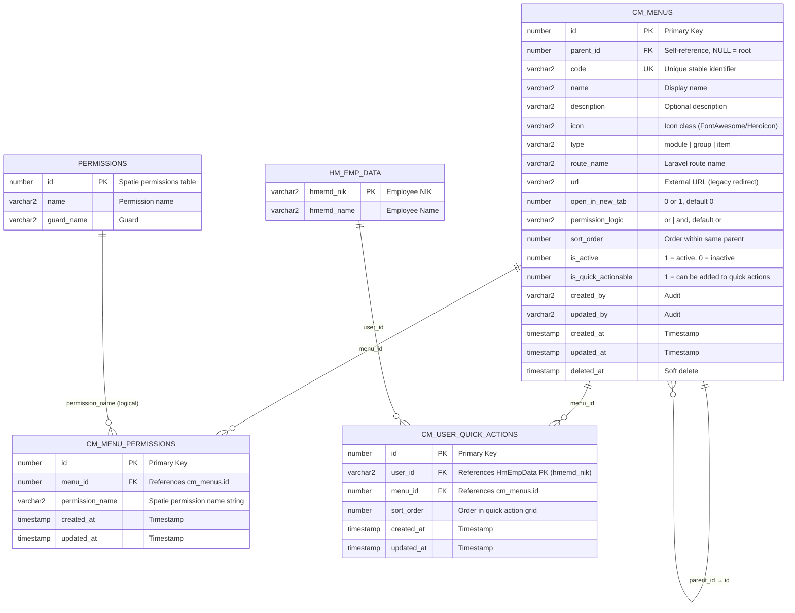
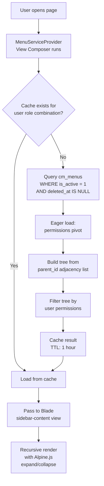
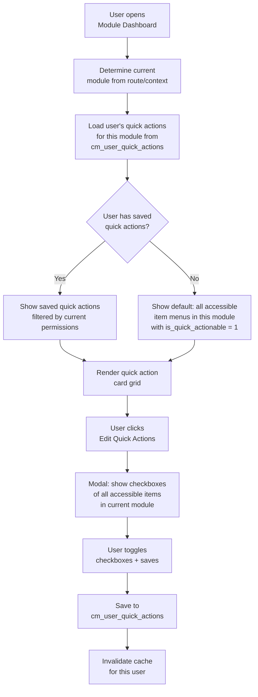
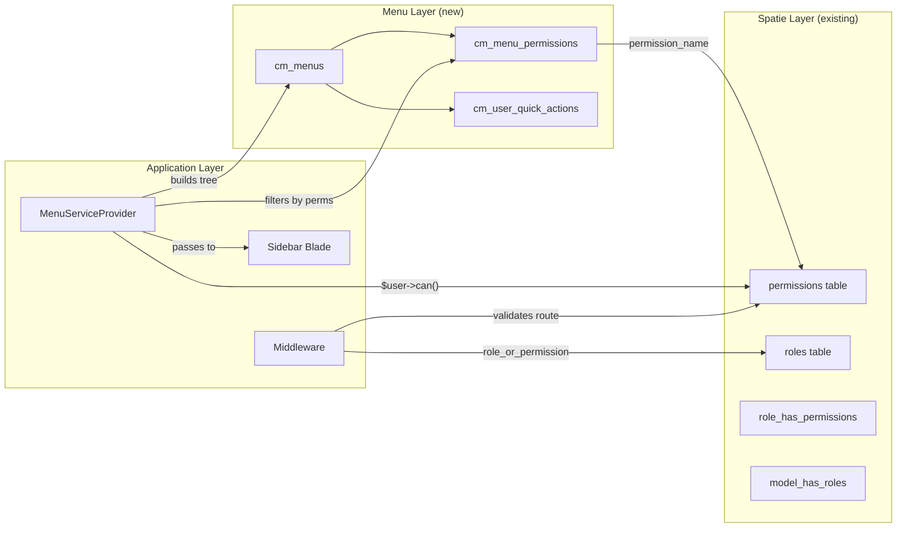
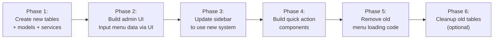

# PRD: Dynamic Menu System — Apps Mutu Gading

> **Author:** AI Assistant  
> **Date:** 2026-04-01  
> **Status:** Draft — Awaiting Review  
> **Module:** Core  
> **Schema:** MGTHRIS (Oracle)

---

## 1. Executive Summary

Membangun sistem menu dinamis yang **unified, scalable, dan secure** untuk `apps.mutugading.com` yang menggantikan dua sistem menu paralel yang ada saat ini. Sistem baru ini akan:

1. **Menyatukan sidebar navigation** dengan satu sumber data hierarkis (self-referencing tree)
2. **Terintegrasi penuh dengan Spatie Permission** — menu visibility dikontrol oleh permission, bukan group/role hardcoded
3. **Mendukung per-user Quick Action** yang dapat dikustomisasi per module di halaman dashboard
4. **Menyediakan Admin UI** di module Core untuk full CRUD menu management (ordering, icon, permission assignment, activate/deactivate)
5. **Mendukung 3-4+ level hierarchy** yang unlimited depth tanpa perubahan schema

---

## 2. Problem Statement

### 2.1 Current State Analysis

Saat ini ada **dua sistem menu yang berjalan paralel** dengan masalah masing-masing:

#### System A: MGTAPPS Legacy (`oracle_mgtapps` schema)

| Table | Purpose |
|---|---|
| `mst_menus` | Hierarki menu (self-referencing via `menu_id_parent`) |
| `mst_groups` | Grup user |
| `mst_group_menus` | Pivot: grup → menu |
| `mst_group_users` | Pivot: grup → user |
| `mst_user_menus` | Direct: user → menu |

**Masalah:**
- ❌ Berada di schema `MGTAPPS` yang shared dengan app lain
- ❌ Akses dikontrol via **group-based system**, bukan Spatie permission
- ❌ Tidak ada kolom `icon`, `permission`, atau `route_name`
- ❌ URL mengarah ke app legacy (`mgtapps.mutugading.com:4433/Webapps/...`)
- ❌ Tidak bisa di-extend untuk kebutuhan apps baru

#### System B: Dashboard Menu (`oracle_mgthris` schema)

| Table | Purpose |
|---|---|
| `dashboard_menu_categories` | Kategori/tab menu dashboard |
| `dashboard_menu_items` | Item menu dalam kategori (self-referencing via `parent_id`) |

**Masalah:**
- ⚠️ Sudah lebih baik (punya `permission`, `icon`, `route`, `parent_id`)
- ❌ Hanya digunakan untuk section "HRIS Menu" di sidebar, bukan sebagai sistem utama
- ❌ Tidak ada fitur quick action per user
- ❌ Terikat oleh `category_id` yang membatasi fleksibilitas hierarki
- ❌ Tidak ada `code` untuk referensi stabil internal

#### Quick Actions: Hardcoded

- ❌ Quick actions saat ini **hardcoded langsung di Blade template** (`_quick-actions.blade.php`)
- ❌ Setiap module punya quick action sendiri yang tidak bisa di-customize user
- ❌ Tidak ada mekanisme user preference

### 2.2 Target State

Satu sistem menu unified di schema `MGTHRIS` yang:
- ✅ Mendukung unlimited depth hierarchy
- ✅ Permission-based visibility (Spatie integration)
- ✅ Multiple permissions per menu (AND/OR logic)
- ✅ Per-user quick action customization per module
- ✅ Admin management UI (CRUD, drag & drop ordering)
- ✅ Icon per menu, active/inactive toggle, soft delete
- ✅ Cache-friendly untuk performa optimal
- ✅ Backward compatible — legacy web cukup jadi link redirect

---

## 3. ERD Design

### 3.1 Entity Relationship Diagram



### 3.2 Table Specifications

---

#### Table 1: `CM_MENUS` — Menu Hierarchy (Self-Referencing Tree)

Menyimpan **seluruh hierarki menu** dalam satu tabel — dari module group (Level 0) sampai leaf item (Level 3-4+).

| Column | Type | Nullable | Default | Description |
|---|---|---|---|---|
| `id` | `NUMBER` | NO | — | Primary Key (via SysIdHelper atau sequence) |
| `parent_id` | `NUMBER` | YES | `NULL` | FK → `cm_menus.id`. NULL = root node (module) |
| `code` | `VARCHAR2(150)` | NO | — | **Unique stable identifier**. Format: `{module}.{group}.{subgroup}.{item}`. Contoh: `hr.employee.master.religion` |
| `name` | `VARCHAR2(100)` | NO | — | Display name yang ditampilkan di UI |
| `description` | `VARCHAR2(500)` | YES | `NULL` | Deskripsi singkat (untuk admin panel & tooltip) |
| `icon` | `VARCHAR2(100)` | YES | `NULL` | CSS icon class. Contoh: `fas fa-users`, `heroicon-o-cog` |
| `type` | `VARCHAR2(20)` | NO | `'item'` | Tipe node: `module`, `group`, `item` |
| `route_name` | `VARCHAR2(255)` | YES | `NULL` | Laravel named route. Contoh: `dashboard.module-hr.master-schedule.index` |
| `url` | `VARCHAR2(500)` | YES | `NULL` | External URL untuk redirect (legacy web). Mutually exclusive dengan `route_name` |
| `open_in_new_tab` | `NUMBER(1)` | NO | `0` | 1 = open in new tab (untuk external/legacy links) |
| `permission_logic` | `VARCHAR2(3)` | NO | `'or'` | Logic untuk multiple permissions: `or` = user butuh salah satu, `and` = user butuh semua |
| `sort_order` | `NUMBER` | NO | `0` | Urutan render dalam satu parent yang sama |
| `is_active` | `NUMBER(1)` | NO | `1` | 1 = aktif (tampil di sidebar), 0 = inactive (hidden tapi data tetap ada) |
| `is_quick_actionable` | `NUMBER(1)` | NO | `1` | 1 = menu ini bisa dipilih sebagai quick action oleh user |
| `created_by` | `VARCHAR2(100)` | YES | `NULL` | NIK user yang membuat |
| `updated_by` | `VARCHAR2(100)` | YES | `NULL` | NIK user yang terakhir mengubah |
| `created_at` | `TIMESTAMP(6)` | YES | `CURRENT_TIMESTAMP` | |
| `updated_at` | `TIMESTAMP(6)` | YES | `CURRENT_TIMESTAMP` | |
| `deleted_at` | `TIMESTAMP(6)` | YES | `NULL` | Soft delete timestamp |

**Indexes:**
- `PK_CM_MENUS` — PRIMARY KEY (`id`)
- `FK_CM_MENUS_PARENT` — FOREIGN KEY (`parent_id`) → `cm_menus.id` ON DELETE SET NULL
- `UQ_CM_MENUS_CODE` — UNIQUE (`code`) WHERE `deleted_at IS NULL`
- `IX_CM_MENUS_PARENT_SORT` — INDEX (`parent_id`, `sort_order`) — untuk query tree building
- `IX_CM_MENUS_TYPE_ACTIVE` — INDEX (`type`, `is_active`) — untuk filter cepat

**Constraints:**
- `CHK_CM_MENUS_TYPE` — CHECK (`type` IN (`'module'`, `'group'`, `'item'`))
- `CHK_CM_MENUS_PERM_LOGIC` — CHECK (`permission_logic` IN (`'or'`, `'and'`))
- `CHK_CM_MENUS_ROUTE_URL` — Validasi di application level: `route_name` dan `url` tidak boleh keduanya terisi

> [!IMPORTANT]
> **Kenapa `code` penting?**
> `code` adalah identifier stabil yang tidak berubah meskipun `name` diubah. Digunakan untuk:
> - Cache key generation
> - Referensi internal di kode (misal conditional rendering per module)
> - Audit trail yang konsisten
> - Seeder/migration yang reproducible

---

#### Table 2: `CM_MENU_PERMISSIONS` — Menu-Permission Pivot

Menghubungkan menu dengan satu atau lebih Spatie permission. Ini memungkinkan skenario:
- Menu tanpa permission → visible untuk semua authenticated user
- Menu dengan 1 permission → visible jika user punya permission tersebut
- Menu dengan banyak permission + `permission_logic = 'or'` → visible jika punya salah satu
- Menu dengan banyak permission + `permission_logic = 'and'` → visible jika punya semua

| Column | Type | Nullable | Default | Description |
|---|---|---|---|---|
| `id` | `NUMBER` | NO | — | Primary Key |
| `menu_id` | `NUMBER` | NO | — | FK → `cm_menus.id` ON DELETE CASCADE |
| `permission_name` | `VARCHAR2(255)` | NO | — | Nama permission Spatie (e.g., `hr.master-schedule.view`) |
| `created_at` | `TIMESTAMP(6)` | YES | `CURRENT_TIMESTAMP` | |
| `updated_at` | `TIMESTAMP(6)` | YES | `CURRENT_TIMESTAMP` | |

**Indexes:**
- `PK_CM_MENU_PERMS` — PRIMARY KEY (`id`)
- `UQ_CM_MENU_PERMS_COMBO` — UNIQUE (`menu_id`, `permission_name`)
- `IX_CM_MENU_PERMS_PERM` — INDEX (`permission_name`) — untuk reverse lookup

> [!NOTE]
> **Kenapa `permission_name` (string) bukan FK ke `permissions.id`?**
> 1. Spatie Permission menggunakan **name-based lookup** dan cache by name
> 2. `$user->can('permission_name')` adalah standard — tidak perlu resolve ID
> 3. Menghindari tight coupling FK cross-table yang bisa menimbulkan masalah saat permission di-rename/delete
> 4. Lebih readable saat debugging database langsung
> 5. Validasi integritas dilakukan di **application level** (service/repository)

---

#### Table 3: `CM_USER_QUICK_ACTIONS` — Per-User Quick Action Preferences

Menyimpan preferensi quick action **per user**. Setiap user bisa memilih menu mana yang ingin ditampilkan sebagai quick action card di halaman dashboard module tertentu.

| Column | Type | Nullable | Default | Description |
|---|---|---|---|---|
| `id` | `NUMBER` | NO | — | Primary Key |
| `user_id` | `VARCHAR2(50)` | NO | — | Employee NIK (HmEmpData primary key) |
| `menu_id` | `NUMBER` | NO | — | FK → `cm_menus.id` ON DELETE CASCADE |
| `sort_order` | `NUMBER` | NO | `0` | Urutan tampilan di quick action grid |
| `created_at` | `TIMESTAMP(6)` | YES | `CURRENT_TIMESTAMP` | |
| `updated_at` | `TIMESTAMP(6)` | YES | `CURRENT_TIMESTAMP` | |

**Indexes:**
- `PK_CM_USER_QA` — PRIMARY KEY (`id`)
- `UQ_CM_USER_QA_COMBO` — UNIQUE (`user_id`, `menu_id`) — prevent duplicate
- `IX_CM_USER_QA_USER` — INDEX (`user_id`, `sort_order`) — untuk load per user

**Constraints:**
- Menu yang di-reference harus `type = 'item'` dan `is_quick_actionable = 1` — divalidasi di application level

---

### 3.3 Design Rationale

#### Kenapa Adjacency List (parent_id self-reference)?

| Approach | Pros | Cons | Verdict |
|---|---|---|---|
| **Adjacency List** (parent_id) | Simple, standard, easy CRUD | Recursive query untuk deep tree | ✅ **Dipilih** — 3-4 level depth cukup performant |
| Nested Set | Fast reads, subtree query | Complex insert/update/delete | ❌ Overkill untuk ~100-200 menu items |
| Closure Table | Flexible, fast subtree query | Extra table, more storage | ❌ Unnecessary complexity |
| Materialized Path | Fast subtree, string path | Path length limit, reindex on move | ❌ Fragile |

Untuk scale menu ~100-500 items dengan 3-4 level depth, **Adjacency List sudah sangat cukup**. Jika nanti jumlah menu sangat besar (1000+), bisa ditambahkan `path` column (materialized path) sebagai optimization tanpa mengubah schema.

#### Kenapa Soft Delete + `is_active`?

Dua mekanisme berbeda untuk dua use case berbeda:

| Mechanism | Use Case | Reversible? | Data Preserved? |
|---|---|---|---|
| `is_active = 0` | Admin ingin **temporarily hide** menu (misal: fitur sedang maintenance) | ✅ Toggle kembali | ✅ Semua relasi utuh |
| `deleted_at` (Soft Delete) | Admin ingin **menghapus** menu secara permanen dari admin panel | ✅ Bisa di-restore | ✅ Data ada tapi ter-exclude dari query |

> [!TIP]
> - `is_active` → operational toggle (frequent, UI-driven)
> - Soft delete → data lifecycle management (rare, admin-driven)
> - Hard delete TIDAK disediakan via UI — hanya via database console jika benar-benar perlu

---

## 4. Data Simulation

### 4.1 Sample Data: `CM_MENUS`

Berikut contoh data untuk menggambarkan hierarki menu HR module:

| id | parent_id | code | name | type | icon | route_name | sort_order |
|---|---|---|---|---|---|---|---|
| 1 | NULL | `hr` | HR Module | module | `fas fa-users` | NULL | 1 |
| 2 | NULL | `mis` | MIS Module | module | `fas fa-chart-line` | NULL | 2 |
| 3 | NULL | `finance` | Finance Module | module | `fas fa-money-bill` | NULL | 3 |
| 4 | NULL | `core` | Core Module | module | `fas fa-cog` | NULL | 4 |
| 5 | NULL | `legacy-mgtapps` | MGTAPPS | module | `fas fa-external-link` | NULL | 90 |
| 6 | NULL | `legacy-mgthrms` | MGTHRMS | module | `fas fa-external-link` | NULL | 91 |
| 10 | 1 | `hr.employee-data` | Employee Data | group | `fas fa-id-card` | NULL | 1 |
| 11 | 1 | `hr.scheduling` | Scheduling | group | `fas fa-calendar` | NULL | 2 |
| 20 | 10 | `hr.employee-data.master` | Master | group | `fas fa-database` | NULL | 1 |
| 21 | 10 | `hr.employee-data.employees` | Employees | group | `fas fa-user-friends` | NULL | 2 |
| 30 | 20 | `hr.employee-data.master.religion` | Master Religion | item | `fas fa-pray` | `dashboard.module-hr.master-attribute.index` | 1 |
| 31 | 20 | `hr.employee-data.master.job-title` | Master Job Title | item | `fas fa-briefcase` | `dashboard.module-hr.master-attribute.index` | 2 |
| 40 | 21 | `hr.employee-data.employees.data` | Employees Data | item | `fas fa-user` | `dashboard.module-hr.master-employee.index` | 1 |
| 41 | 21 | `hr.employee-data.employees.demotion` | Demotion | item | `fas fa-arrow-down` | NULL | 2 |
| 42 | 21 | `hr.employee-data.employees.promotion` | Promotion | item | `fas fa-arrow-up` | NULL | 3 |
| 50 | 5 | `legacy-mgtapps.dashboard` | MGTAPPS Dashboard | item | `fas fa-external-link-alt` | NULL | 1 |
| 51 | 6 | `legacy-mgthrms.dashboard` | MGTHRMS Dashboard | item | `fas fa-external-link-alt` | NULL | 1 |

> Items 50 & 51 menggunakan kolom `url` (bukan `route_name`) dan `open_in_new_tab = 1` untuk redirect ke legacy web.

### 4.2 Visualisasi Hierarki

```
📁 HR Module (module)                     ← Level 0
├── 📁 Employee Data (group)              ← Level 1
│   ├── 📁 Master (group)                 ← Level 2
│   │   ├── 📄 Master Religion (item)     ← Level 3
│   │   └── 📄 Master Job Title (item)    ← Level 3
│   └── 📁 Employees (group)              ← Level 2
│       ├── 📄 Employees Data (item)      ← Level 3
│       ├── 📄 Demotion (item)            ← Level 3
│       └── 📄 Promotion (item)           ← Level 3
├── 📁 Scheduling (group)                 ← Level 1
│   ├── 📄 Master Schedule (item)         ← Level 2
│   └── 📄 Employee Schedule (item)       ← Level 2
│
📁 MIS Module (module)                    ← Level 0
├── 📁 Leave Management (group)           ← Level 1
│   ├── 📄 Leave Request (item)           ← Level 2
│   ├── 📄 Leave Approval (item)          ← Level 2
│   └── 📄 Leave Report (item)            ← Level 2
├── ...
│
📁 Legacy: MGTAPPS (module)              ← Level 0 (open_in_new_tab)
└── 📄 MGTAPPS Dashboard (item, url=https://...)
```

### 4.3 Sample Data: `CM_MENU_PERMISSIONS`

| id | menu_id | permission_name |
|---|---|---|
| 1 | 1 | `hr.dashboard.view` |
| 2 | 30 | `hr.master-attribute.view` |
| 3 | 40 | `hr.master-employee.view` |
| 4 | 11 | `hr.master-schedule.view` |
| 5 | 11 | `hr.employee-schedule-detail.view` |

> Menu id=11 (Scheduling group) has 2 permissions with `permission_logic = 'or'` → user yang punya salah satu dari dua permission tersebut akan bisa melihat menu Scheduling.

### 4.4 Sample Data: `CM_USER_QUICK_ACTIONS`

| id | user_id | menu_id | sort_order |
|---|---|---|---|
| 1 | 12345 | 30 | 1 |
| 2 | 12345 | 40 | 2 |
| 3 | 12345 | 42 | 3 |

> User NIK 12345 memilih 3 quick actions dari module HR: Master Religion, Employees Data, dan Promotion.

---

## 5. Architecture & Data Flow

### 5.1 Sidebar Rendering Flow



**Permission filtering logic (pseudo-code):**

```php
function isMenuVisibleToUser(Menu $menu, User $user): bool
{
    // 1. Menu tanpa permission → visible untuk semua authenticated user
    if ($menu->permissions->isEmpty()) {
        return true;
    }

    // 2. Cek berdasarkan permission_logic
    if ($menu->permission_logic === 'and') {
        // User harus punya SEMUA permission
        return $menu->permissions->every(
            fn ($mp) => $user->can($mp->permission_name)
        );
    }

    // 3. Default 'or' → user butuh salah satu
    return $menu->permissions->some(
        fn ($mp) => $user->can($mp->permission_name)
    );
}

// 4. Group/module tanpa children yang visible → otomatis hidden
function filterTree(Collection $nodes, User $user): Collection
{
    return $nodes->map(function ($node) use ($user) {
        if (!isMenuVisibleToUser($node, $user)) return null;

        if ($node->children->isNotEmpty()) {
            $node->children = filterTree($node->children, $user);
            // Group tanpa visible children → hide
            if ($node->type !== 'item' && $node->children->isEmpty()) {
                return null;
            }
        }
        return $node;
    })->filter()->values();
}
```

### 5.2 Quick Action Flow



**Module determination logic:**

```php
// Pada dashboard module-hr, module = 'hr'
// Pada dashboard module-mis, module = 'mis'
// Module code = root ancestor menu node dengan type = 'module'

// Query quick action candidates:
$moduleMenu = CmMenu::where('code', $moduleCode)
    ->where('type', 'module')->first();

$availableItems = CmMenu::where('type', 'item')
    ->where('is_active', true)
    ->where('is_quick_actionable', true)
    ->whereNull('deleted_at')
    ->whereIsDescendantOf($moduleMenu->id) // custom scope
    ->get()
    ->filter(fn ($menu) => isMenuVisibleToUser($menu, $user));
```

### 5.3 Cache Strategy

| Cache Key | TTL | Invalidation Trigger |
|---|---|---|
| `menu_tree:roles:{role_hash}` | 1 hour | Menu CRUD, permission change |
| `menu_tree:user:{user_id}` | 1 hour | User role change, menu CRUD |
| `quick_actions:user:{user_id}:module:{code}` | 30 min | User saves quick action preferences |

> [!TIP]
> **Cache by role combination, bukan per user**, untuk mengurangi jumlah cache entries.
> Contoh: Jika 50 user punya role yang sama, mereka share 1 cache entry.
>
> ```php
> $roleHash = md5($user->roles->pluck('name')->sort()->implode('|'));
> $cacheKey = "menu_tree:roles:{$roleHash}";
> ```

---

## 6. Integration with Spatie Permission

### 6.1 Current Spatie Setup

```
Schema: MGTHRIS
├── permissions (id, name, guard_name)
├── roles (id, name, guard_name)
├── role_has_permissions (role_id, permission_id)
├── model_has_roles (model_id, role_id, model_type)
└── model_has_permissions (model_id, permission_id, model_type)

Auth Model: HmEmpData (HasRoles trait)
Custom Models: Modules\Auth\Models\RolePermission\{Role,Permission}
```

### 6.2 Integration Points



### 6.3 Defense in Depth — Menu Bukan Satu-Satunya Security Layer

> [!CAUTION]
> **Menu visibility hanya mengontrol UI (tampilan sidebar).** Menu yang tersembunyi BUKAN berarti route-nya aman.
>
> Keamanan berlapis yang harus tetap diterapkan:
> 1. **Layer 1 — Menu visibility** (cm_menu_permissions) → UI filtering
> 2. **Layer 2 — Route middleware** (`role_or_permission`) → HTTP request filtering
> 3. **Layer 3 — Controller/Service authorization** (`$this->authorize()`, Policy) → Business logic
> 4. **Layer 4 — Blade directives** (`@can`) → Granular UI element control

---

## 7. Component Architecture

### 7.1 File Structure (Core Module)

```
Modules/Core/
├── app/
│   ├── Models/MgtHris/Menu/
│   │   ├── CmMenu.php                          # Main menu model
│   │   ├── CmMenuPermission.php                 # Menu-permission pivot model
│   │   └── CmUserQuickAction.php                # User quick action model
│   ├── Enums/Menu/
│   │   ├── MenuTypeEnum.php                     # module | group | item
│   │   └── PermissionLogicEnum.php              # or | and
│   ├── Data/Menu/
│   │   ├── MenuData.php                         # DTO for menu CRUD
│   │   └── QuickActionData.php                  # DTO for quick action save
│   ├── Interfaces/Menu/
│   │   ├── MenuRepositoryInterface.php
│   │   └── QuickActionRepositoryInterface.php
│   ├── Repositories/Menu/
│   │   ├── EloquentMenuRepository.php
│   │   └── EloquentQuickActionRepository.php
│   ├── Services/Menu/
│   │   ├── MenuService.php                      # Business logic: CRUD, tree, cache
│   │   ├── MenuTreeService.php                  # Tree building & permission filtering
│   │   └── QuickActionService.php               # Quick action CRUD per user
│   ├── Livewire/Menu/
│   │   ├── MenuManagement.php                   # Admin: full CRUD page
│   │   └── QuickActionSelector.php              # Dashboard: checkbox modal
│   └── Providers/
│       └── MenuServiceProvider.php              # Updated: view composer for sidebar
├── database/migrations/
│   ├── xxxx_create_cm_menus_table.php
│   ├── xxxx_create_cm_menu_permissions_table.php
│   └── xxxx_create_cm_user_quick_actions_table.php
├── resources/views/
│   ├── livewire/menu/
│   │   ├── menu-management.blade.php            # Admin UI
│   │   └── quick-action-selector.blade.php      # Checkbox modal
│   ├── components/partials/dashboard/
│   │   ├── sidebar-menu-node.blade.php          # NEW: recursive menu node
│   │   └── quick-action-card.blade.php          # NEW: quick action card
│   └── partials/dashboard/
│       └── _sidebar-content.blade.php           # UPDATED: use new menu system
└── routes/
    └── web.php                                  # Add menu management routes
```

### 7.2 Model Design

#### `CmMenu` Model

```php
class CmMenu extends Model
{
    use HasFactory, SoftDeletes, Searchable, LogsActivityWithDescription;

    protected $table = 'cm_menus';
    protected $connection = 'oracle_mgthris';
    public $incrementing = false;
    protected $keyType = 'string';

    protected $fillable = [
        'id', 'parent_id', 'code', 'name', 'description', 'icon',
        'type', 'route_name', 'url', 'open_in_new_tab',
        'permission_logic', 'sort_order', 'is_active',
        'is_quick_actionable', 'created_by', 'updated_by',
    ];

    protected $searchable = ['code', 'name', 'description'];

    // --- Relationships ---
    public function parent(): BelongsTo { ... }
    public function children(): HasMany { ... }  // ordered by sort_order
    public function permissions(): HasMany { ... }
    public function quickActions(): HasMany { ... }

    // --- Scopes ---
    public function scopeActive($q) { ... }
    public function scopeRoots($q) { ... }        // where parent_id IS NULL
    public function scopeModules($q) { ... }       // where type = 'module'
    public function scopeItems($q) { ... }         // where type = 'item'
    public function scopeQuickActionable($q) { ... }

    // --- Helpers ---
    public function isModule(): bool { ... }
    public function isGroup(): bool { ... }
    public function isItem(): bool { ... }
    public function hasRoute(): bool { ... }
    public function hasUrl(): bool { ... }
    public function getResolvedUrl(): ?string { ... }  // route() or url
    public function getAncestorModuleCode(): ?string { ... }
}
```

### 7.3 Service Design

#### `MenuTreeService` — Core Tree Building & Filtering

```php
class MenuTreeService
{
    /**
     * Get the full filtered menu tree for a user (with caching).
     */
    public function getMenuTreeForUser(HmEmpData $user): Collection { ... }

    /**
     * Build tree from flat collection using adjacency list.
     */
    public function buildTree(Collection $menus, ?int $parentId = null): Collection { ... }

    /**
     * Filter tree nodes by user permissions recursively.
     * Groups with no visible children are auto-hidden.
     */
    public function filterByPermissions(Collection $tree, HmEmpData $user): Collection { ... }

    /**
     * Check if a single menu is visible to user based on permission_logic.
     */
    public function isVisibleToUser(CmMenu $menu, HmEmpData $user): bool { ... }

    /**
     * Invalidate all menu-related caches.
     */
    public function invalidateCache(?string $roleHash = null): void { ... }
}
```

---

## 8. Admin UI: Menu Management

### 8.1 Features

Halaman admin di module Core (`/dashboard/core/menu-management`) dengan fitur:

| Feature | Description |
|---|---|
| **Tree View** | Menampilkan hierarchical tree view semua menu (collapsible) |
| **Drag & Drop Ordering** | Reorder menu items dan move antar parent via drag & drop |
| **CRUD Modal** | Add/Edit menu: name, code, icon, type, route, url, description |
| **Icon Picker** | Searchable icon selector (FontAwesome icons) |
| **Permission Assignment** | Multi-select untuk assign permissions ke menu |
| **Active Toggle** | Quick toggle is_active per menu via switch |
| **Soft Delete** | Delete menu (with confirmation, soft delete) |
| **Restore** | Restore soft-deleted menu |
| **Breadcrumb Path** | Show full path: HR > Employee Data > Master > Religion |
| **Search/Filter** | Search menu by name/code, filter by type/status |

### 8.2 Route & Permission

```php
// routes/web.php (Core module)
Route::middleware(['auth', 'role_or_permission:core.menu-management.view'])
    ->prefix('dashboard/core')
    ->group(function () {
        Route::get('/menu-management', MenuManagement::class)
            ->name('dashboard.core.menu-management');
    });
```

**New permissions needed:**

| Permission | Description |
|---|---|
| `core.menu-management.view` | Melihat halaman menu management |
| `core.menu-management.create` | Membuat menu baru |
| `core.menu-management.edit` | Mengedit menu & ordering |
| `core.menu-management.delete` | Menghapus (soft delete) menu |

> Permissions ini ditambahkan ke `ModulePermissionEnum`.

---

## 9. Quick Action — Dashboard Integration

### 9.1 Per-Module Quick Action Widget

Setiap module dashboard (HR, MIS, Finance, Core) akan memiliki **Quick Action card** yang:

1. Menampilkan quick action items yang dipilih user untuk module tersebut
2. Jika user belum pernah memilih → tampilkan **default** (semua accessible items di module)
3. Ada tombol "Edit Quick Actions" yang membuka modal dengan checkbox list

### 9.2 QuickActionSelector Livewire Component

```php
class QuickActionSelector extends Component
{
    public string $moduleCode;          // 'hr', 'mis', dll
    public array $selectedMenuIds = []; // Currently selected
    public bool $showModal = false;

    public function mount(string $moduleCode): void { ... }

    /**
     * Get available menu items (type=item, is_quick_actionable=1)
     * that belong to this module AND user has permission to see.
     */
    public function getAvailableItemsProperty(): Collection { ... }

    /**
     * Get user's current quick actions for this module.
     */
    public function getUserQuickActionsProperty(): Collection { ... }

    public function save(): void { ... }  // Sync to cm_user_quick_actions
}
```

### 9.3 Blade Usage (pada setiap module dashboard)

```blade
{{-- Menggantikan hardcoded _quick-actions.blade.php --}}
<livewire:core::quick-action-selector module-code="hr" />
```

---

## 10. Migration Path dari Sistem Lama

### 10.1 Strategi Migrasi

Migrasi dilakukan secara **incremental** tanpa breaking change:



### 10.2 Backward Compatibility

| Component | Action |
|---|---|
| `MstMenus` model (MGTAPPS) | **Keep untouched** — masih digunakan oleh legacy web `mgtapps` |
| `DashboardMenuCategories/Items` (MGTHRIS) | **Keep sementara** → hapus setelah migrasi selesai dan verified |
| `MenuServiceProvider` | **Update** — ganti source dari old tables ke `cm_menus` |
| `sidebar-menu-item.blade.php` | **Replace** → buat `sidebar-menu-node.blade.php` baru |
| `sidebar-dashboard-menu-item.blade.php` | **Remove** → unified ke `sidebar-menu-node.blade.php` |
| `_quick-actions.blade.php` (hardcoded) | **Replace** → `QuickActionSelector` Livewire component |

### 10.3 Legacy Web Redirect

Untuk MGTAPPS dan MGTHRMS, cukup masukkan sebagai menu items:

```php
// cm_menus data
[
    'code' => 'legacy-mgtapps.dashboard',
    'name' => 'MGTAPPS (Legacy)',
    'type' => 'item',
    'url' => 'https://mgtapps.mutugading.com:4433/',
    'open_in_new_tab' => 1,
    'icon' => 'fas fa-external-link-alt',
]
```

---

## 11. Implementation Phases

### Phase 1: Database & Models (est. 1-2 days)

- [ ] Create migration: `cm_menus` table
- [ ] Create migration: `cm_menu_permissions` table
- [ ] Create migration: `cm_user_quick_actions` table
- [ ] Create Eloquent models: `CmMenu`, `CmMenuPermission`, `CmUserQuickAction`
- [ ] Create enums: `MenuTypeEnum`, `PermissionLogicEnum`
- [ ] Create DTOs: `MenuData`, `QuickActionData`
- [ ] Add new permissions to `ModulePermissionEnum`

### Phase 2: Backend Services (est. 2-3 days)

- [ ] Create `MenuRepositoryInterface` + `EloquentMenuRepository`
- [ ] Create `QuickActionRepositoryInterface` + `EloquentQuickActionRepository`
- [ ] Create `MenuService` (CRUD, validation, audit)
- [ ] Create `MenuTreeService` (tree building, permission filtering, caching)
- [ ] Create `QuickActionService` (per-user CRUD, module-scoped)
- [ ] Register bindings in `RepositoryServiceProvider`

### Phase 3: Admin UI — Menu Management (est. 3-4 days)

- [ ] Create `MenuManagement` Livewire component
- [ ] Build tree view UI with Flux components
- [ ] Implement drag & drop ordering (Alpine.js + SortableJS)
- [ ] Implement CRUD modal (create/edit/delete)
- [ ] Implement icon picker
- [ ] Implement permission multi-select Assignment
- [ ] Implement active/inactive toggle
- [ ] Add route + breadcrumb
- [ ] Add menu navigation link ke Core dashboard sidebar
- [ ] **Input initial menu data** via admin UI

### Phase 4: Sidebar Integration (est. 2-3 days)

- [ ] Update `MenuServiceProvider` — source dari `cm_menus`
- [ ] Create `sidebar-menu-node.blade.php` (recursive, supports icons, multi-level)
- [ ] Update `_sidebar-content.blade.php` — gunakan data baru
- [ ] Implement permission-based filtering di view composer
- [ ] Implement caching (by role hash)
- [ ] Test sidebar rendering dengan berbagai role

### Phase 5: Quick Action Components (est. 2-3 days)

- [ ] Create `QuickActionSelector` Livewire component
- [ ] Create `quick-action-card.blade.php` component
- [ ] Create `quick-action-selector.blade.php` modal view
- [ ] Integrate ke setiap module dashboard (HR, MIS, Finance, Core)
- [ ] Remove hardcoded `_quick-actions.blade.php`
- [ ] Test per-user customization

### Phase 6: Cleanup & Verification (est. 1-2 days)

- [ ] Remove old `sidebar-menu-item.blade.php` component
- [ ] Remove old `sidebar-dashboard-menu-item.blade.php` component
- [ ] Remove old dashboard_menu loading from `MenuServiceProvider`
- [ ] Update CLAUDE.md documentation
- [ ] Write tests (unit + feature)
- [ ] Verify all roles can see correct menus
- [ ] Verify quick action save/load works per user per module

**Total estimated: 11-17 development days**

---

## 12. Verification Plan

### 12.1 Automated Tests

```bash
# Unit tests
php artisan test --filter=MenuTreeServiceTest
php artisan test --filter=MenuServiceTest
php artisan test --filter=QuickActionServiceTest

# Feature tests (Livewire)
php artisan test --filter=MenuManagementTest
php artisan test --filter=QuickActionSelectorTest
php artisan test --filter=SidebarRenderingTest
```

**Key test scenarios:**
1. Menu tree builds correctly from flat data
2. Permission filtering hides unauthorized menus
3. Group without visible children auto-hides
4. `permission_logic = 'and'` requires ALL permissions
5. `permission_logic = 'or'` requires ANY permission
6. Menu without permissions is visible to all authenticated users
7. Quick action saves/loads correctly per user per module
8. Cache invalidates on menu CRUD
9. Soft-deleted menus are excluded from tree
10. Inactive menus are excluded from sidebar but visible in admin

### 12.2 Manual Verification

- [ ] Login sebagai Super Admin → semua menu visible
- [ ] Login sebagai HR role → hanya HR menus visible
- [ ] Login sebagai MIS role → hanya MIS menus visible
- [ ] Toggle menu inactive → langsung hilang dari sidebar
- [ ] Drag & drop reorder → urutan tersimpan dan ter-render benar
- [ ] Legacy redirect menu → open in new tab ke URL external
- [ ] Quick action: user A pilih 3 items, user B pilih 5 items → masing-masing independent
- [ ] Quick action: user edit preferences di MIS dashboard → tidak mempengaruhi HR dashboard

---

## 13. Open Questions

> [!IMPORTANT]
> **Pertanyaan yang perlu dijawab sebelum implementasi:**

1. **ID Generation**: Apakah `cm_menus.id` menggunakan `SysIdHelper` (string-based) atau Oracle sequence (number auto-increment)? Keduanya bisa, tapi mempengaruhi FK type di tabel pivot.

2. **Icon library**: Saat ini project menggunakan mix FontAwesome (fal, fas) dan Heroicons. Apakah icon picker di admin UI support keduanya, atau standardisasi ke satu library saja?

3. **Drag & drop library**: Untuk ordering UI, apakah boleh menggunakan library JavaScript tambahan seperti [SortableJS](https://sortablejs.github.io/Sortable/)? Atau harus pure Alpine.js?

4. **Default quick actions**: Ketika user belum pernah set quick action, apakah default-nya menampilkan **semua** accessible items di module tersebut, atau **tidak menampilkan apa-apa** (kosong)?

5. **Menu `code` generation**: Apakah admin harus input `code` manual saat membuat menu, atau auto-generate dari path name hierarchy? (Contoh: auto-generate `hr.employee-data.master.religion` dari "HR > Employee Data > Master > Religion")

6. **Existing `dashboard_menu_categories/items`**: Apakah data di tabel ini perlu di-migrate ke table baru, atau input ulang manual via admin UI?
