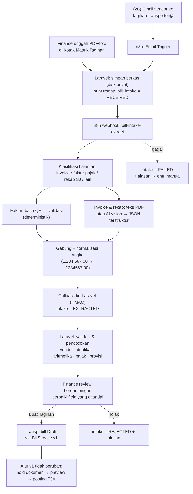

# PRD — Transporter Phase 2: Pembacaan Tagihan Vendor Otomatis (n8n + AI)

**Version:** 0.1 Draft
**Date:** 2026-09-24
**Author:** IT — Apps Mutu Gading
**Status:** Draft untuk diskusi
**Induk:** `PRD_Transporter_Module.md` v2.2 (disebut "PRD v1" di dokumen ini)
**Target Module:** `Modules/Transporter` + instance **n8n** baru
**Target Schema:** `MGTHRIS` (tidak ada tabel baru di `MGTDAT`)

---

## Executive Summary

Di v1, Finance mengetik ulang setiap tagihan vendor angkutan ke halaman Tagihan (F-06.1): nomor invoice, tanggal, faktur pajak, DPP, PPN, PPh, total — lalu mencari dan mencentang satu per satu provisi yang ditagih (F-06.3). Bagian paling melelahkan bukan header-nya, melainkan **baris-barisnya**: satu tagihan biasanya menagih banyak transaksi angkutan sekaligus (volume nyata perlu dikonfirmasi Finance, Q2-03), yang nomor surat jalannya tertulis di lampiran rekap vendor.

Phase 2 menambahkan **Kotak Masuk Tagihan**: Finance cukup mengunggah PDF / foto tagihan (atau vendor mengirim lewat email khusus), lalu sistem membaca isinya, mengisi form tagihan, dan mencocokkan nomor surat jalan di rekap vendor dengan provisi yang sudah diposting. **Finance tetap memeriksa dan menekan tombol "Buat Tagihan"** — tidak ada tagihan yang terbentuk, apalagi terposting, tanpa manusia.

Pembacaan dokumen dijalankan oleh **n8n** (alat otomasi workflow) yang memanggil model AI pembaca dokumen. Laravel tetap menjadi satu-satunya pemilik data dan aturan bisnis; n8n hanya "mata" yang membaca kertas dan mengembalikan JSON.

---

## 0. Pengantar Singkat n8n (untuk pembaca yang belum mengenalnya)

| Pertanyaan | Jawaban |
|---|---|
| **Apa itu n8n?** | Aplikasi otomasi workflow berbasis web. Alur kerja dibuat dengan menyambung kotak-kotak (*node*) di layar — mirip diagram alir — bukan dengan menulis program penuh. Sejenis Zapier / Make, tetapi bisa di-*install* sendiri |
| **Di mana jalannya?** | **Self-hosted** di server internal sebagai container Docker (sama seperti aplikasi Laravel sekarang). Data dokumen tidak lewat server n8n pihak ketiga |
| **Node** | Satu langkah kerja. Contoh yang akan dipakai: *Webhook* (menerima panggilan dari Laravel), *Email Trigger (IMAP)* (membaca kotak email), *HTTP Request* (memanggil API), *Extract From File* (mengambil teks dari PDF), *AI / LLM node* (memanggil model AI), *Code* (sedikit JavaScript untuk merapikan data), *IF / Switch* (percabangan) |
| **Workflow** | Rangkaian node. Dipicu oleh *trigger* (webhook, email masuk, jadwal) |
| **Execution** | Setiap kali workflow berjalan, n8n menyimpan log per langkah — input, output, dan error. Ini yang dipakai untuk menelusuri kalau pembacaan salah |
| **Credentials** | Penyimpanan terenkripsi untuk API key / password (API key AI, akun email, secret untuk Laravel). Tidak ditulis di dalam workflow |
| **Error workflow** | Workflow khusus yang otomatis jalan bila workflow lain gagal — dipakai untuk mengabari Laravel bahwa dokumen gagal dibaca |
| **Lisensi** | *Sustainable Use License* (fair-code): gratis untuk dipakai internal perusahaan sendiri. **Perlu dikonfirmasi** oleh IT/legal sebelum instalasi produksi (Q2-01) |
| **Kenapa n8n, bukan ditulis langsung di Laravel?** | (1) Alur baca dokumen banyak coba-coba (prompt, urutan langkah, model) — di n8n bisa diubah & diuji tanpa deploy aplikasi; (2) log execution per langkah sangat membantu saat tuning; (3) bisa dipakai ulang modul lain (invoice supplier umum, dokumen LC, dsb.). Kekurangannya: satu komponen lagi yang harus dirawat — dimitigasi dengan batas tanggung jawab yang tegas (§4.2) |

---

## 1. Background & Objective

### 1.1 Background

- PRD v1 memindahkan proses tagihan dari Forms ke Laravel tetapi **cara entrinya tetap manual** — sengaja, supaya v1 fokus pada kebenaran angka akuntansi (go/no-go v1 = GL identik).
- Tagihan vendor datang dalam bentuk campuran: PDF invoice, PDF faktur pajak (e-Faktur / Coretax), rekap surat jalan (PDF, Excel, atau foto), kadang difoto dari kertas.
- Faktur pajak elektronik memiliki **QR code** yang bisa divalidasi — data pajaknya bisa diperoleh tanpa AI dan tanpa menebak (lihat F-P2.07; berlaku atau tidaknya untuk format Coretax **perlu diverifikasi**, Q2-04).
- Kesalahan ketik nomor faktur pajak / DPP berdampak langsung ke PPN Masukan dan laporan pajak.

### 1.2 Objective

1. Mengurangi waktu entri satu tagihan vendor minimal **60%** dibanding baseline v1.
2. Mengisi otomatis header tagihan (F-06.1) dan **mengusulkan pencocokan baris provisi** (F-06.3) dari nomor surat jalan di lampiran vendor.
3. Mengurangi salah ketik nomor faktur pajak & nilai pajak lewat validasi silang (QR faktur, aritmetika, profil pajak vendor).
4. Menyimpan berkas asli tagihan menempel di tagihannya, sehingga auditor/Finance bisa membuka dokumen sumber dari halaman tagihan.

### 1.3 Non-Objective

- **Tidak ada posting otomatis.** Posting TJV tetap tindakan Finance seperti F-06.6.
- **Tidak ada tagihan yang terbentuk tanpa konfirmasi manusia.** Hasil baca hanya *usulan*.
- Tidak mengubah satu pun aturan v1: matching, selisih `EXPENSE_DIRECT` (§5.6.1 PRD v1), hold dokumen (F-06.4), pajak (F-06.2), SoD (§8).
- n8n **tidak pernah** menyentuh database Oracle (`MGTDAT` maupun `MGTHRIS`).
- Tidak membangun portal vendor (vendor login & unggah sendiri) — kandidat fase berikutnya.

---

## 2. Scope

### 2.1 In-Scope

| # | Item |
|---|---|
| 1 | Halaman **Kotak Masuk Tagihan** — unggah berkas (PDF, JPG, PNG; beberapa berkas per tagihan) |
| 2 | Instance **n8n self-hosted** + workflow `bill-intake-extract` |
| 3 | Ekstraksi header tagihan: vendor, nomor & tanggal invoice, mata uang, DPP, PPN, PPh, total |
| 4 | Ekstraksi faktur pajak: nomor, tanggal, NPWP penjual, DPP, PPN — via QR bila ada, via AI bila tidak |
| 5 | Ekstraksi daftar nomor surat jalan / GRN / nomor polisi + nominal per baris dari rekap vendor |
| 6 | Validasi & pencocokan di Laravel: vendor, duplikat, aritmetika, profil pajak, pencocokan provisi |
| 7 | Halaman **review berdampingan** (dokumen di kiri, form terisi di kanan) → tombol "Buat Tagihan" yang memakai service tagihan v1 |
| 8 | Pencatatan koreksi user per field (untuk mengukur akurasi & memperbaiki prompt) |
| 9 | *(2B)* Kanal email khusus tagihan transporter yang dibaca n8n |

### 2.2 Out-of-Scope

- Portal vendor, tanda tangan elektronik, OCR tulisan tangan.
- Pembacaan dokumen modul lain (bisa memakai ulang n8n nanti, tapi bukan di PRD ini).
- Rekonsiliasi otomatis tagihan vs pembayaran (terkait rilis Payment Voucher §5.11 PRD v1).

---

## 3. Alur Saat Ini (v1) vs Target (Phase 2)

### 3.1 v1 — manual

```
Vendor kirim tagihan (kertas / PDF / email)
  → Finance buka halaman Tagihan, ketik header (F-06.1)
  → cari provisi vendor, centang satu per satu sambil melihat rekap vendor (F-06.3)
  → tambah baris EXPENSE_DIRECT untuk selisih (F-06.7)
  → cek hold dokumen (F-06.4) → preview TJV → posting (F-06.5/6)
```

### 3.2 Phase 2 — dibaca mesin, diputuskan manusia



Prinsip yang dipegang: **setiap panah setelah "Buat Tagihan" adalah jalur v1 yang sudah diuji.** Phase 2 hanya mengganti cara form terisi, bukan apa yang terjadi setelahnya.

---

## 4. Target Architecture

### 4.1 Komponen

| Komponen | Peran | Catatan |
|---|---|---|
| Laravel `Modules/Transporter` | Pemilik data, aturan bisnis, UI, penyimpanan berkas, keputusan akhir | Tidak ada perubahan pada service posting |
| n8n (container Docker) | Membaca dokumen → JSON | Stateless terhadap bisnis; tidak tahu apa itu provisi |
| Model AI pembaca dokumen | Membaca PDF/gambar, mengembalikan field terstruktur | Dipanggil dari n8n. Pilihan penyedia jadi keputusan (Q2-02); kandidat: Claude (mis. `claude-sonnet-5` untuk akurasi, `claude-haiku-4-5` untuk biaya rendah) atau model self-hosted bila dokumen tidak boleh keluar jaringan |
| Validator QR faktur pajak | Mengambil data faktur resmi dari URL di QR | Deterministik, sumber kebenaran data pajak bila tersedia |
| Penyimpanan berkas | Disk privat Laravel (bukan `public`) | Diakses n8n lewat *signed URL* berumur pendek |

### 4.2 Batas tanggung jawab (kontrak yang tidak boleh dilanggar)

| # | Aturan |
|---|---|
| B-1 | n8n **tidak punya kredensial database** apa pun. Satu-satunya jalan masuk ke data adalah API Laravel |
| B-2 | n8n **tidak mencocokkan provisi, tidak menghitung pajak, tidak memutuskan vendor**. Ia hanya melaporkan apa yang tertulis di dokumen. Semua logika bisnis tetap di Laravel (sesuai NF-03 PRD v1) |
| B-3 | Output n8n selalu memakai **skema JSON berversi** (`schema_version`). Laravel menolak payload yang tidak sesuai skema |
| B-4 | Semua panggilan dua arah ditandatangani **HMAC** (header `X-Signature` + timestamp, toleransi 5 menit) dan idempoten terhadap `intake_id` |
| B-5 | Bila n8n mati, **entri manual v1 tetap berjalan penuh**. Phase 2 tidak boleh menjadi prasyarat menagih |

### 4.3 Kontrak API

**Laravel → n8n** `POST {N8N_URL}/webhook/bill-intake-extract`

```json
{
  "intake_id": "TBI2026000123",
  "files": [
    { "file_id": "TBF2026000301", "mime": "application/pdf",
      "url": "https://apps.../signed/...?expires=...", "sha256": "…" }
  ],
  "hint": { "carrier_supp_code": "LS02128" },
  "callback_url": "https://apps.../api/transporter/bill-intakes/TBI2026000123/extraction",
  "schema_version": "1"
}
```

**n8n → Laravel** `POST /api/transporter/bill-intakes/{id}/extraction`

```json
{
  "schema_version": "1",
  "status": "EXTRACTED",
  "pages": [ { "file_id": "TBF2026000301", "page": 1, "kind": "INVOICE" },
             { "file_id": "TBF2026000301", "page": 2, "kind": "TAX_INVOICE" },
             { "file_id": "TBF2026000301", "page": 3, "kind": "DN_RECAP" } ],
  "header": {
    "vendor_name":   { "value": "CV …", "confidence": 0.97, "page": 1 },
    "vendor_npwp":   { "value": "01.234.567.8-…", "confidence": 0.99, "source": "QR" },
    "invoice_no":    { "value": "INV/2026/09/045", "confidence": 0.95 },
    "invoice_date":  { "value": "2026-09-20", "confidence": 0.93 },
    "currency":      { "value": "IDR", "confidence": 0.99 },
    "dpp":           { "value": 12500000.00, "confidence": 0.96 },
    "ppn_amount":    { "value": 1375000.00, "confidence": 0.96 },
    "pph_amount":    { "value": 250000.00, "confidence": 0.80 },
    "total":         { "value": 13625000.00, "confidence": 0.97 },
    "tax_invoice_no":   { "value": "04002600….", "confidence": 1.0, "source": "QR" },
    "tax_invoice_date": { "value": "2026-09-20", "confidence": 1.0, "source": "QR" }
  },
  "lines": [
    { "ref_no": "LDN2026004512", "ref_date": "2026-09-02", "plate_no": "B 9123 XY",
      "destination": "Bandung", "amount": 1500000.00, "confidence": 0.91, "page": 3 }
  ],
  "model": { "provider": "…", "name": "…", "prompt_version": "bill-v1" },
  "warnings": [ "Halaman 3 miring, 2 baris tidak terbaca" ]
}
```

`confidence` adalah perkiraan model, **bukan jaminan** — Laravel menggabungkannya dengan hasil validasinya sendiri (§5.3) untuk menentukan field mana yang disorot.

### 4.4 Data model baru (MGTHRIS)

| Tabel | Prefix | Isi |
|---|---|---|
| `transp_bill_intake` | `tbi_` | Satu baris per paket tagihan masuk: sumber (`UPLOAD` / `EMAIL`), pengunggah, email pengirim, status (enum §4.5), `tbi_carrier_id` hasil resolusi, payload ekstraksi mentah (CLOB JSON), versi skema/prompt/model, `tbi_bill_id` saat sudah jadi tagihan, alasan tolak / gagal, jumlah percobaan, kolom audit |
| `transp_bill_intake_file` | `tbf_` | Berkas: path disk privat, nama asli, mime, ukuran, **sha256** (deteksi berkas yang sama diunggah dua kali), jumlah halaman |
| `transp_bill_intake_line` | `tbn_` | Baris hasil baca rekap vendor: nomor ref, tanggal, nopol, nominal, confidence, **hasil pencocokan** (`MATCHED` / `AMOUNT_DIFF` / `NOT_FOUND` / `ALREADY_BILLED` / `OTHER_VENDOR`), `tbn_provision_id` usulan |
| `transp_bill_intake_correction` | `tbc_` | Satu baris per field yang diubah user saat review: field, nilai mesin, nilai akhir, user, waktu — sumber metrik akurasi (§7) |

Perubahan pada tabel v1 — **hanya penambahan kolom nullable**:

| Tabel | Kolom | Guna |
|---|---|---|
| `transp_bill` | `trb_source` varchar(10) default `MANUAL` (`MANUAL` / `INTAKE`) | Membedakan asal tagihan untuk laporan & metrik |
| `transp_bill` | `trb_intake_id` varchar(30) nullable FK | Tautan ke berkas asli dari halaman tagihan |

> **Usulan untuk v1 (perlu keputusan, D2-01):** tambahkan kedua kolom itu sekarang di migration v1 sebagai nullable, mengikuti pola §5.12 PRD v1 (kolom gerbang disiapkan lebih awal). Biaya di v1 nyaris nol; Phase 2 jadi murni penambahan tabel. Konsekuensi: jumlah tabel modul naik dari 22 (v1) menjadi 26 di Phase 2 — test/dokumen yang memaku angka 22 perlu disesuaikan dan perubahannya dicatat di `DECISIONS.md`.

### 4.5 State machine intake

```php
enum BillIntakeStatusEnum: int {
    case Received  = 0; // berkas tersimpan, belum dikirim ke n8n
    case Extracting = 1; // sudah dikirim, menunggu callback
    case Extracted = 2; // hasil baca masuk, siap direview
    case Failed    = 3; // gagal dibaca / timeout — bisa "Coba lagi" atau entri manual
    case Converted = 4; // sudah jadi transp_bill (terkunci)
    case Rejected  = 5; // ditolak user (bukan tagihan, duplikat, salah vendor) + alasan
}
```

Transisi: `Received → Extracting → Extracted | Failed`, `Failed → Extracting` (coba lagi, maks 3), `Extracted → Converted | Rejected`, `Failed → Converted` (user mengisi manual dari layar review yang sama). Intake `Extracting` lebih dari 10 menit otomatis jadi `Failed` (job terjadwal).

---

## 5. Functional Requirements

### 5.1 Kotak Masuk & Unggah

| ID | Requirement |
|---|---|
| F-P2.01 | Halaman **Kotak Masuk Tagihan**: daftar intake dengan status, vendor (hasil resolusi), nomor invoice, total, umur, pengunggah. Filter per status & vendor. Dipaginasi (NF-01 v1) |
| F-P2.02 | Unggah 1–10 berkas per intake (PDF / JPG / PNG, maks 20 MB per berkas, konfigurabel). Satu intake = satu tagihan vendor (invoice + faktur + rekap boleh terpisah atau digabung dalam satu PDF) |
| F-P2.03 | Pengunggah boleh memilih vendor lebih dulu (opsional) sebagai petunjuk; bila kosong, vendor diresolusi dari dokumen |
| F-P2.04 | Berkas dengan sha256 yang sama dengan intake lain yang belum `Rejected` ditolak saat unggah, dengan tautan ke intake yang sudah ada |
| F-P2.05 | Pengiriman ke n8n lewat **queued job** (`transporter_bill_intake`), bukan request sinkron. Halaman memperbarui status sendiri (polling Livewire) dan user mendapat notifikasi saat hasil siap |

### 5.2 Pembacaan dokumen (workflow n8n)

| ID | Requirement |
|---|---|
| F-P2.06 | Setiap halaman diklasifikasi: `INVOICE`, `TAX_INVOICE`, `DN_RECAP`, `OTHER` |
| F-P2.07 | Halaman `TAX_INVOICE`: coba baca QR code dan ambil data resmi faktur (nomor, tanggal, NPWP penjual & pembeli, DPP, PPN). Bila berhasil, field tersebut bertanda `source: QR` dan **diutamakan di atas hasil AI** |
| F-P2.08 | PDF yang punya lapisan teks: teks diambil langsung (lebih murah & akurat); hanya PDF hasil scan / foto yang dikirim ke AI vision |
| F-P2.09 | AI dipanggil dengan **skema output terstruktur** (JSON schema) dan instruksi: "laporkan hanya yang tertulis; kosongkan bila tidak terbaca; jangan menghitung atau menebak". Nilai yang dihitung sendiri oleh model dilarang |
| F-P2.10 | Angka dinormalisasi dari format Indonesia (`1.234.567,00`, `Rp`, `IDR`) ke desimal; tanggal ke ISO. Normalisasi dilakukan di node *Code*, bukan oleh AI |
| F-P2.11 | Rekap surat jalan: setiap baris menghasilkan `ref_no` (LDN/PDN/JWDN/nomor GRN), tanggal, nopol, tujuan, nominal. Pola nomor dokumen dikirim sebagai petunjuk ke model |
| F-P2.12 | Gagal (timeout, dokumen tak terbaca, error API) → error workflow mengirim callback `status: FAILED` + alasan yang bisa dipahami user |
| F-P2.13 | Versi prompt dan model tercatat di setiap hasil (`prompt_version`, `model.name`) sehingga perubahan akurasi bisa ditelusuri ke perubahan workflow |

### 5.3 Validasi & pencocokan di Laravel

| ID | Requirement |
|---|---|
| F-P2.14 | **Resolusi vendor:** NPWP penjual (dari QR bila ada) → `OM_SUPPLIER` (`SUPP_FLEX_08`/`FLEX_07`, seperti T016) → `transp_carrier` tipe `VENDOR`. Bila tidak ketemu atau lebih dari satu, user wajib memilih. Nama vendor dari dokumen hanya dipakai sebagai petunjuk, tidak pernah sebagai kunci |
| F-P2.15 | **Duplikat:** tolak bila `(carrier, invoice_no)` sudah ada di `transp_bill` atau di intake lain yang belum `Rejected`; peringatan bila nomor faktur pajak sudah pernah dipakai |
| F-P2.16 | **Aritmetika:** `DPP + PPN − PPh = total` (toleransi konfigurabel, default Rp 1); jumlah baris rekap vs DPP. Selisih → field disorot, bukan ditolak |
| F-P2.17 | **Pajak:** tarif PPN/PPh hasil baca dibandingkan profil pajak vendor dari `IM_VS_STATIC_VALUE` (F-06.2 v1) pada tanggal invoice; beda → disorot. **Nilai yang dipakai tagihan tetap hasil hitung F-06.2**, hasil baca hanya pembanding |
| F-P2.18 | **Pencocokan provisi** per baris rekap, hanya terhadap provisi vendor tersebut yang `Posted` dan belum ber-TJV: `MATCHED` (nomor & nominal cocok), `AMOUNT_DIFF` (nomor cocok, nominal beda → usulan baris `EXPENSE_DIRECT` dengan jenis selisih yang sesuai, alasan tetap diisi user), `NOT_FOUND`, `ALREADY_BILLED` (sudah ditagih di TJV lain — indikasi tagihan ganda), `OTHER_VENDOR` |
| F-P2.19 | Provisi vendor yang **tidak disebut** di rekap tidak diusulkan (tidak ada pencocokan "tebak-tebakan") |
| F-P2.20 | Additional expense `Approved` milik transaksi yang cocok ditawarkan untuk ditarik seperti F-06.7b v1 — tetap pilihan user |

### 5.4 Review & konversi

| ID | Requirement |
|---|---|
| F-P2.21 | Layar review berdampingan: pratinjau dokumen (berpindah halaman, zoom) di kiri; form tagihan v1 terisi di kanan. Klik field → dokumen melompat ke halaman asalnya |
| F-P2.22 | Field disorot tiga tingkat: **hijau** (QR / tervalidasi), **kuning** (confidence rendah atau validasi F-P2.16/17 berbeda), **merah** (wajib diisi / tidak terbaca / konflik). Tombol "Buat Tagihan" nonaktif selama masih ada merah |
| F-P2.23 | Tabel baris rekap dengan hasil pencocokan F-P2.18; user bisa menerima, mengganti provisi, atau membuang baris. Baris `NOT_FOUND` / `ALREADY_BILLED` harus diputuskan eksplisit |
| F-P2.24 | "Buat Tagihan" memanggil **service tagihan v1 yang sama** dengan entri manual — satu jalur validasi, tidak ada jalan pintas. Hasilnya `transp_bill` status Draft dengan `trb_source = INTAKE`; intake jadi `Converted` |
| F-P2.25 | Setiap field yang berbeda antara hasil mesin dan nilai akhir dicatat ke `transp_bill_intake_correction` |
| F-P2.26 | Halaman tagihan v1 menampilkan tautan "Dokumen asli" bila tagihan berasal dari intake (melengkapi F-10.10 v1) |
| F-P2.27 | "Tolak" wajib alasan (pilihan: bukan tagihan, duplikat, salah vendor, lain-lain + teks) |

### 5.5 Kanal email (Phase 2B)

| ID | Requirement |
|---|---|
| F-P2.28 | Kotak email khusus (mis. `tagihan-transporter@…`) dibaca n8n lewat IMAP. Lampiran diteruskan ke endpoint unggah Laravel sebagai intake bersumber `EMAIL` |
| F-P2.29 | Hanya pengirim yang terdaftar di daftar email vendor (konfigurasi di master carrier) yang diproses otomatis; pengirim lain masuk intake berstatus `Received` dengan tanda "pengirim tidak dikenal" |
| F-P2.30 | Email tanpa lampiran atau dengan lampiran di luar mime yang diizinkan diabaikan dan dicatat |

---

## 6. Non-Functional Requirements

| # | Requirement |
|---|---|
| NF-P2.01 | Hasil baca satu tagihan ≤ 3 halaman tersedia **< 2 menit** (p95) |
| NF-P2.02 | Berkas di disk privat; n8n mengambilnya lewat signed URL berumur ≤ 15 menit. Tidak ada berkas tagihan di disk `public` |
| NF-P2.03 | Retensi berkas & payload mengikuti NF-09 v1 (**tanpa purge**) — berkas tagihan adalah dokumen sumber audit |
| NF-P2.04 | Instance n8n: container tersendiri, di jaringan internal, UI n8n tidak terekspos ke internet, login dengan akun per orang (bukan akun bersama) |
| NF-P2.05 | Retensi log *execution* n8n dibatasi (mis. 30 hari) karena memuat isi dokumen; sumber kebenaran jangka panjang tetap tabel `transp_bill_intake` |
| NF-P2.06 | Workflow n8n di-*export* ke JSON dan disimpan di repo (`Modules/Transporter/n8n/`) — perubahan workflow ikut review seperti kode |
| NF-P2.07 | Log channel baru `transporter_bill_intake` (pola §4.6 v1) |
| NF-P2.08 | Biaya pemanggilan AI tercatat per intake (token / halaman) untuk laporan bulanan |
| NF-P2.09 | Test: kontrak API (skema, HMAC, idempotensi), validator F-P2.14–19, dan **set dokumen emas** (± 50 tagihan nyata beranonim dari berbagai vendor) yang dijalankan ulang setiap kali prompt/model berubah |

---

## 7. Metrik Keberhasilan

| Metrik | Cara ukur | Target |
|---|---|---|
| Waktu entri per tagihan | Baseline: diukur 1 bulan pertama v1 live (waktu buka form → simpan). Phase 2: unggah → "Buat Tagihan" | turun ≥ 60% |
| Akurasi header | `1 − (field terkoreksi / field terisi)` dari `transp_bill_intake_correction` | ≥ 95% |
| Akurasi faktur pajak via QR | idem, khusus field `source: QR` | ≥ 99,5% |
| Tingkat cocok otomatis baris | baris `MATCHED` yang diterima tanpa diubah / seluruh baris | ≥ 90% |
| Tingkat gagal baca | intake `Failed` / seluruh intake | ≤ 5% |
| Tagihan ganda tertangkap | jumlah `ALREADY_BILLED` / duplikat invoice yang tertangkap | dilaporkan (tidak ada target — nilai tambah kontrol) |
| Adopsi | tagihan `trb_source = INTAKE` / seluruh tagihan | ≥ 80% setelah 3 bulan |

---

## 8. Security & Access Control

| Role / Permission | Hak |
|---|---|
| `Finance` + `transporter-bill-intake-upload` | Unggah, lihat kotak masuk, review, tolak |
| `Finance` + `transporter-bill-intake-convert` | "Buat Tagihan" dari intake (setara hak membuat tagihan v1) |
| `Transporter Viewer` | Lihat intake & dokumen asli, tidak bisa mengubah |
| Akun servis n8n | Hanya endpoint callback & unggah-email; token/secret tersendiri, tidak punya sesi user |

- SoD v1 tidak berubah: pembuat tagihan dari intake tunduk pada aturan yang sama dengan pembuat tagihan manual (posting TJV hanya Finance, §8 v1).
- **Kerahasiaan data:** dokumen tagihan memuat NPWP, nama, rekening bank vendor. Bila memakai model AI berbasis cloud, perlu keputusan manajemen (Q2-02) dan pengaturan penyedia agar data tidak dipakai untuk pelatihan. Alternatif: model self-hosted dengan akurasi lebih rendah.
- Secret HMAC dan API key AI disimpan di *Credentials* n8n dan `.env` Laravel, tidak di workflow JSON yang di-commit.

---

## 9. Risks & Mitigations

| # | Risiko | Dampak | Mitigasi |
|---|---|---|---|
| RP2-01 | AI "mengarang" angka yang terlihat masuk akal | **Tinggi** — nilai tagihan/pajak salah | Tidak ada auto-create/posting; validasi aritmetika & profil pajak; QR diutamakan; nilai pajak final tetap hasil hitung F-06.2; set dokumen emas |
| RP2-02 | Format tagihan tiap vendor berbeda-beda, sebagian foto miring / kertas lecek | Sedang — akurasi rendah untuk vendor tertentu | Metrik akurasi per vendor; vendor bermasalah diminta mengirim PDF asli; fallback manual selalu ada |
| RP2-03 | Format faktur pajak Coretax berbeda dari e-Faktur lama / QR tidak bisa divalidasi otomatis | Sedang | Verifikasi di awal Phase 2A (Q2-04); bila tidak bisa, faktur dibaca AI + validasi silang dengan NPWP & aritmetika |
| RP2-04 | n8n jadi titik gagal baru / tidak ada yang paham merawatnya | Sedang | B-5 (manual tetap jalan); workflow disimpan di repo; runbook singkat; minimal 2 orang IT dilatih |
| RP2-05 | Dokumen sensitif keluar jaringan | Sedang–Tinggi (kebijakan) | Keputusan Q2-02 sebelum build; opsi self-hosted; retensi log n8n terbatas |
| RP2-06 | Biaya AI tak terkendali | Rendah — volume ± puluhan tagihan/bulan | Teks PDF diambil tanpa AI bila bisa (F-P2.08); batas halaman per intake; laporan biaya NF-P2.08 |
| RP2-07 | User percaya penuh pada sorotan hijau dan berhenti memeriksa | Sedang | Sorotan hijau hanya untuk QR / tervalidasi silang, bukan sekadar confidence tinggi; sampling audit bulanan oleh Head of Finance |
| RP2-08 | Phase 2 dimulai sebelum v1 stabil | Tinggi — dua perubahan bersamaan di proses tagihan | Prasyarat §10: v1 lulus gerbang P7 & 1 bulan hypercare |

---

## 10. Roadmap

**Prasyarat:** v1 sudah cutover (gerbang P7 di `ACCEPTANCE.md`) dan berjalan stabil minimal 1 bulan, termasuk pengukuran baseline waktu entri. Phase 2 **tidak** mengubah urutan v1; satu-satunya hal yang diusulkan masuk v1 adalah D2-01 (dua kolom nullable).

| Fase | Isi | Estimasi |
|---|---|---|
| **2.0 — Spike & keputusan** | Instal n8n di staging; kumpulkan ± 50 tagihan nyata (set emas); uji QR faktur Coretax; bandingkan 2 kandidat model pada set emas; putuskan Q2-02 | 1,5 minggu |
| **2A — Kotak masuk & ekstraksi header** | Tabel intake, unggah, workflow n8n (klasifikasi, QR, header), callback, validasi F-P2.14–17, layar review, konversi ke tagihan | 3 minggu |
| **2A+ — Baris rekap & pencocokan** | Ekstraksi rekap SJ, `transp_bill_intake_line`, pencocokan F-P2.18–20, tabel baris di layar review | 2 minggu |
| **Pilot** | 2–3 vendor bervolume terbesar, entri manual paralel untuk pembanding; ukur metrik §7 | 3–4 minggu kalender |
| **2B — Kanal email** | IMAP trigger, whitelist pengirim | 1 minggu |
| **Total build** | | **± 7,5 minggu** + pilot |

---

## 11. Open Questions

| # | Pertanyaan | Kepada |
|---|---|---|
| Q2-01 | Lisensi n8n (*Sustainable Use License*) sesuai untuk pemakaian internal kita? Community edition cukup, atau butuh fitur enterprise (SSO, audit log)? | IT / Legal |
| Q2-02 | Bolehkah dokumen tagihan (berisi NPWP & rekening vendor) dikirim ke layanan AI cloud? Bila tidak, siap dengan akurasi model self-hosted yang lebih rendah? | Manajemen / Finance |
| Q2-03 | Berapa volume tagihan per bulan saat ini dan rata-rata baris per tagihan? | Finance |
| Q2-04 | Faktur pajak dari vendor sekarang formatnya Coretax semua? QR-nya bisa divalidasi otomatis? | Finance / Pajak |
| Q2-05 | Seperti apa rekap surat jalan dari vendor — selalu ada? Excel, PDF, atau tulisan tangan? Selalu mencantumkan nomor LDN/GRN? | Finance |
| Q2-06 | Kanal email (2B) diinginkan, atau cukup unggah oleh Finance? | Finance |
| Q2-07 | Siapa yang merawat workflow n8n sehari-hari (ubah prompt, tambah vendor)? | IT |
| Q2-08 | Server untuk n8n: satu host dengan aplikasi Laravel, atau terpisah? | IT Infra |
| D2-01 | Setuju menambahkan `trb_source` + `trb_intake_id` (nullable) ke migration v1 sekarang? | Indra |

---

## Document Control

| Versi | Tanggal | Perubahan |
|---|---|---|
| 0.1 Draft | 2026-09-24 | Draft awal. Disusun dari PRD v1 v2.2 (§5.6 Tagihan, §5.9 Kontrol Dokumen, §8 SoD), `spec.md` §2.4 (`transp_bill`, `transp_bill_line`), dan `PROGRESS.md` (fase aktif P1, 18/82 task) |
